> DESARROLLO WEB EN ENTORNO SERVIDOR

# Tema 1: CONCEPTOS GENERALES <!-- omit in toc -->
> Selección de arquitecturas y herramientas de programación  
> CONCEPTOS, BACKEND, FRONTEND, LENGUAJES, FRAMEWORKS, NODEJS, NPM, JSON

**[`CÓDIGO DE EJEMPLO`](codigo)**


---

- [1. Introducción](#1-introducción)
  - [1.1. La base de la web](#11-la-base-de-la-web)
  - [1.2. Partes de una aplicación web](#12-partes-de-una-aplicación-web)
- [2. Arquitectura Cliente/Servidor](#2-arquitectura-clienteservidor)
  - [2.1. Protocolo HTTP/HTTPS](#21-protocolo-httphttps)
  - [2.2. Peticiones HTTP y códigos de estado](#22-peticiones-http-y-códigos-de-estado)
  - [2.3. Clientes web](#23-clientes-web)
  - [2.4. Servidores web](#24-servidores-web)
    - [2.4.1. Servidores de contenido estático](#241-servidores-de-contenido-estático)
    - [2.4.2. Servidores de contenido dinámico](#242-servidores-de-contenido-dinámico)
- [3. Tecnologías para el backend](#3-tecnologías-para-el-backend)
  - [3.1. Lenguajes del lado del servidor](#31-lenguajes-del-lado-del-servidor)
  - [3.2. Frameworks del lado servidor](#32-frameworks-del-lado-servidor)
  - [3.3. Resumen](#33-resumen)
- [4. Tecnologías para el frontend](#4-tecnologías-para-el-frontend)
  - [4.1. Lenguajes del lado del cliente](#41-lenguajes-del-lado-del-cliente)
  - [4.2. Frameworks del lado cliente](#42-frameworks-del-lado-cliente)
  - [4.3. Resumen](#43-resumen)
- [5. Tecnologías Javascript Fullstack](#5-tecnologías-javascript-fullstack)
  - [5.1. Frameworks para servidor y cliente](#51-frameworks-para-servidor-y-cliente)
- [6. Tecnología alternativa](#6-tecnología-alternativa)
  - [6.1. WebAssembly (Wasm)](#61-webassembly-wasm)
  - [6.2. Apps en Wasm](#62-apps-en-wasm)
- [7. Arquitecturas](#7-arquitecturas)
  - [7.1. Arquitectura cliente-servidor](#71-arquitectura-cliente-servidor)
  - [7.2. Arquitectura en tres capas](#72-arquitectura-en-tres-capas)
  - [7.3. Arquitectura MVC (Modelo-Vista-Controlador)](#73-arquitectura-mvc-modelo-vista-controlador)
  - [7.4. Arquitectura monolítica](#74-arquitectura-monolítica)
  - [7.5. Arquitectura de microservicios](#75-arquitectura-de-microservicios)
  - [7.6. Arquitectura basada en APIs](#76-arquitectura-basada-en-apis)
  - [7.7. Comparativa de arquitecturas](#77-comparativa-de-arquitecturas)
  - [7.8. Diferencias importantes](#78-diferencias-importantes)
    - [7.8.1. MVC vs Arquitectura en tres capas](#781-mvc-vs-arquitectura-en-tres-capas)
    - [7.8.2. Monolito vs Microservicios](#782-monolito-vs-microservicios)
- [8. Persistencia de los datos](#8-persistencia-de-los-datos)
  - [8.1. Bases de datos relacionales](#81-bases-de-datos-relacionales)
  - [8.2. Bases de datos no relacionales (noSQL)](#82-bases-de-datos-no-relacionales-nosql)
- [9. Desarrollo Backend](#9-desarrollo-backend)
  - [9.1. Lenguajes de servidor](#91-lenguajes-de-servidor)
- [10. NodeJS](#10-nodejs)
  - [10.1. Instalación del entorno de ejecución NodeJS](#101-instalación-del-entorno-de-ejecución-nodejs)
  - [10.2. Probando Node](#102-probando-node)
  - [10.3. Probando VSCode](#103-probando-vscode)
  - [10.4. Inicializar un proyecto](#104-inicializar-un-proyecto)
  - [10.5. Archivo package.json](#105-archivo-packagejson)
  - [10.6. Ejecución de paquetes sin necesidad de instalar](#106-ejecución-de-paquetes-sin-necesidad-de-instalar)
  - [10.7. Módulos incorporados (built-in) en Node](#107-módulos-incorporados-built-in-en-node)
- [11. Linter para Javascript (y también para CSS)](#11-linter-para-javascript-y-también-para-css)
- [12. Configuración de usuario en VSCode](#12-configuración-de-usuario-en-vscode)
  - [12.1. Atajos imprescindibles del teclado](#121-atajos-imprescindibles-del-teclado)
  - [12.2. Archivo settings.json](#122-archivo-settingsjson)
  - [12.3. Archivo keybindings.json](#123-archivo-keybindingsjson)
  - [12.4. Plugins](#124-plugins)
- [13. Referencias](#13-referencias)


---

# 1. Introducción

En este tema abordaremos conceptos generales relacionados con las aplicaciones web:

- Arquitectura Cliente/Servidor 
- Lenguajes utilizados
- Frameworks disponibles

Más adelante trataremos asuntos más prácticos, como el entorno de ejecución Node.js y el gestor de paquetes NPM. También veremos el formato JSON y realizaremos una configuración básica de VSCode.


## 1.1. La base de la web

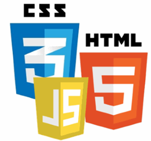

- **HTML**: Estructura del documento. `HTML5`. `2014`
- **CSS**: Formato/apariencia del documento. `CSS3`. 
- **Javascript**: Funcionalidad del documento. `ECMAScript6`. `2015`

> [!NOTE] 
> 
> Al final de línea se muestra la versión más relevante actualmente y el año de su aparición oficial.


## 1.2. Partes de una aplicación web

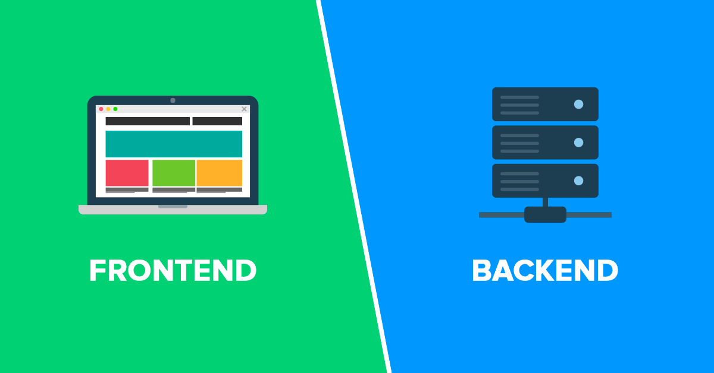


- **Backend**: parte que se ejecuta en el servidor.
  - Se encarga de atender las peticiones de los clientes.
  - Suele tener soporte de almacenamiento de datos.
  - También se denomina capa de acceso a datos
- **Frontend**: parte que se ejecuta en el cliente.
  - Se encarga de la experiencia del usuario (UX).
  - Puede tener soporte de cache de datos.
  - También se denomina capa de presentación.


# 2. Arquitectura Cliente/Servidor

Uno de los servicios más populares de Internet es el servicio WWW o web. Existen otros servicios como correo electrónico y mensajería, entre otros, pero la tendencia es hacia su integración con la WWW.

Cada servicio tiene su protocolo propio (o protocolos). Así tenemos:

- Web: HTTP
- Correo: SMTP, POP, IMAP
- Mensajería: XMPP y otros
- Intercambio de archivo: FTP, BitTorrent

Muchos de los protocolos de Internet, sobre todo los más veteranos, son del tipo **Cliente/Servidor**, frente a algunos más novedosos, como BitTorrent, que son **PeerToPeer (P2P)**.

La principal diferencia entre estos 2 modos es la siguiente:

- Cliente/Servidor: Un dispositivo actúa como Cliente o como Servidor de forma exclusiva.
- PeerToPeer: Un dispositivo actual como Cliente y como Servidor a la vez.

El protocolo HTTP es un protocolo Cliente/Servidor, en el cual la comunicación sigue el siguiente proceso:

1. El cliente realiza una petición (**request**) al servidor.
2. El servidor devuelve una respuesta (**response**) al cliente.


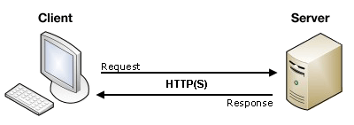


## 2.1. Protocolo HTTP/HTTPS

Referencias:

- [Protocolo HTTP - Wikipedia](https://es.wikipedia.org/wiki/Protocolo_de_transferencia_de_hipertexto)
- [Protocolo HTTP - MDN](https://developer.mozilla.org/es/docs/Web/HTTP/Basics_of_HTTP)
- [Protocolo HTTP - CodeAndCoke](https://datos.codeandcoke.com/apuntes:http)

El protocolo usado mayoritariamente para la transferencia de información web es el protocolo HTTP (o su versión segura HTTPS). Se trata de un protocolo de texto, en el cual la información entre cliente y servidor se transmite en texto plano.

A continuación se muestra un ejemplo de una petición y un ejemplo de una respuesta.


**Petición del cliente**

```
GET / HTTP/1.1
Host: developer.mozilla.org
Accept-Language: es-ES
User-Agent: Mozilla/5.0 (X11; Linux x86_64; rv:45.0) Gecko/20100101 Firefox/45.0
Connection: keep-alive
[Línea en blanco]
```


**Respuesta del servidor**

```
HTTP/1.1 200 OK
Date: Sat, 09 Oct 2010 14:28:02 GMT
Server: Apache
Last-Modified: Tue, 01 Dec 2009 20:18:22 GMT
ETag: "51142bc1-7449-479b075b2891b"
Accept-Ranges: bytes
Content-Length: 29769
Content-Type: text/html

<!DOCTYPE html... (aquí estarían los 29769 bytes de la página web pedida)
```

> [!NOTE] 
>
> Un cliente web, además de realizar peticiones GET, también puede hacer peticiones de tipo POST. Por ejemplo, al enviar al servidor información de un formulario:
>
> ```
> POST /contact_form.php HTTP/1.1
> Host: developer.mozilla.org
> Content-Length: 64
> Content-Type: application/x-www-form-urlencoded
> 
> name=Juan%20Garcia&request=Envieme%20uno%20de%20sus%20catalogos
> ```

**Formato de peticiones y respuestas**

El formato que siguen tanto las peticiones como las respuestas es el siguiente:

- **Línea inicial**
- **Cabeceras**
- **Línea en blanco**
- **Cuerpo** (opcional en las peticiones)
  

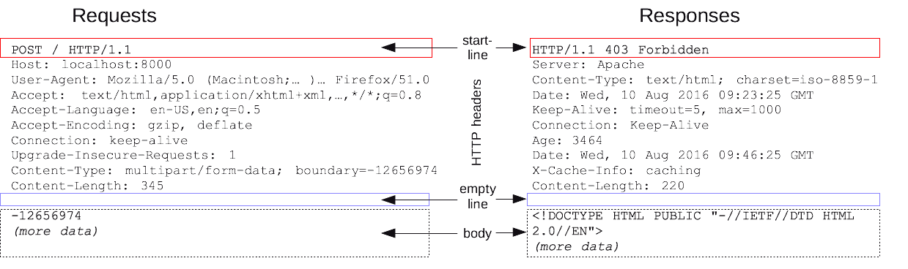

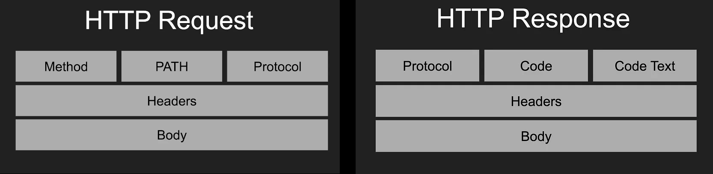

## 2.2. Peticiones HTTP y códigos de estado

Existen diversos tipos de [peticiones a un servidor](https://developer.mozilla.org/es/docs/Web/HTTP/Methods), también conocidas como **métodos** o verbos. Algunas de ellas son:

- **GET**
- **POST**
- **PUT**
- **DELETE**
- ...

Los [códigos de estado que devuelve el servidor](https://developer.mozilla.org/es/docs/Web/HTTP/Status) más habituales son:

- **200 OK**
- 201 Created
- 204 No Content
- 301 Moved Permanently
- 400 Bad Request
- 401 Unauthorized
- 403 Forbidden
- **404 Not Found**
- 500 Internal Server Error


## 2.3. Clientes web

El cliente web más ampliamente usado es el navegador web o *browser*. Este tipo de software interpreta y renderiza código HTML + CSS. HTML por si sólo permite únicamente realizar peticiones de tipo GET y POST (ésta última mediante el uso de un formulario)

Para realizar todo tipo de peticiones (GET, POST, PUT, DELETE, ...) deberemos hacer uso de Javascript en el navegador.

A continuación se muestra como realizar estas peticiones usando Javascript.


```js 
fetch('/api/clientes', { method: 'GET' })
  .then ( res => res.json())
  .then ( data => console.log(data) );

fetch('/api/clientes/5b4916cb2100bc25330b6ac9', { method: 'GET' })
  .then ( res => res.json())
  .then ( data => console.log(data) );

fetch('/api/clientes/5b49b5e33808be1b00b982e2', { method: 'DELETE' })
  .then ( res => res.json())
  .then ( data => console.log(data) );


var cliente = { nombre: "Isabel", apellidos: "López" };

fetch('/api/clientes', {
  method: 'POST',
  body: JSON.stringify(cliente), 
  headers:{
    'Content-Type': 'application/json'
  }
})
  .then(res => res.json())
  .then(data => console.log(data))


var cliente = { nombre: "Pepe", apellidos: "Pérez" };

fetch('/api/clientes/5b4916cb2100bc25330b6ac9', {
  method: 'PUT',
  body: JSON.stringify(cliente), 
  headers:{
    'Content-Type': 'application/json'
  }
})
  .then(res => res.json())
  .then(data => console.log(data));
```

Ni Javascript es el único lenguaje, ni el navegador web es el único entorno, desde el que podemos utilizar los métodos HTTP. 

Por ejemplo, podemos realizar peticiones HTTP usando multitud de aplicaciones:

- Clientes para API: Postman, Insomnia, ...
- Aplicaciones de terminal
- Aplicaciones de escritorio
- Otro tipo de aplicaciones

Como ejemplo, se muestra como realizar peticiones HTTP desde la línea de comandos, con la herramienta `curl`:


```sh
# GET
curl  http://localhost:3000/api/articulos
curl -H 'Content-Type: application/json' \
     -X GET http://localhost:3000/api/articulos

# POST
curl -H 'Content-Type: application/json' \
     -X POST -d '{"nombre": "Botas de invierno","precio": 99.99}' \
     http://localhost:3000/api/articulos

# PUT
curl -H 'Content-Type: application/json' \
     -X PUT -d '{"nombre": "Paraguas","precio": 100.20}' \
     http://localhost:3000/api/articulos/5b609c52c60bd6656205e3d7

# DELETE
curl -H 'Content-Type: application/json' \
     -X DELETE http://localhost:3000/api/articulos/5b609c52c60bd6656205e3d7
```

- Referencia: [Comprobando la API](https://github.com/jamj2000/jamj2000.github.io/blob/701459e108598281b9d1cd1fd668ede7a7db16e2/hlc-fullstack/4/diapositivas.md#comprobando-la-api-1)


## 2.4. Servidores web

Un servidor web es el software encargado de recibir y responder a las peticiones de los clientes.

Según su nivel de complejidad y recursos necesarios, podemos dividirlos en 2 tipos:

- Servidores de **contenido estático**
- Servidores de **contenido dinám**ico

> [!NOTE]  
>
> Por otro lado, también podemos diferenciar entre:
>
> 1. Servidores generalistas: Apache, Tomcat, nginx, IIS.
> 2. Servidores específicos de aplicación
> 
> Los primeros se suelen usar con aplicaciones desarrolladas con lenguajes como PHP, Java, .Net.
> Los segundos suelen programarse específicamente para implementar el backend de una aplicación web desarrollada para Python, NodeJS.
>
> Tanto unos como otros pueden ofrecer tanto contenido estático como computo. 


### 2.4.1. Servidores de contenido estático

Estos servidores web son funcionalmente muy sencillos. Se limitan a atender las peticiones de los clientes y a servir el contenido estático solicitado por ellos: HTML, CSS y Javascript para ejecutar en el lado cliente. También sirven imágenes, fuentes, ...

Suelen ser muy baratos e incluso gratuitos muchas veces. Se usan para desplegar sitios web y aplicaciones sencillas (del lado cliente). 

Los servidores de computo, por otro lado, ofrecen la posibilidad de ejecutar código en el propio servidor, por lo cual suponen un mayor costo al proveedor tanto energético como en tiempo. Su complejidad y gestión también es menos simple. Aunque es posible encontrar algún que otro proveedor con un *free tier*, es habitual la necesidad de realizar un pago mensual.


### 2.4.2. Servidores de contenido dinámico

Son aquellos servidores que, antes de servir el contenido, realizan algún tipo de computo. Suele ser habitual la búsqueda y modificación de información en bases de datos y el posterior renderizado y envío de vistas al cliente (la mayoría de las veces es un navegador web). Otras operaciones que se realizan en el lado servidor suelen ser la gestión de la autenticación y autorización.

Los lenguajes más utilizados para estos fines, sin ningún orden en particular, son:

- PHP
- Java / JSP
- Python
- NodeJS
- ...

Los servidores de contenido dinámico se pueden clasificar en diferentes categorías. Las más habituales son las siguientes:


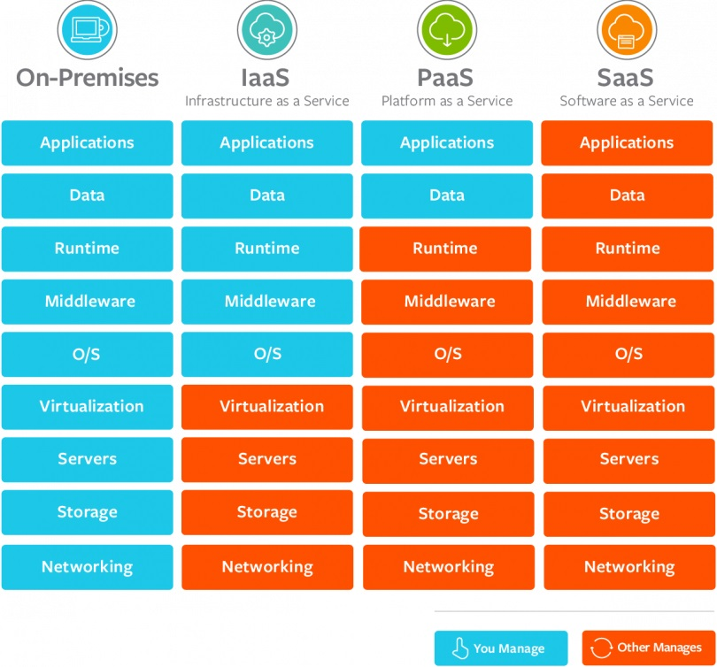

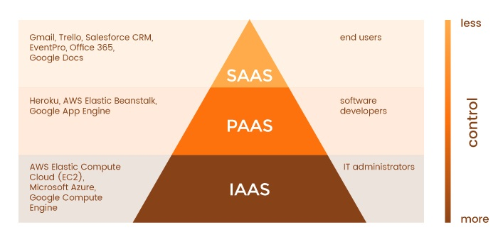

> [!NOTE] 
>
> También existe **DBaaS** (Base de datos como servicio). Se puede considerar equivalente al PaaS, pero aplicado a bases de datos.

Algunos proveedores de estos servicios son:

- [IaaS (Infraestructura como servicio)](https://es.wikipedia.org/wiki/Infraestructura_como_servicio)
  - Amazon: mediante EC2 (Elastic Compute Cloud )
  - Digital Ocean: mediante Droplets
- [PaaS (Plataforma como servicio)](https://en.wikipedia.org/wiki/Platform_as_a_service)
  - Heroku
  - Vercel

Una variante de los servidores de contenido dinámico son los [serverless](https://www.cloudflare.com/es-es/learning/serverless/what-is-serverless/)

[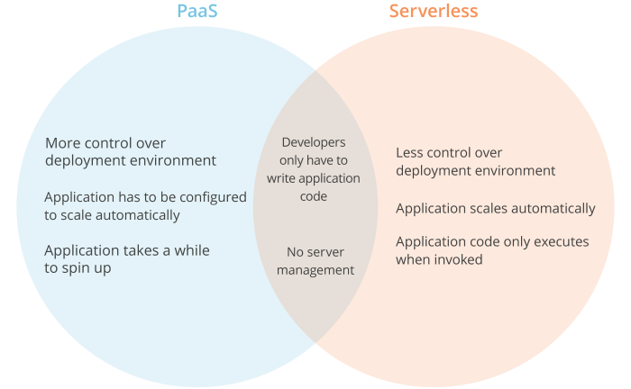](https://www.cloudflare.com/es-es/learning/serverless/glossary/serverless-vs-paas/)

# 3. Tecnologías para el backend


## 3.1. Lenguajes del lado del servidor

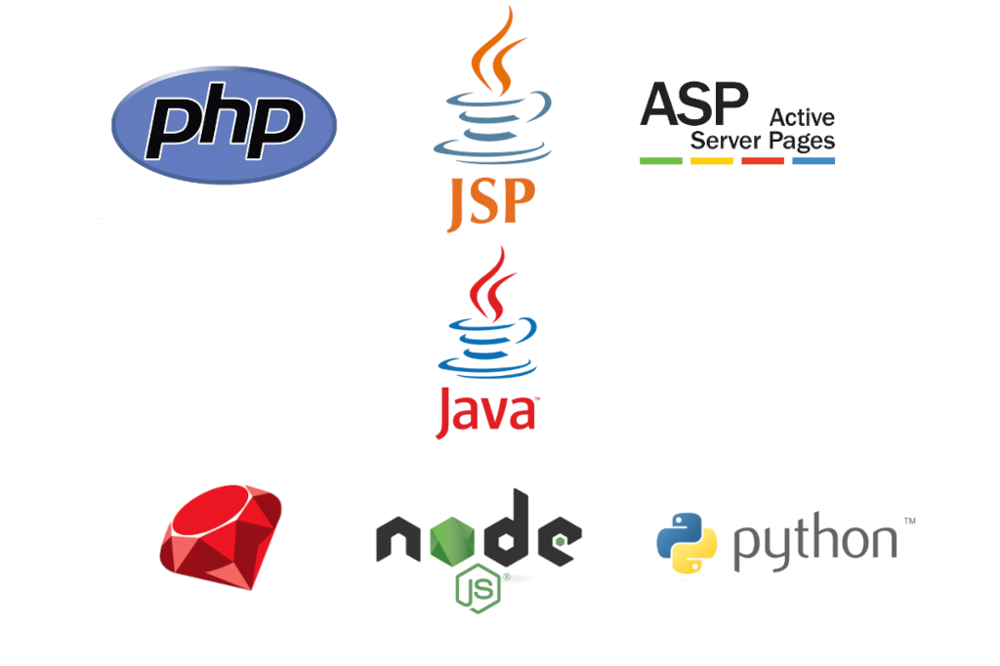


- **PHP**: PHP Hypertext Preprocessor. Uno de los lenguajes más utilizados para la creación de todo tipo de CMS.
- **JSP**: JavaServer Pages. Es la propuesta de Java similar a PHP.
- **ASP**: Active Server Pages. Es la propuesta de Microsoft similar a PHP. 
- **Java**: es un lenguaje multiplataforma propiedad de Oracle.
- **C#**:  es un lenguaje multiplataforma propiedad de Microsoft.
- **Ruby**: es un lenguaje de programación interpretado, reflexivo y orientado a objetos.
- **Python**: es un lenguaje de programación multiparadigma que hace hincapié en el código legible. 
- **Javascript (NodeJS)**: cada vez más popular puesto que se usa también en el lado cliente.


## 3.2. Frameworks del lado servidor 

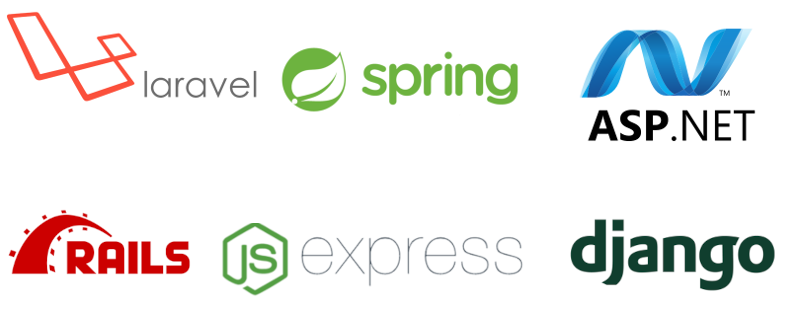


| Framework         | Lenguaje   |
| ----------------- | ---------- |
| **Laravel**       | PHP        |
| **Spring**        | Java       |
| **.NET**          | C#         |
| **Ruby on rails** | Ruby       |
| **Django**        | Python     |
| **Express**       | Javascript |


## 3.3. Resumen

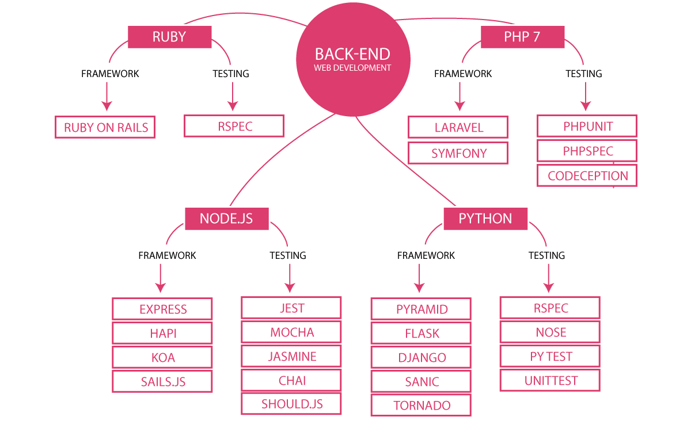


# 4. Tecnologías para el frontend


## 4.1. Lenguajes del lado del cliente

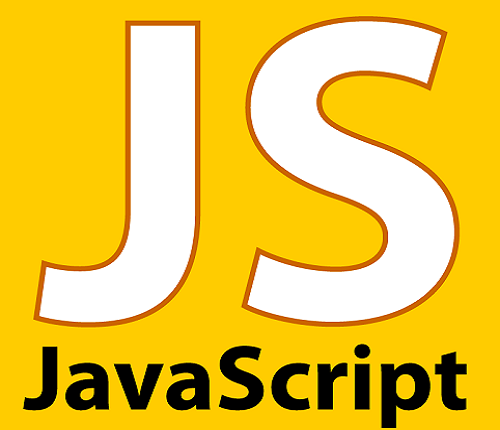

## 4.2. Frameworks del lado cliente

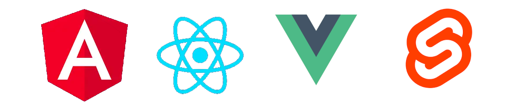

- **Angular**
- **React**
- **Vue**
- **Svelte** (compilador)


## 4.3. Resumen

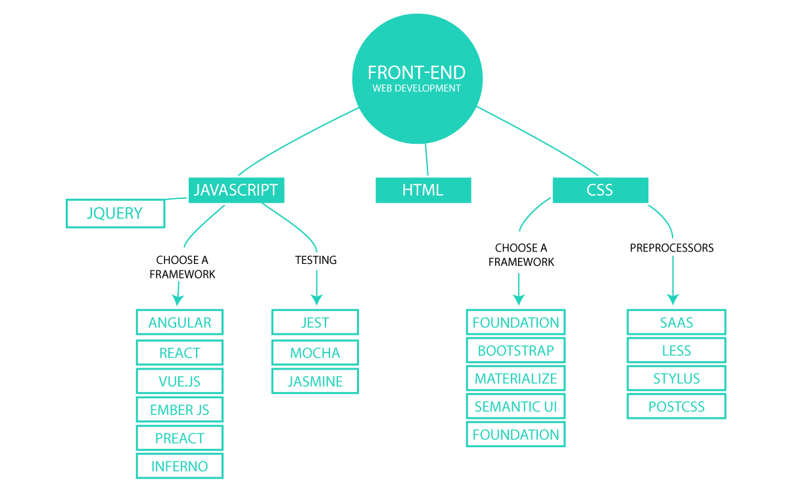


# 5. Tecnologías Javascript Fullstack


## 5.1. Frameworks para servidor y cliente 

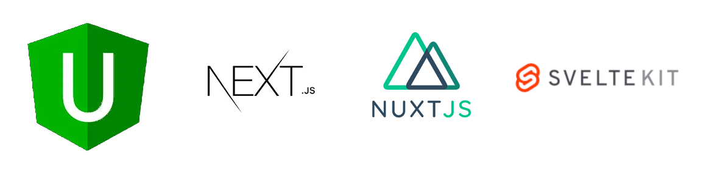

- **Universal**
- **Next**
- **Nuxt**
- **SvelteKit**


# 6. Tecnología alternativa

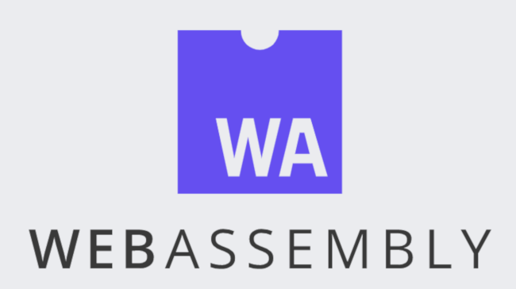

- [WebAssembly](https://es.wikipedia.org/wiki/WebAssembly)


## 6.1. WebAssembly (Wasm)

- Formato binario pequeño y rápido que promete un rendimiento casi nativo para las aplicaciones web.
- Los principales navegadores son compatibles con WebAssembly.
- Los desarrolladores escriben en el lenguaje de su elección (C, C++, ...), que luego se compila en bytecode WebAssembly.
- Para casos de uso intensivo de rendimiento, como juegos, transmisión de música, edición de vídeo y aplicaciones CAD.


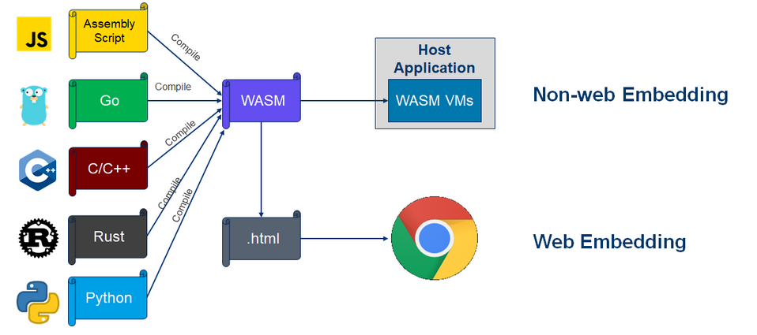

- [WebAssembly explicado](https://www.ciospain.es/liderazgo--gestion-ti/que-es-webassembly-la-plataforma-web-de-proxima-generacion-explicada)


## 6.2. Apps en Wasm

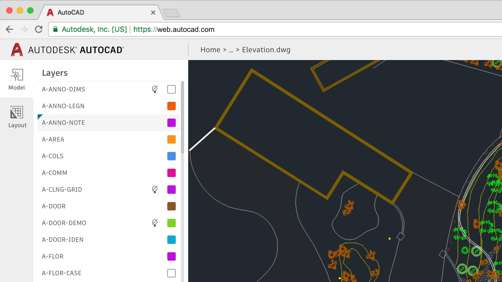

- [Algunas aplicaciones desarrolladas para WebAssembly](https://www.campusmvp.es/recursos/post/8-proyectos-espectaculares-que-utilizan-webassembly.aspx)


# 7. Arquitecturas

En desarrollo web en entorno servidor, las arquitecturas definen cómo se organiza una aplicación, cómo se separan las responsabilidades y cómo se comunican los distintos componentes del sistema.

Las arquitecturas permiten crear aplicaciones más organizadas, mantenibles y escalables.

## 7.1. Arquitectura cliente-servidor

Es la arquitectura básica de las aplicaciones web.

Un cliente (normalmente un navegador web) realiza peticiones a un servidor, y el servidor responde devolviendo información o recursos.

**Funcionamiento básico**

1. El usuario accede a una página web.
2. El navegador envía una petición HTTP al servidor.
3. El servidor procesa la petición.
4. El servidor devuelve una respuesta.

**Ejemplo**

- Cliente: navegador web.
- Servidor: aplicación desarrollada en PHP, Java, Node.js o Python.
- Base de datos: MySQL o PostgreSQL.

**Ventajas**

- Arquitectura sencilla.
- Centralización de la información.
- Fácil mantenimiento inicial.

**Inconvenientes**

- Dependencia del servidor.
- Posibles problemas de saturación.
- Menor escalabilidad si crece mucho el número de usuarios.


## 7.2. Arquitectura en tres capas

La aplicación se divide en tres capas independientes. Esta separación facilita el mantenimiento y la organización del código.

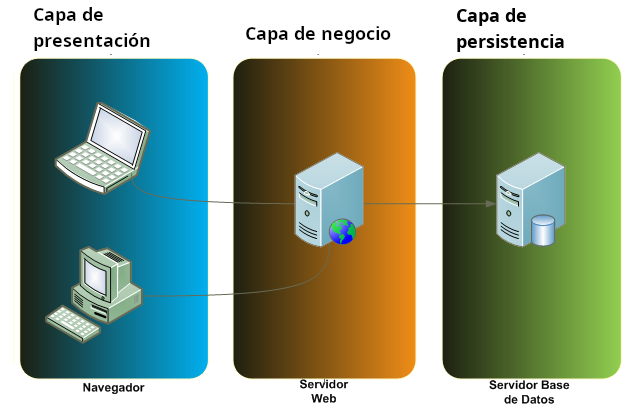

> [!NOTE]
> 
> **CAPAS PRINCIPALES**
> 
> **Capa de presentación**
>
> Es la interfaz que utiliza el usuario. Ejemplos:
> 
> - HTML
> - CSS
> - JavaScript
> 
> **Capa lógica o de negocio**
> 
> Contiene las reglas y procesos de la aplicación. Ejemplos:
> 
> - Validación de formularios.
> - Gestión de usuarios.
> - Procesamiento de pedidos.
>
>
> Tecnologías habituales:
> 
> - PHP
> - Java
> - Node.js
> - ASP.NET
>
> **Capa de datos**
> 
> Gestiona el acceso y almacenamiento de la información. Ejemplos:
> 
> - MySQL
> - PostgreSQL
> - MongoDB

**Ventajas**

- Código organizado.
- Facilita el trabajo en equipo.
- Mayor mantenimiento y escalabilidad.

**Inconvenientes**

- Mayor complejidad inicial.
- Necesita una buena planificación.


## 7.3. Arquitectura MVC (Modelo-Vista-Controlador)

MVC es un patrón arquitectónico que separa la aplicación en tres componentes principales.

Su objetivo es dividir la lógica, la presentación y el control.

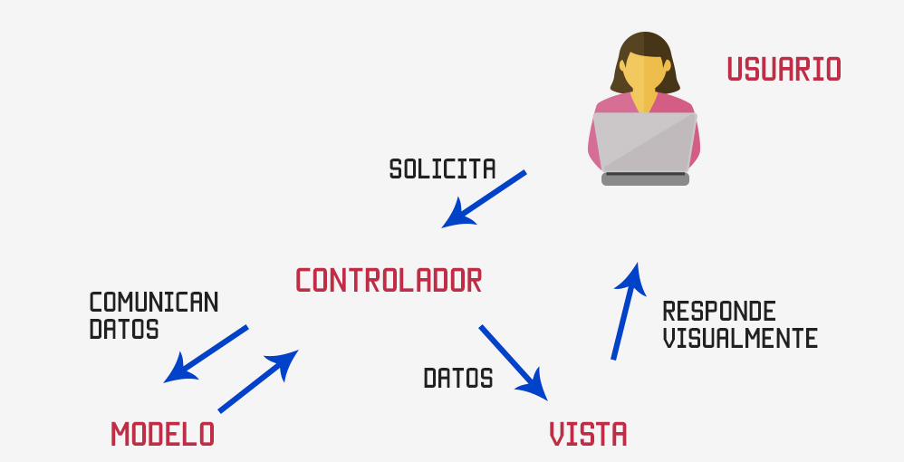

[Artículo en Wikipedia](https://es.wikipedia.org/wiki/Modelo%E2%80%93vista%E2%80%93controlador )

> [!NOTE] 
> 
> **COMPONENTES**
> 
> **Modelo (Model)**
>
> Gestiona los datos y la lógica de negocio.
> 
> Ejemplos:
> 
> - Consultas a bases de datos.
> - Validaciones.
>
> **Vista (View)**
> 
> Se encarga de mostrar la información al usuario.
> 
> Ejemplos:
>
> - Páginas HTML.
> - Plantillas.
> 
> **Controlador (Controller)**
> 
> Recibe las peticiones del usuario y coordina la aplicación.
> 
> Funciones:
> 
> - Procesar formularios.
> - Llamar al modelo.
> - Seleccionar la vista adecuada.
>

**Funcionamiento básico**

1. El usuario realiza una petición.
2. El controlador recibe la petición.
3. El modelo obtiene o procesa los datos.
4. La vista muestra la información.

**Frameworks conocidos**

- Laravel
- Django
- Ruby on Rails
- ASP.NET MVC

**Ventajas**

- Separación clara de responsabilidades.
- Facilita mantenimiento y reutilización.
- Muy utilizado en frameworks modernos.

**Inconvenientes**

- Puede resultar complejo para principiantes.
- Requiere organización adecuada.


## 7.4. Arquitectura monolítica

Toda la aplicación se desarrolla y despliega como un único bloque.

Todos los módulos forman parte del mismo proyecto.

**Características**

- Un único despliegue.
- Un solo proyecto.
- Código centralizado.

**Ventajas**

- Fácil de desarrollar inicialmente.
- Despliegue sencillo.
- Adecuada para proyectos pequeños.

**Inconvenientes**

- Difícil mantenimiento en proyectos grandes.
- Escalabilidad limitada.
- Cambios más arriesgados.


## 7.5. Arquitectura de microservicios

La aplicación se divide en pequeños servicios independientes.

Cada microservicio realiza una función concreta.

**Ejemplo**

Una plataforma puede dividirse en:

- Servicio de usuarios.
- Servicio de pagos.
- Servicio de productos.
- Servicio de notificaciones.

Todos los servicios se comunican mediante APIs.

**Ventajas**

- Alta escalabilidad.
- Servicios independientes.
- Facilita el trabajo de equipos grandes.

**Inconvenientes**

- Arquitectura compleja.
- Mayor dificultad de despliegue.
- Requiere monitorización y coordinación.


## 7.6. Arquitectura basada en APIs

El servidor proporciona una API que puede ser utilizada por distintos clientes.

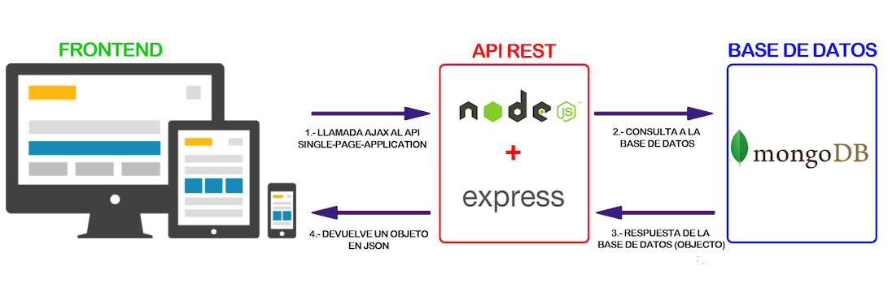

**Clientes habituales**

- Aplicaciones web.
- Aplicaciones móviles.
- Aplicaciones de escritorio.

**Tecnologías frecuentes**

- REST
- JSON
- GraphQL

**Ventajas**

- Gran flexibilidad.
- Permite separar frontend y backend.
- Facilita integración con otras aplicaciones.

**Inconvenientes**

- Mayor complejidad en seguridad.
- Necesidad de documentación adecuada.


## 7.7. Comparativa de arquitecturas

| Arquitectura     | Uso habitual                  | Ventaja principal               | Dificultad |
| ---------------- | ----------------------------- | ------------------------------- | ---------- |
| Cliente-servidor | Aplicaciones web básicas      | Simplicidad                     | Baja       |
| Tres capas       | Aplicaciones empresariales    | Organización                    | Media      |
| MVC              | Frameworks web                | Separación de responsabilidades | Media      |
| Monolítica       | Proyectos pequeños y medianos | Despliegue sencillo             | Baja       |
| Microservicios   | Grandes plataformas           | Escalabilidad                   | Alta       |
| Basada en APIs   | Aplicaciones modernas         | Flexibilidad                    | Media      |


La elección de una arquitectura depende del tamaño del proyecto, los requisitos de escalabilidad y la complejidad de la aplicación.


## 7.8. Diferencias importantes

### 7.8.1. MVC vs Arquitectura en tres capas

- La arquitectura en tres capas separa la aplicación por niveles funcionales.
- MVC organiza principalmente la estructura interna del código.

### 7.8.2. Monolito vs Microservicios

**Monolito**

- Todo el sistema está unido.
- Más sencillo de desarrollar.
- Menor complejidad.

**Microservicios**

- Servicios independientes.
- Mayor escalabilidad.
- Más complejidad técnica.


# 8. Persistencia de los datos

- Uso de archivos
- Bases de datos relacionales
  - Subtipo importante: **BBDD objeto-relacionales**.
- Bases de datos no relacionales
  - Subtipo importante: **BBDD noSQL**.


## 8.1. Bases de datos relacionales

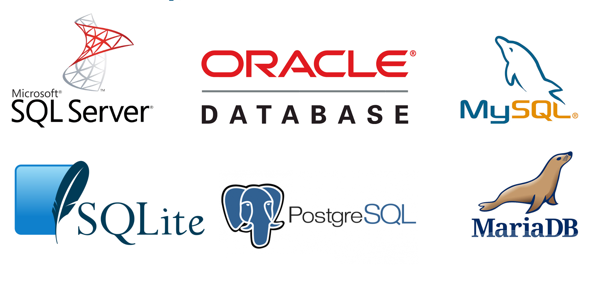


## 8.2. Bases de datos no relacionales (noSQL)

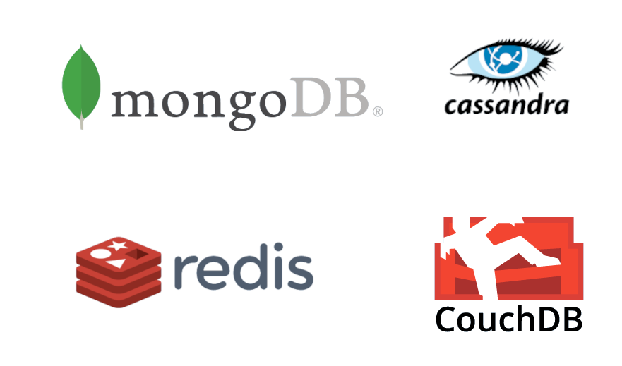


# 9. Desarrollo Backend

En el desarrollo backend son muy numerosos los lenguajes de programación y frameworks que podemos usar. Actualmente las tecnologías web desarrolladas con Javascript están en plena efervescencia tanto en la parte *frontend* como *backend*. Es un ecosistema muy dinámico y con ideas novedosas e innovadoras.

El gran interés despertado se debe, entre muchas otras cosas, a:

1. Javascript puede usarse tanto en frontend, como backend. De esta forma no es necesario aprender 2 lenguajes.
2. Javascript permite ejecución asíncrona de código desde hace tiempo, algo muy necesario en las aplicaciones web.
3. Es un lenguaje muy eficiente y rápido. Más aún si se sabe utilizar adecuadamente.
4. Está soportado por todos los navegadores en el frontend. Existen numerosos sitios donde desplegar aplicaciones basadas en NodeJS para el backend.
5. Existe gran cantidad de software y paquetes escritos en Javascript.
6. Existe gran cantidad de documentación y desarrolladores.

Como desventajas, pueden señalarse las siguientes:

1. Existen tantos frameworks basados en Javascript que resulta abrumador.
2. Cada framework ofrece una forma de desarrollo y campo de aplicación diferentes, lo cual genera confusión entre los recién llegados.
3. Es difícil seguir el ritmo de las tecnologías que van surgiendo. 
   

En el lado servidor usaremos **NodeJS como entorno de ejecución** y como framework del lado servidor usaremos **NextJS 13**.

> [!NOTE]
>
> Actualmente, no existe un único entorno de ejecución, sino 3:
>
> **Node**: https://nodejs.org
>
> **Deno**: https://deno.com/ 
>
> **Bun**: https://bun.sh/


## 9.1. Lenguajes de servidor

A continuación se muestra un ejemplo de código de una pequeña aplicación desarrollada en distintos lenguajes de servidor.

Los lenguajes son:

- PHP
- .NET
- JSP
- JAVA
- PYTHON
- NODEJS
  

**PHP**

```php
<!DOCTYPE html>
<!-- PHP: /var/www/html/hello.php => http://localhost/hello.php -->
<!-- Servidor Apache2 con módulo libapache2-mod-php en Linux -->
<html>
<body>

<?php

$color = "red";
echo "My car is " . $color . "<br>";
echo "My house is " . $color . "<br>";
echo "My boat is " . $color . "<br>";

?>

</body>
</html>
```


**ASP.NET**

```csharp
<%@ Page Language="C#" %>
<!DOCTYPE html>
<!-- ASP.NET: /var/www/html/hello.aspx => http://localhost/hello.aspx -->
<!-- Servidor Apache2 con módulo libapache2-mod-mono en Linux -->
<html>
<body>

<%

string color = "red";
Response.Write("My car is " + color + "<br>");
Response.Write("My house is " + color + "<br>");
Response.Write("My boat is " + color + "<br>");

%>

</body>
</html>
```

**JSP**

```jsp
<!DOCTYPE html>
<!-- JSP: /var/lib/tomcat9/webapps/ROOT/hello.jsp  => http://localhost:8080/hello.jsp -->
<!-- Servidor Tomcat9 en Linux -->
<html>
<body>

<%

String color = "red";
out.println("My car is " + color + "<br>");
out.println("My house is " + color + "<br>");
out.println("My boat is " + color + "<br>");

%>

</body>
</html>
```

**PYTHON/DJANGO**

```python
<!-- PYTHON/DJANGO -->
<!DOCTYPE html>
<html>
<body>


  My car is {{ color }} <br>
  My house is {{ color }} <br>
  My boat is {{ color }} <br>


</body>
</html>
```

**JAVA**

```java
// JAVA SERVLET
import java.io.IOException;
import java.io.PrintWriter;
import jakarta.servlet.ServletException;
import jakarta.servlet.annotation.WebServlet;
import jakarta.servlet.http.HttpServlet;
import jakarta.servlet.http.HttpServletRequest;
import jakarta.servlet.http.HttpServletResponse;

@WebServlet("/MyServlet")
public class MyServlet extends HttpServlet {
    protected void doGet(HttpServletRequest request, HttpServletResponse response)
    throws ServletException, IOException {
        response.setContentType("text/html");
        PrintWriter out = response.getWriter();

        String color = "red";
        out.println("<!DOCTYPE html>");
        out.println("<html>");
        out.println("<body>");
        out.println("My car is " + color + "<br>");
        out.println("My house is " + color + "<br>");
        out.println("My boat is " + color + "<br>");
        out.println("</body>");
        out.println("</html>");
    }
}
```


**NODEJS**

```javascript
const express = require('express');
const app = express();
const port = 3000;

app.get('/', (req, res) => {
  const color = "red";
  const html = `
    <!DOCTYPE html>
    <html>
    <body>
      <p>My car is ${color}</p>
      <p>My house is ${color}</p>
      <p>My boat is ${color}</p>
    </body>
    </html>
  `;
  res.send(html);
});

app.listen(port, () => {
  console.log(`Server is running on http://localhost:${port}`);
});
```


**NEXTJS**
```javascript
import React from 'react';

const Home = () => {
  const color = "red";

  return (
    <html>
      <body>
        <p>My car is {color}</p>
        <p>My house is {color}</p>
        <p>My boat is {color}</p>
      </body>
    </html>
  );
};

export default Home;
```

# 10. NodeJS


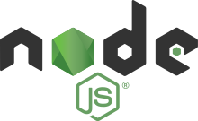

Node.js es un **entorno en tiempo de ejecución** multiplataforma, de código abierto, para la capa del servidor basado en el lenguaje de programación **JavaScript**, asíncrono, con E/S de datos en una arquitectura orientada a eventos y **basado en el motor V8 de Google**.


Este entorno nos permitirá desarrollar aplicaciones en el servidor usando Javascript. También es muy utilizado como plataforma de desarrollo para frameworks del lado cliente.

Posee un extenso repositorio de paquetes para prácticamente cualquier funcionalidad que deseemos. 

Trabajaremos con la version LTS, por ser más estable y tener soporte a largo plazo. 


## 10.1. Instalación del entorno de ejecución NodeJS

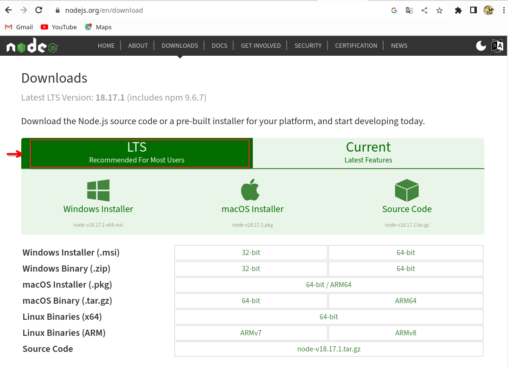

La instalación de NodeJS es bastante sencilla. Existen instaladores para Windows y Mac. 

En el caso de Linux lo haremos desde el terminal de texto. Aquí tienes los comandos. Es copiar y pegar.

```bash
# instalamos nvm (Node Version Manager)
curl -o- https://raw.githubusercontent.com/nvm-sh/nvm/v0.40.0/install.sh | bash

# descargamos e instalamos Node.js (después necesitarás reiniciar el terminal)
nvm install 22
```

Los versiones instaladas se guardarán en la carpeta del usuario, en `~/.nvm/versions/node/`


Una vez realizada la instalación dispondremos de 3 utilidades:

- **node**:  es el entorno de ejecución propiamente dicho.
- **npm**:  es el gestor de paquetes.
- **npx**:  es el lanzador de paquetes ejecutables.

Podemos comprobar que se han instalado correctamente y la version de cada utilidad:

```bash
node --version
npm  --version
npx  --version
nvm  --version
```

Si nos muestra la versión de cada uno, es que la instalación fue exitosa.


## 10.2. Probando Node

Podemos lanzar el intérprete de node, simplemente ejecutando en un terminal el comando `node`:

```bash
node 
Welcome to Node.js v18.17.1.
Type ".help" for more information.
> 
```

Algunos comandos: 


```javascript
console.log("Hola mundo")
```

```javascript
for (let i=0; i<10; i++) console.log (i)
```

```javascript
let desarrolladores = [
    { nombre: 'Juan', tipo: 'móvil', edad: 24 },
    { nombre: 'Inma', tipo: 'móvil', edad: 31 },
    { nombre: 'Ana',  tipo: 'web',   edad: 25 },
    { nombre: 'Eva',  tipo: 'web',   edad: 30 },
    { nombre: 'José', tipo: 'móvil', edad: 33 }
];

console.table(desarrolladores)
```

```javascript
const fs = require('fs')

// Creación de archivo leeme.txt
const datos = `
Este contenido ha sido generado desde Javascript
y escrito en un archivo desde NodeJS.

Chao.
`

fs.writeFile ("leeme.txt", datos, (error) => {
  if (error)
    console.log(error);
  else 
    console.log("Archivo creado exitosamente");
})
```

```javascript
const fs = require('fs')

// Lectura de archivo leeme.txt
fs.readFile('leeme.txt', 'utf8', (error, datos) => {
  if (error) 
    console.error(error);
  else
    console.log(datos);
})
```


> **ACTIVIDAD**
>
> Escribe `os.` y pulsa tabulador 2 veces
>
> Te aparecerán todas las propiedades y métodos disponibles en este módulo.
>
> Ejecuta los siguientes y haz una captura de pantalla:
> 
> `os.type()`
> 
> `os.platform()`
> 
> `os.arch()`
>
> `os.release()`
>
> `os.cpus()`
>
> `os.totalmem()`
>
> `os.freemem()`
>
> `os.uptime()`
>
> `os.networkInterfaces()`
>
> `os.userInfo()`


> **ACTIVIDAD**
>
> Escribe `process.` y pulsa tabulador 2 veces
>
> Te aparecerán todas las propiedades y métodos disponibles en este módulo.
>
> Ejecuta los siguientes y haz una captura de pantalla:
>
> `process.env`
>
> `process.pid`
>
> `process.ppid`
> 
> `process.uptime()`


Para salir de Node, escribimos `.exit` o pulsamos las teclas `Ctrl+D`.

## 10.3. Probando VSCode

La manera anterior de trabajar es muy incómoda. Nos sirve para tareas muy simples, pero si deseamos trabajar más cómoda podemos hacer uso de un editor o IDE. En la captura de más abajo se muestra un ejemplo de uso de VSCode. En el terminal lanzamos **`node  --watch  codigo.js`**, lo cual dejará a Node escuchando los cambios en el archivo `codigo.js`, y cada vez que guardemos los cambios a disco se ejecutará su código.

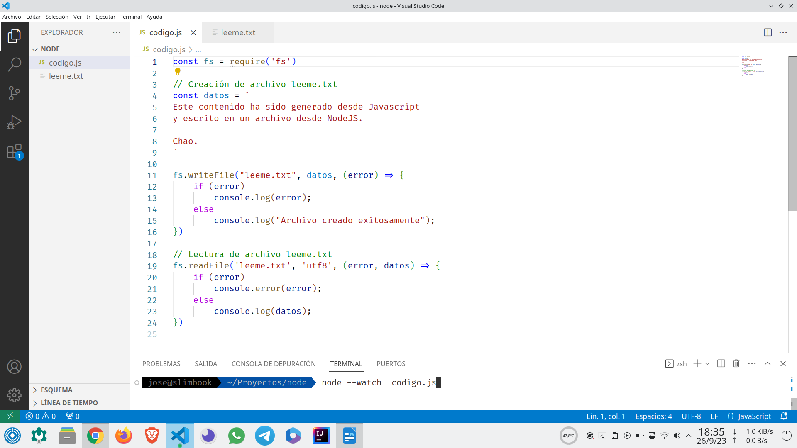


## 10.4. Inicializar un proyecto

Normalmente, node no se suele ejecutar de la forma que hemos realizado previamente, sino que se crean proyectos que se ejecutan en node.

Para crear un proyecto, creamos una carpeta, entramos en ella y ejecutamos `npm init -y`
```bash
mkdir proyecto-node  &&  cd proyecto-node

npm  init  -y 
```

> [!TIP]
> 
> La opción -y (--yes) de `npm init` crea un archivo **package.json** con opciones por defecto, sin hacer preguntas al usuario.

> [!IMPORTANT]
> 
> El comando `npm` (**Node Package Manager**) es muy importante. Nos permitirá:
> - Inicializar proyectos. 
> - Instalar paquetes.
> - Desinstalar paquetes.
> - Ejecutar diversos scripts: lanzamiento de entorno de desarrollo, generación de la compilación, tests, ...


## 10.5. Archivo package.json

Una vez inicializado un proyecto, se nos generará un archivo parecido al siguiente:

```json
{
  "name": "proyecto-node",
  "version": "1.0.0",
  "description": "",
  "main": "index.js",
  "scripts": {
    "test": "echo \"Error: no test specified\" && exit 1"
  },
  "keywords": [],
  "author": "",
  "license": "ISC"
}
```
Podemos instalar módulos externos con `npm`. Por ejemplo:

```console
npm install express     # Dependencia de aplicación
npm install nodemon -D  # Dependencia de desarrollo (dev)
```

Al realizar las instalaciones anteriores, se insertarán automáticamente las siguientes líneas en el archivo anterior:

```json
  "dependencies": {
    "express": "^4.16.4"
  },
  "devDependencies": {
    "nodemon": "^1.18.4"
  }
```

> [!NOTE]
> 
> La versión de cada paquete puede diferir de la que tu tengas.


El archivo `package.json` contiene los metadatos del proyecto, entre estos están 3 cosas muy importantes:

- **scripts**:  tareas que podremos invocar, por ejemplo `npm run test` 
- **dependencies**: paquetes que nuestra aplicación necesita para ofrecer la funcionalidad deseada y serán incorporados a la aplicación final. 
- **devDependencies**: paquetes que sólo usaremos durante el desarrollo, no se incorporan a la aplicación final.


## 10.6. Ejecución de paquetes sin necesidad de instalar

Si no tenemos permisos para instalar paquetes en el sistema, podemos usar la herramienta **npx**. Características:

- Es una herramienta de ejecución de paquetes.
- **Ejecuta** paquetes ejecutables de `node.js` sin necesidad de instalarlos.
- Es más cómodo que usar `sudo npm install -g ...`
- Ejemplo (lanzar servidor web):
  
**Usando `sudo npm install -g ...`**

  ```bash
  sudo npm  install  -g  http-server
  http-server
  ```
**Usando `npx  ...`**
 
  ```bash
  npx  http-server
  ```

**Ejemplos**

```
npx  serve                     # Inicia un servidor web
npx  http-server               # Inicia otro servidor web
npx  live-server               # Inicia otro servidor web con recarga de archivos modificados
npx  servor                    # Inicia otro servidor web con recarga de archivos modificados

npx  @angular/cli  new         nombre-proyecto  # Iniciar proyecto de Angular 
npx  create-react-app          nombre-proyecto  # Iniciar proyecto de React 
npx  @vue/cli  create          nombre-proyecto  # Iniciar proyecto de Vue
npx  degit  sveltejs/template  nombre-proyecto  # Iniciar proyecto de Svelte   
```


## 10.7. Módulos incorporados (built-in) en Node

- No es necesario instalarlos.
- Ya vienen con node.js.
- Ejemplos:
  - **fs**:  Sistema de archivos
  - **http**:  Servidor HTTP
  - **https**:  Servidor HTTPS
  - **os**:  Sistema operativo
  - **path**:  Rutas de archivos
  - **process**:  Información y control del proceso actual
  - ...

Mas info: https://www.w3schools.com/nodejs/ref_modules.asp


# 11. Linter para Javascript (y también para CSS)

Un linter es un software que se encarga de examinar el código del programador y lo ayuda cuando detecta errores de sintaxis, código incorrecto, malas prácticas o incluso promueve a seguir unas normas de estilo. 

Dos linter muy conocidos son:
- **eslint** (para Javascript)
- **stylelint** (para CSS)


Podemos configurar un linter básico de Javascript haciendo:

```javascript
npm  init  -y               # Inicialización de proyecto
npm  init  @eslint/config   # Asistente de configuración de ESLint
```

Más información en https://lenguajejs.com/javascript/calidad-de-codigo/eslint/

Otra forma más directa, aunque menos configurable, es realizar:

```javascript
npm  init  -y                                        # Inicialización de proyecto
npm  install -D standard  stylelint-config-standard  # Instalamos el conjunto de reglas standard
```

E insertamos en `package.json`

```json
"eslintConfig": {
  "extends": [ "standard" ]
},
"stylelint": {
  "extends": "stylelint-config-standard",
  "rules": {
     "indentation": 2
  }
},
``` 

# 12. Configuración de usuario en VSCode

## 12.1. Atajos imprescindibles del teclado

- `Ctrl+K`, `Ctrl+S`: Configuración de atajos del teclado
- `Ctrl+,`: Prefeencias del usuario
- `Ctrl+P`: Ir a archivo, ...
- `Ctrl+Shift+P`: Paleta de comandos

**Referencias**:

- [keyboard-shortcuts-windows](https://code.visualstudio.com/shortcuts/keyboard-shortcuts-windows.pdf)
- [keyboard-shortcuts-linux](https://code.visualstudio.com/shortcuts/keyboard-shortcuts-linux.pdf)
- [keyboard-shortcuts-macos](https://code.visualstudio.com/shortcuts/keyboard-shortcuts-macos.pdf)


## 12.2. Archivo settings.json

La configuración de usuario se guarda en un archivo **`settings.json`**, dentro de la carpeta del usuario, en la subcarpeta `.config/Code/User`.

Para acceder al archivo anterior y realizar las configuraciones deseadas, pulsamos **`Ctrl+Shift+P`** para acceder a la paleta de comandos de VSCode, y luego escribimos `user settings json`. Abrimos el archivo, y editamos las opciones de configuración deseadas. 

Por ejemplo, mi configuración es la siguiente:

```json
{
    "workbench.colorTheme": "Default Light+",
    "workbench.iconTheme": "material-icon-theme",
    // Tailwind autofold 
    "tailwind-fold.autoFold": true,
    // Actualizar etiquetas de cierre de HTML y JSX
    "editor.linkedEditing": true,
    // Fuente con ligaduras
    "editor.fontLigatures": true,
    "editor.fontVariations": false,
    "editor.fontFamily": "'Fira Code', monospace",
    "svg.preview.mode": "svg",
    // Desactivamos validación CSS por defecto de VSCode
    "css.validate": false,
    "less.validate": false,
    "scss.validate": false,
    // Activamos stylelint para CSS
    "stylelint.enable": true,
    // linters: activamos eslint para Javascript
    "javascript.validate.enable": true,
    "eslint.validate": [
        "javascript"
    ],
    "eslint.enable": true,
    // linters: arreglamos código CSS + Javascript al guardar a disco
    "editor.codeActionsOnSave": {
        "source.fixAll.eslint": true,
        "source.fixAll.stylelint": true,
    },
    // Desactivamos la opción siguiente para no interferir con los linters
    // "editor.formatOnSave": true,
    "extensions.ignoreRecommendations": true,
    // Permite la edición simultánea de inicio y cierre de etiquetas HTML y JSX
    "editor.linkedEditing": true,
    // Soporte de Emmet para JSX
    "emmet.includeLanguages": {
        "javascript": "javascriptreact"
    }
}
```

Básicamente, la configuración hace lo siguiente:

- Se usa fuente con ligaduras [`Fira Code`](https://github.com/tonsky/FiraCode). Dicha fuente tiene que estar instalada previamente en el sistema.
- Se activa el [`lint`](https://es.wikipedia.org/wiki/Lint) para CSS y Javascript.
- Al guardar los cambios a disco, se arregla ( *fix* ) el código. Algunos errores requerirán la intervención del usuario al no poder solucionarse automáticamente.
- Se activa la edición enlazada, que permite modificar las 2 etiqueta HTML de una sola vez.   

> [!IMPORTANT] 
>
> Para que la configuración anterior sea efectiva es necesario cumplir los 3 requisitos siguientes:
> - Tener la fuente Fira Code instalada en el sistema.
> - Tener el plugin ESLint instalado en VSCode
> - Tener el plugin Stylelint instalado en VSCode


## 12.3. Archivo keybindings.json

La configuración de usuario para atajos de teclado se guarda en un archivo **`keybindings.json`**, dentro de la carpeta del usuario, en la subcarpeta `.config/Code/User`.


Por ejemplo, mi configuración es la siguiente:

```json
// Coloque sus atajos de teclado en este archivo para sobreescribir los valores predeterminados
[
    {
        "key": "ctrl+l",
        "command": "editor.action.insertSnippet",
        "when": "editorTextFocus",
        "args": {
          "snippet": "console.log(${TM_SELECTED_TEXT}$1);"
        }
      }
]
```

Esta configuración me permite seleccionar un texto o variable y envolverla dentro de `console.log`. Es muy útil para realizar tareas de depuración.


> [!NOTE]
>
> Los archivos de configuración de VSCode en realidad no son JSON, sino **JSONC** (JSON con comentarios). JSONC no es un estándar oficial. A continuación se muestra una tabla comparativa de características de JSON, JSONC y JSON5. 
> 
>
> | Característica              | JSON | JSONC         | JSON5         |
> |----------------------------|------|---------------|---------------|
> | Comentarios                | ❌   | ✅            | ✅            |
> | Claves sin comillas        | ❌   | ❌            | ✅            |
> | Comillas simples           | ❌   | ❌            | ✅            |
> | Notación JS extra          | ❌   | ❌            | ✅ (`NaN`, etc.) |
> | Coma en la última línea    | ❌   | ❌            | ✅            |
> | Compatible con APIs        | ✅   | ❌            | ❌ (generalmente) |
> | Soporte general            | 🔥   | 😐            | 😐            |
>
> Por otro lado, JSON5 es poco usuado y no es nativamente compatible con todos los lenguajes. Para usarlo necesitas una librería que lo interprete.


## 12.4. Plugins

Existen numerosos plugins para VSCode que nos permiten adaptar el entorno de desarrollo a nuestras necesidades. Para el desarrollo web suelen ser habituales, aunque pueden instalarse muchos otros, los siguientes:

**Spanish Language Pack for Visual Studio Code**

Para cambiar el idioma de VSCode a español. 


**Material Icon Theme**

Permite mostrar un icono por cada carpeta y archivo.


**Multiple cursor case preserve**

Nos permite preservar mayúsculas y minúsculas cuando editamos con cursor múltiple (Ctrl+D)


**ESLint**

Para hacer *lint* de Javascript.


**Stylelint**

Para hacer *lint* de CSS.


**Error Lens** 

Para mostrar los errores en la línea en la que ocurren.
Este plugin puede considerarse opcional, según el caso. De cualquier modo, una vez instalado, puede deshabilitarse si lo consideramos intrusivo.


**Console Ninja**

Este plugin es opcional, pero recomendado para realizar tareas de depuración de código. Nos permite mostrar dentro del propio VSCode los mensajes producidos por `console.log()` sin tener que recurrir al terminal constantemente.


**REST Client**

Este plugin es opcional. Es útil cuando deseamos *testear endpoints* de una API REST.


**Svg Preview**

Este plugin es opcional, pero recomendado si trabajamos con imagenes vectoriales `.svg`. Permite su visualización gráfica.


**Markdown All in One**

Este plugin es opcional, pero recomendado si trabajamos con Markdown. Permite numerar automáticamente los títulos y crear índice de contenido, entre otras funcionalidades.


**ES7+ React/Redux/React-Native snippets**

Este plugin es opcional, pero recomendado si trabajamos con React y/o NextJS.


**Prisma**

Este plugin es opcional. Recomendado si trabajamos con ORM Prisma.


**Tailwind CSS IntelliSense** y **Tailwind Fold**

Plugins opcionales. Recomentados si trabajamos con framework CSS Tailwind.


# 13. Referencias

- [Apuntes de Javascript](https://github.com/jamj2000/Javascript)
- [Vídeo: ¡Trucazos de Visual Studio Code para Programadores Web!](https://www.youtube.com/live/UdIcAdQtiws?si=nON_1sTZNnTQP1ZB)
