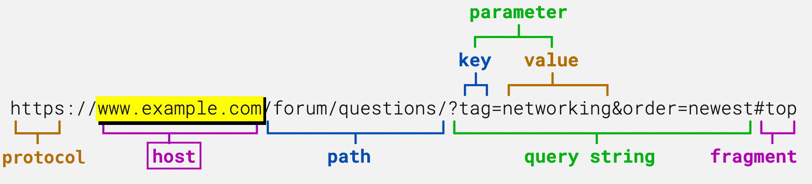
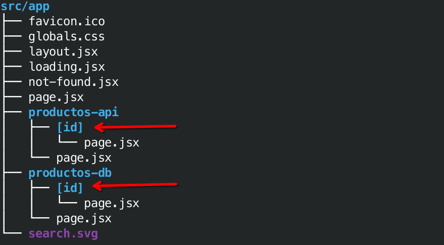
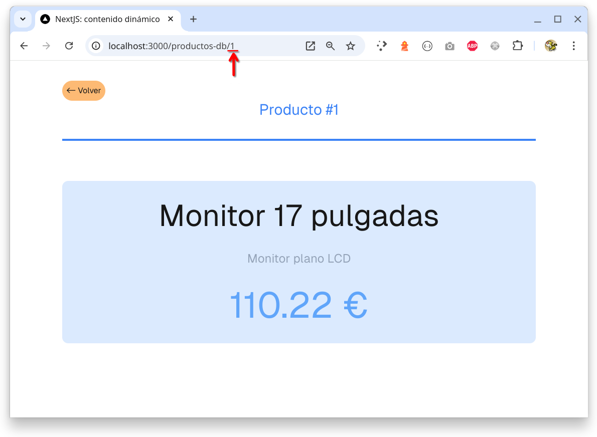
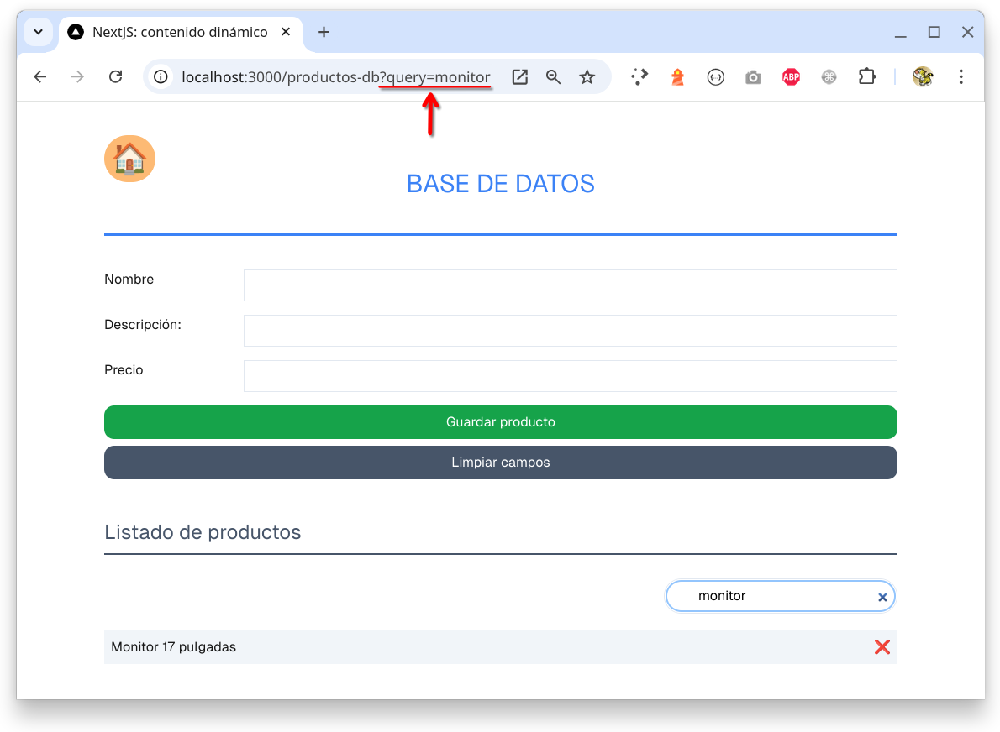
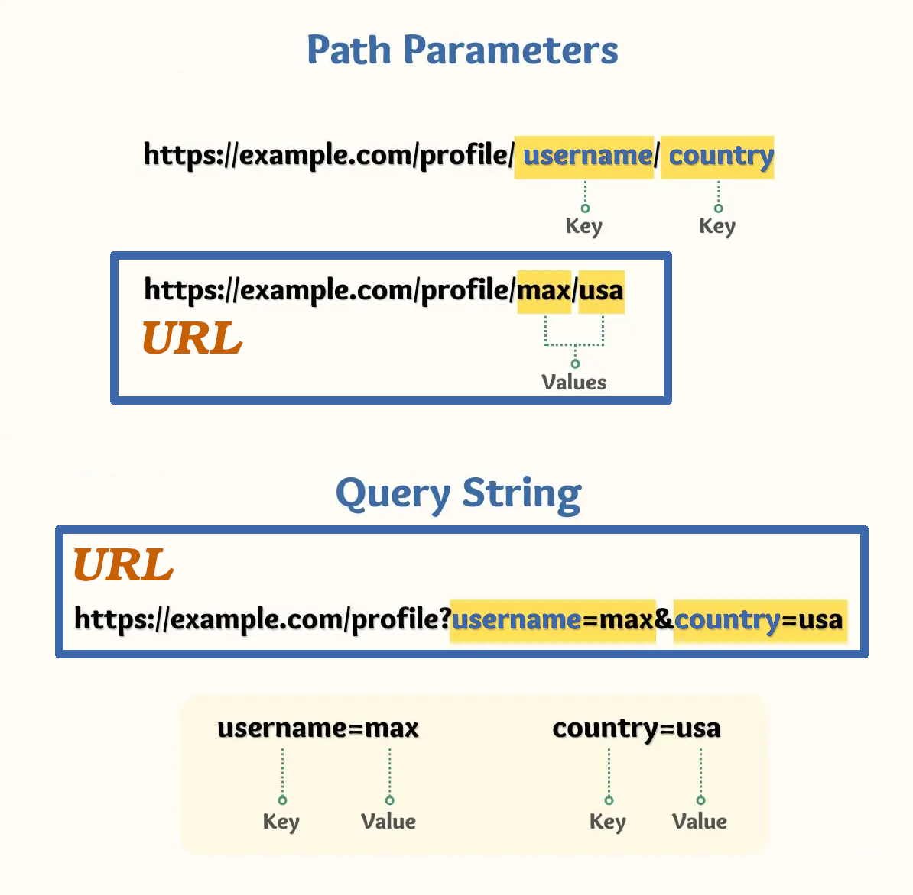
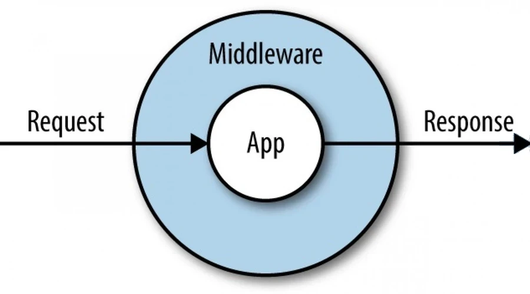

> DESARROLLO WEB EN ENTORNO SERVIDOR

# Tema 4: CONTENIDO DINÁMICO <!-- omit in toc -->
> Desarrollo de aplicaciones Web utilizando código embebido  
> PARAMS, SEARCHPARAMS, COOKIES

**[`PROYECTOS DE EJEMPLO`](PROYECTOS.md)**


---

- [1. Introducción](#1-introducción)
- [2. Contenido estático vs Contenido dinámico](#2-contenido-estático-vs-contenido-dinámico)
- [3. Renderizado en el Servidor vs Renderizado en el Cliente](#3-renderizado-en-el-servidor-vs-renderizado-en-el-cliente)
- [4. Características dinámicas](#4-características-dinámicas)
- [5. Parámetros de URL](#5-parámetros-de-url)
  - [5.1. Parámetros de ruta](#51-parámetros-de-ruta)
  - [5.2. Parámetros de consulta](#52-parámetros-de-consulta)
  - [5.3. Parámetros de ruta vs Parámetros de consulta.](#53-parámetros-de-ruta-vs-parámetros-de-consulta)
- [6. Paginación de datos](#6-paginación-de-datos)
  - [6.1. Ejemplo](#61-ejemplo)
  - [6.2. Ejemplo avanzado: Paginación y búsqueda](#62-ejemplo-avanzado-paginación-y-búsqueda)
- [7. Cookies](#7-cookies)
  - [7.1. Tipos de cookies](#71-tipos-de-cookies)
  - [7.2. Generar Cookies](#72-generar-cookies)
  - [7.3. Leer Cookies](#73-leer-cookies)
  - [7.4. Eliminar Cookies](#74-eliminar-cookies)
- [8. Middleware](#8-middleware)
  - [8.1. Archivo middleware.js](#81-archivo-middlewarejs)
- [9. ANEXO I: Parámetros de ruta y consulta en página de cliente](#9-anexo-i-parámetros-de-ruta-y-consulta-en-página-de-cliente)
- [10. ANEXO II: SSG](#10-anexo-ii-ssg)
- [11. Referencias](#11-referencias)


--- 


# 1. Introducción

En este tema veremos las características que nos proporciona NextJS para la gestión de contenido dinámico. Normalmente este contenido suele provenir de una **Base de Datos** o de una **API REST**.

Cuando trabajamos con este tipo de contenido, suele asaltarnos la duda de si debería renderizarse en el lado servidor o en el lado cliente. Así que en el siguiente apartado trataremos este asunto. Una vez visto un ejemplo que muestra los distintos tipos de renderizado, dedicaremos el resto del tema a trabajar desde el lado servidor.

Al crear páginas que gestionan contenido dinámico suele ser habitual la necesidad de pasarle parámetros, a los que NextJS denomina `params` y `searchParams`. Veremos ejemplos de uso más adelante en este tema.

Después de haber estudiado los parámetros de las páginas dinámicas, pasaremos a trabajar las `cookies`, que es también una información gestionada de forma dinámica en cada petición/respuesta.

Por último, aunque no está directamente relacionado con el contenido de este tema, haremos una breve incursión al `middleware`.


# 2. Contenido estático vs Contenido dinámico

La definición de contenido estático y dinámico es muy sencilla:

- **Contenido estático** es aquel que **NO cambia** a lo largo del tiempo.
- **Contenido dinámico** es aquel que **SÍ cambia** a lo largo del tiempo.

> [!IMPORTANT]
> 
> **MUY IMPORTANTE**
>
> **Cuando hablamos de contenido, nos referiremos al código fuente de la página**, no a lo que ve el usuario.
>
> Por ejemplo, podemos tener una página con código javascript que se ejecuta en el navegador. Dicho código se encarga de generar un número aleatorio, por lo cual el usuario verá un número distinto cada vez que refresque la página. Sin embargo el código javascript no cambia nunca. Decimos por tanto que el contenido es estático. 
>
> Lo dicho anteriormente puede resultar contraintuitivo pero, debido a razones históricas, ésta es la terminología empleada. En los inicios, los servidores web sólo eran capaces de servir contenido estático: HTML, CSS, Javascript, imágenes, ... No se entraba a valorar si el código javascript enviado al navegador modificaba o no dicha información. **Desde el punto de vista del lado servidor, el contenido enviado al navegador es estático**. Hoy en día, con el uso de AJAX y `fetch` en el navegador resulta aún más contraintuitivo decir que el contenido es estático, pero  así es considerado por muchos desarrolladores y por NextJS, como veremos más adelante con un ejemplo práctico.
>
> **El término de contenido dinámico se reserva en exclusiva para cuando dicho contenido es generado desde el lado servidor**. Uno de los primeros procedimientos que se usó para generar contenido dinámico fue [CGI](https://es.wikipedia.org/wiki/Interfaz_de_entrada_com%C3%BAn). Luego vendrían gran cantidad de lenguajes interpretados en el servidor, siendo PHP uno de los más populares. La generación de contenido dinámico requiere de un servidor web más complejo, que sea capaz de ejecutar código y de manejar los problemas de seguridad que ello pudiera acarrear.


> [!NOTE]
>
> El contenido dinámico requiere de renderizado en el lado servidor, lo cual ralentiza la respuesta al usuario.
>  


# 3. Renderizado en el Servidor vs Renderizado en el Cliente

El renderizado es la **representación gráfica del contenido de una página**, es decir, el proceso necesario para mostrar una página web en un navegador.

Existen 2 tipos de renderizado:

1. Client-Side Rendering (CSR) 
2. Server-Side Rendering (SSR)

NextJS soporta ambos tipos de renderizado, aunque recomienda usar SSR siempre que se pueda. Podemos entender SSR como sinónimo de generación en el lado servidor de contenido dinámico.

Para indicar a NextJS que una página o componente será renderizado en el lado cliente debemos colocar la primera línea del archivo con el siguiente texto.

```js
'use client'
```

**Ejemplo práctico**

A continuación tienes el código fuente para trabajar los conceptos anteriores.

- [Static vs Dynamic / CSR vs SSR](https://github.com/jamj2000/nxrender)

Para realizar ***build*** ejecutamos: 

```sh
npm  run  build
```


Para lanzar: 

```sh
npm  run  start
```

Diferencias entre SSR y CSR

| SSR                                                                                          | CSR                                                                             |
| -------------------------------------------------------------------------------------------- | ------------------------------------------------------------------------------- |
| SSR significa Renderizado del lado del servidor                                              | CSR significa Renderizado del lado del cliente                                  |
| Representa la página en el lado del servidor                                                 | Representa la página en el lado del cliente                                     |
| Es más amigable con el SEO                                                                   | Es menos compatible con SEO                                                     |
| La interactividad del usuario es limitada                                                    | La interactividad del usuario es altamente interactiva                          |
| Consume los recursos del servidor                                                            | Consume los recursos del cliente                                                |
| Ofrece un mejor rendimiento en dispositivos de baja potencia                                 | Es posible que no ofrezca un mejor rendimiento en dispositivos de baja potencia |
| Es posible que se requieran más recursos del servidor para manejar las tareas de renderizado | No requiere más recursos del servidor para manejar las tareas de renderizado    |


# 4. Características dinámicas


Las características dinámicas se basan en información que sólo se puede conocer en el momento de la solicitud, como las cookies del usuario, los encabezados de las solicitudes actuales o los parámetros de ruta y consulta de la URL. En Next.js, estas características dinámicas son:

- `params` (**parámetros de ruta**): El uso de esta propiedad en las `props` de una página habilitará la página para el renderizado dinámico en el momento de la solicitud. 
- `searchParams` (**parámetros de consulta**): El uso de esta propiedad en las `props` de una página habilitará la página para el renderizado dinámico en el momento de la solicitud.
- `cookies()` (**cookies**):  al usarse en un componente de servidor optará por toda la ruta hacia el renderizado dinámico en el momento de la solicitud.
- `headers()` (**cabeceras**): al usarse en un componente de servidor optará por toda la ruta hacia el renderizado dinámico en el momento de la solicitud.


> [!NOTE]
> 
>  A partir de NextJS 15, deberemos hacer uso asíncrono de las características anteriores.
>
> ```js
> // Ejemplo
> import { cookies, headers } from 'next/headers'
>
> async function Page ( { params, searchParams }) {
>    const { id, slug } = await params
>    const { query, sort } = await searchParams
>
>    const cookieStore = await cookies()
>    const cabeceras = await headers()
>
>    // ...
> }
>
> export default Page
> ```


**Referencia:**

- https://nextjs.org/docs/app/building-your-application/rendering/server-components#dynamic-apis


# 5. Parámetros de URL




Los parámetros de URL o **`URL Parameters`** son partes de la URL en las cuales los valores que aparecen pueden variar de una petición a otra, aunque la estructura de la URL se mantiene.

En las páginas podemos acceder a los 2 tipos que existen:

- **Parámetros de ruta** `Path Parameters`
- **Parámetros de consulta** `Query Parameters` o `Query Strings` 

## 5.1. Parámetros de ruta





## 5.2. Parámetros de consulta




**Ejemplo**

Si tenemos la página `src/app/products/[store]/[category]/page.js` con el código siguiente:


```js
export default async function page({ params, searchParams }) {

    const { store, category } = await params    // parámetros de ruta
    const { sort, skip } = await searchParams   // parámetros de consulta

    console.log( store, category, sort, skip ) 

    // ...
}
```

Al acceder a la URL:

**`http://localhost:3000/products/bristol/books?sort=author&skip=1`**


Producirá la siguiente salida:

```
bristol books author 1
``` 


## 5.3. Parámetros de ruta vs Parámetros de consulta.

Los parámetros de ruta y los parámetros de consulta transportan información al servidor a través de la URL. Ambos se utilizan para el mismo propósito. Pero tienen algunas diferencias.

- Los parámetros de ruta, debes colocarlos individualmente dentro de la ruta y son obligatorios.
- Sólo puedes indicar los parámetros de ruta especificados en la URL y en el mismo orden estipulado.
- Los parámetros de consulta no modifican la ruta, debes agregarlos al final de la URL y son opcionales. 
- Puedes indicar tantos parámetros de consulta, y en el orden que quieras, después de la ruta.


Es posible expresar una URL dinámica tanto de una forma como de la otra.




Aunque, a la hora de decidir si usar parámetros de ruta o parámetros de consulta, se siguen los siguientes convenios:

- Los parámetros de ruta nos proporcionan una URL más limpia.
- **Usamos parámetros de ruta si dicha información debe ir siempre en la URL.**
- **Usamos parámetros de consulta si dicha información es opcional, como información de filtrado o búsqueda.**


# 6. Paginación de datos

Cuando recuperamos datos de una fuente (base de datos o API), a menudo deseamos no mostrar todos los datos de golpe, sino mostrarlos poco a poco en porciones más pequeñas. Esta técnica se conoce como paginación.

La decisión de realizar la paginación en el lado del servidor o del cliente en Next.js depende de varios factores, como el tamaño de los datos, la frecuencia de actualización de los datos y las necesidades de rendimiento de tu aplicación.

- **Paginación en el lado del servidor**: Si estás trabajando con **grandes conjuntos de datos** o necesitas una carga inicial rápida, puede ser más eficiente implementar la paginación en el lado del servidor. Esto significa que la lógica de paginación se ejecuta en el servidor y solo se envían al cliente los datos necesarios para la página actual. Esto puede ayudar a reducir el tiempo de carga inicial y mejorar la experiencia del usuario.
- **Paginación en el lado del cliente**: Si estás trabajando con **conjuntos de datos más pequeños** o si los datos se actualizan frecuentemente, puede ser más práctico implementar la paginación en el lado del cliente. Esto significa que todos los datos se cargan inicialmente en el cliente y la paginación se gestiona mediante JavaScript en el navegador. Esto puede simplificar la lógica del servidor y permitir una interacción más fluida con la página sin necesidad de recargarla.

En resumen, la mejor opción dependerá de las necesidades específicas de tu aplicación. En algunos casos, puede ser beneficioso combinar ambas estrategias, utilizando la paginación en el lado del servidor para la carga inicial y luego la paginación en el lado del cliente para una navegación más fluida.

## 6.1. Ejemplo

- [Código fuente de ejemplo](https://github.com/jamj2000/nxpagination.git) 


## 6.2. Ejemplo avanzado: Paginación y búsqueda

- [Aplicación de lado servidor para consultar biblioteca de libros](https://github.com/jamj2000/book-inventory)


# 7. Cookies

Una cookie es un fichero de datos que una página web le envía a tu ordenador o móvil cuando la visitas. 

Las cookies suelen utilizarse principalmente para dos finalidades principales: **recordar accesos** y **conocer hábitos de navegación**. Las cookies hacen que las páginas web puedan identificar tu ordenador, y por lo tanto, si vuelves a entrar a ellas podrán recordar quién eres y qué has hecho antes dentro de ellas.

Gracias a las cookies la página web podrá recordar que eres tú, y por lo tanto podrá permitirte seguir en el perfil con el que iniciases sesión sin tener que volver a escribir tus credenciales.

Y no sólo para iniciar sesión. Imagínate que entras en Amazon y colocas muchos archivos en tu cesta de la compra sin tener una cuenta, pero luego te vas. Entonces, cuando vuelvas a entrar, gracias a tu IP y los otros identificadores que miran las cookies, Amazon sabrá quién eres y qué hiciste antes, y muy posiblemente todavía podrá recordar lo que tenías en la cesta de la compra para que no tengas que volver a meterlo.

## 7.1. Tipos de cookies

- **Cookies persistentes**: pueden llegar a almacenarse en el dispositivo del cliente durante meses o años. A menudo, la única manera de impedirlo es haciendo un borrado manual. Es importante que lo hagas sobre todo cuando uses un ordenador público. 
- **Cookies de sesión**: siempre se borran cuando finalizas la sesión en un sitio de Internet. Lo normal es que esto suceda de forma automática cuando cierras el navegador. En las cookies de sesión, no se especifica el campo expires ni maxAge. Aunque también existe la posibilidad de indicar un tiempo de expiración usando la propiedad `expires`, o usando la propiedad `maxAge`, cuando queremos indicar al menos una validez mínima. 

> [!NOTE]
> 
> A partir de NextJS 15, el manejo de cookies se realiza de forma asíncrona. Por tanto deberemos usar `await cookies()`

A continuación se muestra como trabjar con cookies desde NextJS.

## 7.2. Generar Cookies 

**`const cookieStore = await cookies()`**  
**`cookieStore.set(name, value, options)`**  
**`cookieStore.set( { name, value, /* options */ } )`**

> [!IMPORTANT]
>
> Sólo es posible generar cookies en un `Server Action` o un `Route Handler`.
> HTTP no permite generar cookies después del comienzo de la respuesta.

```javascript
import { cookies } from 'next/headers'

const oneDay = 1000 * 60 * 60 * 24  // ms

async function setCookie( name ) {
  const cookieStore = await cookies()

  // Ejemplos
  cookieStore.set( name, 'jose')
  cookieStore.set( name, JSON.stringify({ id: 1, user: "Pepe", loginDate: new Date() }))
  cookieStore.set( name, 'jose', { httpOnly: true, secure: true })
  cookieStore.set({ name: name, value: 'jose', httpOnly: true, secure: true })
  cookieStore.set({
    name: name,
    value: 'jose', 
    httpOnly: true,
    path: '/',
    expires: Date.now() + oneDay 
    })

}
```

> [!NOTE]
> 
> Para crear una cookie de sesión que se elimine al cerrar la pestaña del navegador debes omitir la opción `expires`. 


## 7.3. Leer Cookies 

**`const cookieStore = await cookies()`**  
**`cookieStore.get(name)`**

```javascript
import { cookies } from 'next/headers'

export async function getCookie(name) {
    const cookieStore = await cookies()

    // Leemos cookie
    const cookie = cookieStore.get( name )?.value

    return cookie
}
```


## 7.4. Eliminar Cookies

**`const cookieStore = await cookies()`**  
**`cookieStore.delete(name)`**

> [!IMPORTANT]
>
> Sólo es posible eliminar cookies en un `Server Action` o un `Route Handler`.

```javascript
import { cookies } from 'next/headers'
 
async function deleteCookie( name ) {
  const cookieStore = await cookies()
  cookieStore.delete(name)

  // Otras formas de eliminar una cookie
  cookieStore.set( { name, "", expires: new Date(0) } );
  cookieStore.set( { name, "", maxAge: 0 } );
}
```

**Ejemplo práctico**

A continuación tienes el código fuente para trabajar los conceptos anteriores.

- [Gestión de cookies y sesión](https://github.com/jamj2000/nxsession)

En el proyecto anterior también se hace uso de `middleware`. Consulta el apartado siguiente.

    
**Referencias**: 

- [Documentación de NextJS](https://nextjs.org/docs/app/api-reference/functions/cookies)


# 8. Middleware

Desde el punto de vista de una aplicación NextJS, el middleware es un software que funciona como capa de conversión, traducción y/o integración.

En este escenario, el middleware permite ejecutar código antes de que se complete una petición (request). Según la petición entrante, se puede modificar la respuesta reescribiendo, redirigiendo, modificando los encabezados de petición o respuesta, o respondiendo directamente.



La integración de middleware en una aplicación puede generar mejoras significativas en el rendimiento, la seguridad y la experiencia del usuario. Algunos escenarios comunes en los que el middleware es particularmente eficaz incluyen:

- **Autenticación y autorización**: garantizar la identidad del usuario y verificar las cookies de sesión antes de otorgar acceso a páginas específicas o rutas API.
- **Redireccionamientos del lado del servidor**: redireccionar a los usuarios a nivel del servidor según ciertas condiciones (por ejemplo, configuración regional, rol del usuario).
- **Reescritura de rutas**: implementar funcionalidades o gestionar rutas heredadas al reescribir dinámicamente rutas a rutas API o páginas según las propiedades de la solicitud.
- **Detección de bots**: proteger los recursos detectando y bloqueando el tráfico de bots.
- **Registro y análisis**: capturar y analizar datos de solicitudes para obtener información antes de procesarlos en la página o API.
- **Marcado de funcionalidades**: habilitar o deshabilitar funcionalidades dinámicamente para implementar o probar sin problemas dichas funcionalidades.

Debido a la extensión de funcionalidades que pueden implementarse en el middleware, su implementación tiene cierta complejidad y require de conocimientos avanzados por parte del programador.

Para implementar dicho middleware, NextJS hace uso de un archivo `middleware.js` o `middleware.ts` que debe situarse en la raíz del proyecto. **Si tenemos carpeta `src` será ahí donde pondremos dicho archivo.** Si no tenemos carpeta `src` pondremos el archivo en la carpeta `app`.


**Referencia:**

- [Funcionalidades del middleware](https://nextjs.org/docs/app/building-your-application/routing/middleware)


## 8.1. Archivo middleware.js 

A continuación se muestra un ejemplo muy, muy básico, con el contenido esencial de este archivo:

```js
// Esta función puede ser `async` si usas `await` en su interior
export default function middleware(request) {
  // Lógica del Middleware
}

export const config = {
  matcher: [ '/about/:path*' ],
}
```

La opción **`matcher`** permite seleccionar las rutas específicas a las que se aplicará la función **`middleware`**.

Esta opción admite una lista de rutas (strings), cada cual:

- DEBE comenzar con `/`
- Puede incluir parámetros con nombre: `/about/:path` coincide con `/about/a` y `/about/b` pero no con `/about/a/c`
- Puede tener modificadores en parámetros con nombre (comenzando con :): `/about/:path*` coincide con `/about/a/b/c` porque **`*`** es cero o más. **`?`** es cero o uno y **`+`** uno o más
- Puede utilizar una expresión regular entre paréntesis: `/about/(.*)` es lo mismo que `/about/:path*`


**Referencia:**

- [Archivo middleware.js](https://nextjs.org/docs/app/api-reference/file-conventions/middleware)


# 9. ANEXO I: Parámetros de ruta y consulta en página de cliente

También es posible obtener los parámetros de ruta y los de consulta en el lado cliente. Para ello deberemos usar los hooks **`useParams`** y **`useSearchParams`**. También disponemos del hook `usePathname`, que nos devuelve la ruta (incluyento los parámetros de ruta, si existen) 

Por ejemplo, si tenemos la página `src/app/product/[name]/page.js` con el siguiente código:

```js
'use client'
import { usePathname, useParams, useSearchParams } from 'next/navigation';

const Page = () => {
  const pathname = usePathname();
  const { name } = useParams();
  const searchParams = useSearchParams();

  const provider = searchParams.get('provider');
  const screen = searchParams.get('screen');

  return (
    <>
      <p> Ruta: {pathname} </p>
      <p> Parámetro de ruta: name -&gt; {name} </p>
      <p> Parámetro de consulta: provider -&gt; {provider} </p>
      <p> Parámetro de consulta: screen -&gt; {screen}  </p>
    </>
  )
};

export default Page
```

y el usuario visita la URL `http://localhost:3000/product/laptop?provider=HP&screen=15`, entonces obtendrá el siguiente resultado

```
Ruta: /product/laptop
Parámetro de ruta: name -> laptop
Parámetro de consulta: provider -> HP
Parámetro de consulta: screen -> 15
```

**A partir de React 19**, disponemos del hook **`use`** que permite leer el valor de un recurso, ya sea un contexto o una promesa. Este hook se puede usar para leer el valor de las promesas `params` y `searchParams` y evitar el uso de `useParams` y `useSearchParams`. 

De esta manera se simplifica el código, obtenemos una sintaxis más limpia y la forma de declarar las propiedades de una página se unifica para ser igual en una página en el lado servidor y en una página en el lado cliente. Por ejemplo, el código anterior, quedaría así:

```js
'use client'
import { usePathname } from 'next/navigation';
import { use } from 'react'                          // <----


const Page = ({ params, searchParams }) => {         // <---- 
    const { name }             = use(params)         // <----
    const { provider, screen } = use(searchParams)   // <----

    const pathname = usePathname() 

    return (
        <>
            <p> Ruta: {pathname} </p>
            <p> Parámetro de ruta: name -&gt; {name} </p>
            <p> Parámetro de consulta: provider -&gt; {provider} </p>
            <p> Parámetro de consulta: screen -&gt; {screen}  </p>
        </>
    )
};

export default Page
```


**Referencias**:

- https://nextjs.org/docs/app/api-reference/functions/use-params
- https://nextjs.org/docs/app/api-reference/functions/use-search-params
- https://react.dev/reference/react/use
  

# 10. ANEXO II: SSG

NextJS también nos proporciona soporte para SSG. Esta técnica proporciona un mecanismo mediante el cual podemos generar contenido estático en el momento del despliegue a producción a partir de diversas fuentes de datos.

Una vez desplegada la aplicación, esto permite que las respuestas a las peticiones de los usuarios sean muy rápidas. Por otro lado, el contenido es estático y no cambia a lo largo del tiempo, no permitiendo servir contenido dinámico. 

Para actualizar el contenido necesitaremos editar el código y volver a desplegar. Esta técnica es adecuada para aplicaciones y sitios donde el contenido cambia muy poco a lo largo del tiempo. Por ejemplo, documentación y blogs de actualización poco frecuente (una o dos veces a mes). 

Los mecanismos y herramientas que podemos usar para SSG se comentan a continuación.

**Static Site Generat{ion,or,ed}**

Los generadores de sitios estáticos (SSG) son motores que utilizan archivos de entrada de texto (como Markdown, reStructuredText y AsciiDoc) o datos de otras fuentes (bases de datos, APIs) para generar páginas web estáticas en tiempo de *build*/*deploy*. Los sitios estáticos generados de esta forma no requieren de ejecución de código en el backend después de la generación del sitio, lo que los convierte una solución muy adecuada para las redes de entrega de contenido (CDN). Algunos de los generadores de sitios estáticos más populares son:

| Framework | Lenguaje   |
| --------- | ---------- |
| Jekyll    | Ruby       |
| Hugo      | Go         |
| Gatsby    | Javascript |
| Next.js   | Javascript |
| Astro     | Javascript |

Una lista exhaustiva puede encontrarse en [jamjstack.org](https://jamstack.org/generators/)

**Los SSG suelen ser para contenido informativo que rara vez cambia**, como páginas de productos, sitios web de noticias, documentación (software), manuales y blogs.


**Ejemplo**

La estructura de carpetas del proyecto es la siguiente:

```sh
.
├── jsconfig.json
├── next.config.js
├── package.json
├── package-lock.json
├── posts
│   ├── markdown.md
│   ├── pre-rendering.md
│   └── ssg-ssr.md
├── public
│   ├── avatar.png
│   ├── next.svg
│   └── vercel.svg
├── README.md
└── src
    ├── app
    │   ├── about
    │   │   └── page.js
    │   ├── blog
    │   │   ├── layout.js
    │   │   ├── page.js
    │   │   └── [slug]
    │   │       ├── error.js
    │   │       └── page.js
    │   ├── favicon.ico
    │   ├── globals.css
    │   ├── layout.js
    │   ├── not-found.js
    │   └── page.js
    └── components
        ├── getPosts.js
        └── PostPreview.js
```

Para convertir rutas, que en un principio son dinámicas (creadas mediante parámetros de ruta), necesitamos indicar qué rutas estaran finalmente disponibles. Para ello usamos **`generateStaticParams()`** (ver archivo `src/app/blog/[slug]/page.js`). Esta función permite generar de forma estática esas rutas durante el proceso de construcción (build time).


Un aspecto muy recomendable es disponer de los siguientes archivos:

- `not-found.js`
- `error.js`

En este ejemplo, se mostrará `No encontrado` cuando el usuario acceda a rutas distintas de las siguientes:

- ✅ / 
- ✅ /about
- ✅ /blog

Por ejemplo, rutas que mostrarán `No encontrado` son:

- ❌ /hola
- ❌ /acerca
- ❌ /posts

Se mostrará `Error` cuando el usario acceda a rutas distintas de las siguientes:

- ✅ /blog/markdown
- ✅ /blog/ssg-ssr
- ✅ /blog/pre-rendering

Por ejemplo, rutas que provocaran `Error` son:

- ❌ /blog/este-post-no-existe
- ❌ /blog/este-tampoco
  
**Enlaces**

- [Código fuente](https://github.com/jamj2000/nxblog)
- [Demo](https://jamblog.vercel.app/)


**Ejemplo 2**

En este ejemplo, nos ahorramos tener que utilizar `generateStaticParams()`. 

Para ello hacemos uso de [`MDX`](https://mdxjs.com/). Existe un tutorial en [dev.to](https://dev.to/mikeesto/next-js-mdx-w-code-highlighting-16fi)

La estructura de carpetas es la siguiente:

```
.
├── jsconfig.json
├── next.config.js
├── next-env.d.ts
├── package.json
├── package-lock.json
├── public
│   ├── next.svg
│   └── vercel.svg
├── README.md
├── src
│   ├── app
│   │   ├── favicon.ico
│   │   ├── globals.css
│   │   ├── layout.js
│   │   ├── mdx
│   │   │   └── page.mdx
│   │   └── page.js
│   └── mdx-components.tsx
└── tsconfig.json
```

**Enlaces**

- [Código fuente](https://github.com/jamj2000/nxmdx)
- [Demo](https://nxmdx.vercel.app/mdx)


# 11. Referencias

- [Listado de APIs públicas](https://publicapis.dev)

