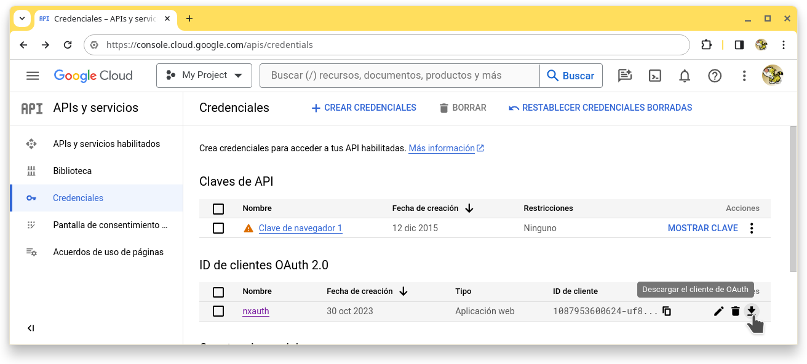
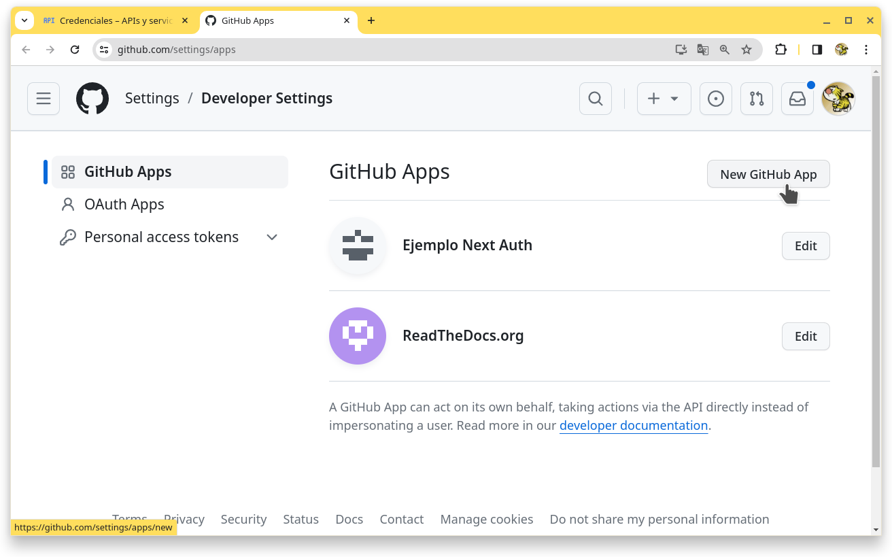
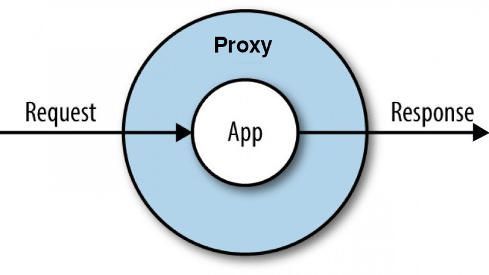
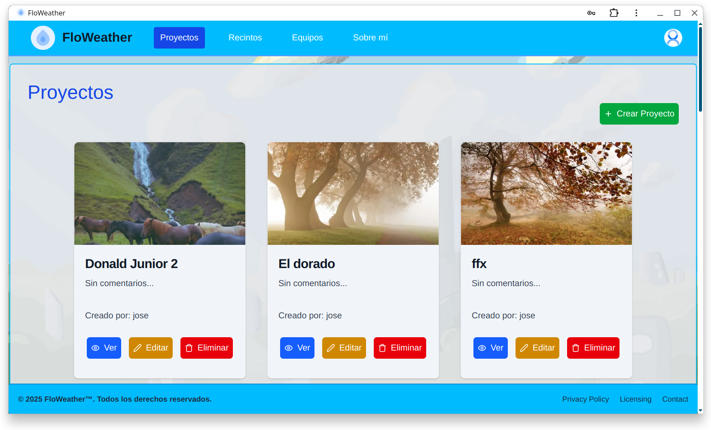

> DESARROLLO WEB EN ENTORNO SERVIDOR

# Tema 7: AUTENTICACIÓN <!-- omit in toc -->
> Generación dinámica de páginas Web interactivas  
> AUTENTICACIÓN DE USUARIOS, NEXT AUTH. OAUTH, CREDENTIALS.

**[`PROYECTOS DE EJEMPLO`](PROYECTOS.md)**


---- 

- [1. Introducción](#1-introducción)
- [2. Instalación de dependencias](#2-instalación-de-dependencias)
- [3. Creación de archivos necesarios](#3-creación-de-archivos-necesarios)
  - [3.1. .env](#31-env)
  - [3.2. src/auth.js](#32-srcauthjs)
  - [3.3. src/app/api/auth/\[...nextauth\]/route.js](#33-srcappapiauthnextauthroutejs)
  - [3.4. src/proxy.js](#34-srcproxyjs)
- [4. Sesiones](#4-sesiones)
  - [4.1. Estrategias de gestión de sesiones](#41-estrategias-de-gestión-de-sesiones)
- [5. Adaptadores. Tipos de persistencia de datos](#5-adaptadores-tipos-de-persistencia-de-datos)
  - [5.1. Prisma](#51-prisma)
  - [5.2. Neon.tech](#52-neontech)
- [6. Proveedores. Tipos de autenticación](#6-proveedores-tipos-de-autenticación)
  - [6.1. OAuth (Open Authentication)](#61-oauth-open-authentication)
    - [6.1.1. Google](#611-google)
    - [6.1.2. GitHub](#612-github)
    - [6.1.3. Discord](#613-discord)
  - [6.2. Email](#62-email)
  - [6.3. Credentials](#63-credentials)
- [7. Despliegue](#7-despliegue)
- [8. Aplicaciones de ejemplo](#8-aplicaciones-de-ejemplo)
  - [8.1. Aplicación OAuth](#81-aplicación-oauth)
  - [8.2. Aplicación Credentials](#82-aplicación-credentials)
  - [8.3. Aplicación con Proxy](#83-aplicación-con-proxy)
- [9. CASOS PRÁCTICOS](#9-casos-prácticos)
  - [9.1. App para gestionar un blog](#91-app-para-gestionar-un-blog)
  - [9.2. App para gestionar una pizzería](#92-app-para-gestionar-una-pizzería)
  - [9.3. App para gestionar proyectos de climatización](#93-app-para-gestionar-proyectos-de-climatización)
- [10. ANEXO: Datos de sesión en el lado cliente](#10-anexo-datos-de-sesión-en-el-lado-cliente)
- [11. Referencias:](#11-referencias)


--- 


# 1. Introducción

En este Tema usaremos el sistema de autenticación proporcionado por **[Auth.js](https://authjs.dev/)**. 

Auth.js es una solución completa de autenticación de código abierto para aplicaciones web. Algunas de sus características son:

- Cookies firmadas, con prefijo y solo de servidor
- Protección CSRF incorporada
- Agnóstico del tiempo de ejecución: Funciones Vercel Edge, Node.js, Serverless, etc.
- Soporte integrado para más de 75 servicios populares (Google, Facebook, Auth0, Apple…)
- Soporte integrado para más de 23 bases de datos/ORM (MySQL, Postgres, Prisma, Drizzle…)
- Autenticación integrada de correo electrónico/sin contraseña/enlace mágico

> [!NOTE]
> 
> En sus inicios, hasta la versión 4, el proyecto se llamaba NextAuth y estaba enfocado en el framework NextJS. A partir de la versión 5, pasó a llamarse Auth.js y estar disponible también para otros frameworks como SvelteKit, SolidStart, ... A lo largo de este documento usaremos de forma indistinta los términos Auth.js y NextAuth 5.


# 2. Instalación de dependencias

```sh
npm install next-auth@beta
```

Si además trabajamos con el ORM Prisma:

```sh
npm install @auth/prisma-adapter
npm install @prisma/client@6 
npm install prisma@6 -D 
```

> [!CAUTION]
>
> Trabajaremos con la versión 6 de Prisma.


Si vamos a necesitar cifrar contraseñas:

```sh
npm install bcryptjs
```


# 3. Creación de archivos necesarios


| Ruta           | Archivo                               |
| -------------- | ------------------------------------- |
| **`/`**        | **`.env`**                            |
| **`/src`**     | **`auth.js`**                         |
| **`/src`**     | **`proxy.js`**                        |
| **`/src/app`** | **`api/auth/[...nextauth]/route.js`** |


> [!NOTE]
> 
> Trabajaremos con archivos de Javascript, en lugar de Typescript, para evitar complejidad. 


## 3.1. .env

En este archivo guardamos las variables de entorno de los proveedores OAuth, conexión a BD, ...

```
AUTH_SECRET=         

AUTH_GITHUB_ID=
AUTH_GITHUB_SECRET=

AUTH_GOOGLE_ID=
AUTH_GOOGLE_SECRET=
```

> [!NOTE]
> 
> Podemos generar **AUTH_SECRET** con una de las siguientes formas:
> 
> 1. Ejecutar en el terminal el comando
> ```sh
> npx  auth  secret
> ```

> 2. Ejecutar en el terminal el comando
> ```sh
> openssl rand -hex 32    # Sólo en Linux
> ```
>
> 3. Visitar 
> ```
> https://generate-secret.vercel.app/32
> ```

> [!IMPORTANT]
> 
> NextAuth 5 simplifica el proceso de gestión de variables de entorno con respecto a NextAuth4. La nueva forma de nombrado de variables es la mostrada arriba. Si seguimos esta convención, AuthJs las reconocerá automáticamente y nuestra configuración de archivos se verá simplificada de forma notable. 

## 3.2. src/auth.js

Es el archivo más importante, puesto que incluye toda la configuración para la autenticación.

```js
import NextAuth from "next-auth"
import GitHub from "@auth/core/providers/github"
import Google from "@auth/core/providers/google"


const options = {
  providers: /* ... */,
  session:   /* ... */,
  adapter:   /* ... */,
  pages:     /* ... */,
  callbacks: /* ... */, 
  events:    /* ... */,
}


export const {
  handlers: { GET, POST },
  auth,
  signIn,
  signOut
} = NextAuth ( 
  options 
)
```

> [!NOTE]
> 
> En la versión 5 de NextAuth importamos los proveedores desde `@auth/core/providers/*` en lugar de `next-auth/providers/*` como se realizaba en la versión 4, aunque esta última forma se mantiene por motivos de retrocompatibilidad.


## 3.3. src/app/api/auth/[...nextauth]/route.js

Esta archivo proporciona una API para autenticación.

```js
export { GET, POST } from '@/auth' // Reexportamos GET  y POST
```

Las rutas que proporciona son las siguientes:

```
api/auth/providers    -> muestra JSON de los proveedores incorporados a nuestra app
api/auth/session      -> muestra JSON de la sesión actual en caso de existir, sino muestra null
api/auth/signin       -> muestra formulario por defecto para login
api/auth/signout      -> muestra formulario por defecto para logout
api/auth/error        -> muestra página por defecto para error
api/auth/verify-request
```

**Ejemplo de página signin**


**Ejemplo de página signout**


## 3.4. src/proxy.js

> [!NOTE]
>
> A partir de Next.js 16 el nombre de archivo debe ser `proxy.js`.
>
> Este archivo se nombraba `middleware.js` en versiones de Next.js 15 y anteriores.
>
> Este archivo es opcional.

La configuración de este archivo nos permite indicar qué rutas de nuestra aplicación están protegidas y cuales no según las configuración. 

**`src/proxy.js`**

```js
// Vercel lo ejecuta en edge
import { auth } from "@/auth";

export default auth((req) => {
    // ...

})

// Rutas que seran revisadas por la función anterior
export const config = {
    matcher: ['/dashboard(.*)']
};

```

En configuraciones más complejas, cuando nuestro proxy se despliega en Internet en una red `edge` (es el caso de Vercel), necesitaremos configurar de una manera algo distinta a la anterior, tal como se muestra a continuación.

En un archivo separado pondremos la configuración de los proveedores. Y en el proxy sólamente incluiremos la configuración de este archivo. El resto de opciones de autenticación no los incluiremos. Esto es necesario, porque actualmente Prisma no puede ejecutarse en el `edge`, que es donde se ejecutará el *proxy*.

```js
// auth.config.js
import Credentials from "@auth/core/providers/credentials"
import Google from "@auth/core/providers/google"
import GitHub from '@auth/core/providers/github'

export default {
    providers: [
        Google,
        GitHub,
        Credentials({  /* ... */ })
    ]
}
```

```js
// proxy.js
import NextAuth from "next-auth";
import authConfing from "@/auth.config"

const { auth } = NextAuth(authConfing)


export default auth((req) => {
    // ...

})

export const config = {
    matcher: [
        '/',
        '/about',
        '/dashboard(.*)' 
    ]
};
```

El acceso a las rutas se puede configurar también sin necesidad de *proxy*. 


# 4. Sesiones

Antes de nada es importante diferenciar 2 conceptos:

- `Autenticación`: proceso para identificar a un usuario
- `Autorización`: proceso de dar acceso a determindos recursos al usuario autenticado.

AuthJS es esencialmente una solución de **autenticación** para aplicaciones web. Pero junto con el manejo de sesiones y el proxy podemos conseguir una solución completa de autenticación/autorización.


HTTP / HTTPS son protocolos sin estado. Esto quiere decir, que aunque realicemos una conexión desde la misma IP, dichos protocolos no son capaces por si mismos de gestionar una sesión. 

Se entende por **sesión** la capacidad de un servidor web de mantener la identidad del usuario y almacenar datos específicos de éste durante múltiples interacciones de solicitud/respuesta entre una aplicación web en el servidor y el cliente web en el navegador.

Debido a las limitaciones que tienen HTTP / HTTPS para este fin, ya hace tiempo que se inventó una forma de gestionar las sesiones y que a día de hoy es ampliamente usado.

El mecanismo más usado para gestionar sesiones se compone de 2 elementos:

- **cookies** en el lado cliente
- **variables de sesión** en el lado servidor


En Auth.js, los datos de sesión tienen una forma similar a la siguiente:


```json
{
  "user": {
    "name": "José Antonio Muñoz Jiménez",
    "email": "jamj2000@gmail.com",
    "image": "https://avatars.githubusercontent.com/u/2934084?v=4",
  },
  "expires": "2024-02-20T12:02:43.639Z"
}
```

La sesión activa puede consultarse en el *endpoint* `/api/auth/session` proporcionado por la API de Auth.js.


## 4.1. Estrategias de gestión de sesiones

[Auth.js admite 2 estrategias](https://authjs.dev/concepts/session-strategies) de sesión para conservar el estado de inicio de sesión de un usuario. El valor predeterminado es utilizar la estrategia de almacenar sesiones en cookies + JWT: (`strategy: "jwt"`), pero también podemos utilizar el adaptador de base de datos para almacenar la sesión en una base de datos  (`strategy: "database"`).

Para la gestión de información de la sesión, nosotros usaremos la estrategia `jwt`:

```js
const options = {
    providers: [Google, GitHub],
    adapter: PrismaAdapter(prisma),
    session: { strategy: "jwt" },
    /* ... */
}
```


# 5. Adaptadores. Tipos de persistencia de datos

Un adaptador en Auth.js conecta la aplicación a cualquier base de datos o sistema backend que desees utilizar para almacenar datos de los usuarios, sus cuentas, sesiones, etc. Los adaptadores son opcionales, a menos que necesites conservar la información del usuario en su propia base de datos, o desees implementar ciertos flujos. Por ejemplo, el proveedor de correo electrónico requiere un adaptador para poder guardar tokens de verificación.

La lista de adaptadores soportados de forma oficial está disponible en el siguiente enlace:

- https://authjs.dev/getting-started/adapters


## 5.1. Prisma

- Referencia: https://authjs.dev/reference/adapter/prisma

Un adaptador es un objeto con métodos para leer y escribir datos de una fuente de datos. Piensa en estos métodos como una forma de normalizar la capa de datos a interfaces comunes que Auth.js pueda entender.

Esto es lo que hace que Auth.js sea muy flexible y permite utilizarlo con cualquier capa de datos.

Los métodos del adaptador se utilizan para realizar las siguientes operaciones:

- Crear/actualizar/eliminar un usuario
- Vincular/desvincular una cuenta a/de un usuario
- Manejar sesiones activas
- Admite autenticación sin contraseña en múltiples dispositivos

Auth.js se puede integrar con cualquier capa de datos (base de datos, ORM o API backend, cliente HTTP) para crear usuarios automáticamente, manejar la vinculación de cuentas automáticamente, admitir el inicio de sesión sin contraseña y almacenar información de la sesión.

Auth.js tiene una lista bastante extensa de adaptadores para ORM/Bases de datos:

- @auth/azure-tables-adapter
- @auth/d1-adapter
- @auth/dgraph-adapter
- @auth/drizzle-adapter
- @auth/dynamodb-adapter
- @auth/edgedb-adapter
- @auth/fauna-adapter
- @auth/firebase-adapter
- @auth/hasura-adapter
- @auth/kysely-adapter
- @auth/mikro-orm-adapter
- @auth/mongodb-adapter
- @auth/neo4j-adapter
- @auth/pg-adapter
- @auth/pouchdb-adapter
- **@auth/prisma-adapter**
- @auth/sequelize-adapter
- @auth/supabase-adapter
- @auth/surrealdb-adapter
- @auth/typeorm-adapter
- @auth/unstorage-adapter
- @auth/upstash-redis-adapter
- @auth/xata-adapter

Los Modelos que usa Auth.js son los siguientes:


> [!IMPORTANT]
>
> Sólo necesitaremos los modelos User y Account. 
> 
> Además se ha **ampliado el módelo `User` con campos `password`, `role` y `active`**.
> 
> -  `password` para el trabajo con credenciales. 
> -  `role` nos permitirá distinguir entre roles USER y ADMIN.
> -  `active` nos permitira activar o desactivar usuarios.


```prisma
model User {
  id            String  @id @default(cuid())
  // ...
  password      String?
  role          String?   @default("USER")  // o  ADMIN
  active        Boolean?  @default(true)    // o  false
  // ...
}
```

**EJEMPLO DE ARCHIVO prisma/schema.prisma**


```prisma
generator client {
  provider = "prisma-client-js"
}

datasource db {
  provider = "postgresql"
  url      = env("DATABASE_URL")
}


model User {
  id            String  @id @default(cuid())
  name          String
  email         String?   @unique
  password      String?
  emailVerified DateTime?
  image         String?
  role          String?   @default("USER")  // o  ADMIN
  active        Boolean?  @default(true)    // o  false
  accounts      Account[]
}

model Account {
  id                 String  @id @default(cuid())
  userId             String
  type               String
  provider           String
  providerAccountId  String
  refresh_token      String?  @db.Text
  access_token       String?  @db.Text
  expires_at         Int?
  token_type         String?
  scope              String?
  id_token           String?  @db.Text
  session_state      String?

  user User @relation(fields: [userId], references: [id], onDelete: Cascade)

  @@unique([provider, providerAccountId])
}
```

> [!IMPORTANT]
>
> Observa que el modelo `User` debe permitir **valores null en los siguientes campos: `password`, `email`, `image` y `active`**. Esto es así puesto que OAuth nunca nos devuelve información de password ni de active, y en muchos casos tampoco devuelve información de email e image.
>
> Si no permitimos valores null en estos campos la autenticación OAuth fallará.

## 5.2. Neon.tech

[neon.tech](https://neon.tech) es un DBaaS muy sencillo de usar y con un plan gratis bastante generoso. Se recomienda su uso para las tareas de este Tema. 

Una vez nos hayamos registrado y creado una base de datos, podemos acceder a los datos de conexión mediante `Dashboard` -> `Connection Details`-> `Database` -> `Prisma` y `.env`


# 6. Proveedores. Tipos de autenticación

Los proveedores de autenticación en NextAuth.js son servicios que se pueden utilizar para iniciar sesión un usuario. Existen varios tipos. Los más usados son:

- **OAuth**
- **Email**
- **Credentials**

Los proveedores disponibles en nuestra app pueden consultarse en el *endpoint* `/api/auth/providers` proporcionado por la API de Auth.js.


## 6.1. OAuth (Open Authentication)

- [Documentación de OAuth](https://authjs.dev/getting-started/providers/oauth-tutorial)

**Open Authorization (OAuth)** es un estándar abierto que permite flujos simples de autorización para sitios web o aplicaciones informáticas. Se trata de un protocolo propuesto por Blaine Cook y Chris Messina, que permite autorización segura de una API de modo estándar y simple para aplicaciones de escritorio, móviles y web.

OAuth permite a un usuario del sitio A (proveedor de servicio) compartir su información con el sitio B (llamado consumidor) sin compartir toda su identidad. Para desarrolladores de consumidores, OAuth es un método de interactuar con datos protegidos y publicarlos. Para desarrolladores de proveedores de servicio, OAuth proporciona a los usuarios un acceso a sus datos al mismo tiempo que protege las credenciales de su cuenta. Este mecanismo es utilizado por compañías como Google, Facebook, Microsoft, Twitter y Github para permitir a los usuarios compartir información sobre sus cuentas con aplicaciones de terceros o sitios web.

NextAuth.js está diseñado para funcionar con cualquier servicio OAuth, es **compatible con OAuth 1.0, 1.0A, 2.0 y OpenID Connect** y tiene soporte integrado para los servicios de inicio de sesión más populares.

Los lista proveedores soportados de forma oficial está disponible en el siguiente enlace:

- https://authjs.dev/getting-started/providers


Para configurar dicha funcionalidad necesitaremos editar 2 archivos. A continuación se muestra un ejemplo:
 
- Archivo **/.env**

```
AUTH_GITHUB_ID=
AUTH_GITHUB_SECRET=

AUTH_GOOGLE_ID=
AUTH_GOOGLE_SECRET=
```

- Archivo **/src/auth.js**

```js
import Github from "@auth/core/providers/github"
import Google from "@auth/core/providers/google"

  // ...

  providers: [ Github, Google ],
```

> [!NOTE]
> 
> A diferencia de versiones anteriores, en NextAuth 5 no es necesario indicar en este archivo las variables de entorno, siempre que la hayamos declarado en el archivo `.env` con la forma `AUTH_PROVEEDOR_ID` y `AUTH_PROVEEDOR_SECRET`.

Para poder ofrecer OAuth necesitaremos **registrar nuestra aplicación** web en la **sección destinada a desarrolladores que ofrece el proveedor** para estos fines.

Una vez hecho esto, el proveedor nos proporcionará 2 valores, que deberemos añadir a nuestro archivo `.env`, que son:

- **ID**
- **SECRET**

A continuación se muestra el proceso resumido de registro de una aplicación web en los proveedores Google y Github, aunque existen muchos otros.


### 6.1.1. Google

https://console.developers.google.com/apis/credentials


> [!IMPORTANT]  
> 
> Cuando nuestra aplicación esté desplegada en producción, deberemos cambiar la URL `http://localhost:3000` por la URL del despliegue, p. ej: `https://mi-app.vercel.app`. 




Si no has usado nunca está consola, Google te pedirá que primero crees un Proyecto, y después que rellenes una Pantalla de Consentimiento. Y finalmente podrás dar de alta las credenciales de tu app tal como se muestra en las capturas anteriores.

Si tienes algún problema puedes consultar la página https://support.google.com/cloud/answer/10311615 


### 6.1.2. GitHub

https://github.com/settings/apps




> [!IMPORTANT] 
> 
> Cuando nuestra aplicación esté desplegada en producción, deberemos cambiar la URL `http://localhost:3000` por la URL del despliegue, p. ej: `https://mi-app.vercel.app`. 

 


### 6.1.3. Discord

https://discord.com/developers/applications


## 6.2. Email

- [Documentación de Email](https://authjs.dev/getting-started/providers/email-tutorial)

Además de autenticar usuarios en Auth.js mediante OAuth, también puedes habilitar la opción de autenticarlos mediante `magic links`. Son enlaces que se envían al correo electrónico del usuario y al hacer clic en ellos se registrará el usuario automáticamente.

Agregar soporte para iniciar sesión por correo electrónico además de uno o más servicios OAuth proporciona una manera para que los usuarios inicien sesión si pierden el acceso a su cuenta OAuth (por ejemplo, si está bloqueada o eliminada).

El proveedor de correo electrónico se puede utilizar junto con (o en lugar de) uno o más proveedores de OAuth.

<!-- 
Para configurar dicha funcionalidad necesitaremos editar 2 archivos. A continuación se muestra un ejemplo:
 
- Archivo **/.env**

```
SMTP_USER=apikey
SMTP_PASSWORD={API_KEY}
SMTP_HOST=smtp.sendgrid.net
SMTP_PORT=587
EMAIL_FROM={SENDER_EMAIL}
```

- Archivo **/src/auth.js**

```js
import Email from "@auth/core/providers/email"

  providers: [
    Email({
      server: {
        host: process.env.SMTP_HOST,
        port: Number(process.env.SMTP_PORT),
        auth: {
          user: process.env.SMTP_USER,
          pass: process.env.SMTP_PASSWORD,
        },
      },
      from: process.env.EMAIL_FROM,
    }),
  ],
```
-->

Si desaas realizar la verificación de email, por ejemplo al usar credenciales, necesitarás enviar un correo de confirmación al usuario. Y para ello puedes usar alguno de los correos transaccionales que aparecen a continuación.

**Servidores de correo transaccional**

- [Resend](https://resend.com)
- [Sendgrid](https://sendgrid.com)
- [Mailtrap](https://mailtrap.io/)
- [Brevo](https://brevo.com)

El proceso de verificación de email es complejo y no se aboradará en este tema. Si te interesa, en [este vídeo](https://youtu.be/MNm1XhDjX1s?si=XtUeR4FxpEY5MYSy) puedes ver como se realiza.

> [!TIP]
>
> Si sólo deseas añadir la funcionalidad de envío de correo sin la necesidad de registro de usuarios, puedes consultar la sección [envío de correos](../08_Tema8/README.md#36-envío-de-correos) del siguiente tema.
> 


Simplificando mucho, podemos decir que el proceso a seguir sería el siguiente:

1. Disponer de cuenta en un servidor con DNS y reenvío de correo (p. ej: https://gandi.net)
2. Disponer de cuenta en un servidor de envío de correo transaccional (p. ej: https://resend.com)
   - Dar de alta el dominio DNS personal
   - Obtener API KEY 
3. Actualizar los registros DNS de nuestro servidor de dominio.
4. Editar el código siguiendo la documentación disponible en https://authjs.dev/getting-started/providers/resend?framework=next-js
   
A continuación se muestran capturas de pantalla de los pasos 2 y 3.


## 6.3. Credentials

- [Documentación de Credentials](https://authjs.dev/getting-started/providers/credentials-tutorial)

Tradicionalmente, y aún hoy en día, se trabaja con el clásico método **usuario / contraseña**, y es la mayoría de las veces como **email / contraseña**. Sin embargo, este método se considera inseguro y además requiere de trabajo extra para su gestión. Al menos se debería realizar un proceso de verificación del email para aumentar la seguridad.

Desde AuthJS se limita intencionalmente para desalentar el uso de contraseñas debido a los riesgos de seguridad inherentes asociados con ellas y la complejidad adicional asociada con el soporte de nombres de usuario y contraseñas.

AuthJS ha sido diseñado para manejar la sesión del usuario desde el punto de vista del cliente, para admitir múltiples métodos de autenticación (OAuth, correo electrónico, etc.) para que no se vea obligado a ejecutar su propio servicio de autenticación.


```js
import Credentials from "@auth/core/providers/credentials"
// ...
 providers: [
    Credentials({
        async authorize(credentials) {
              return getUserByEmail(credentials.email)
        },
    }),
  ],
```


# 7. Despliegue

> [!IMPORTANT] 
>
> **MUY IMPORTANTE:**
>
> Cuando despliegues tu aplicación en Internet deberás actualizar las URLs en los proveedores OAuth, de forma similar a la mostrada a continuación:

**Google**


**Github**


**Discord**


# 8. Aplicaciones de ejemplo

En este tema trabajaremos con el código fuente de 3 aplicaciones:

1. [nxauth-oauth](https://github.com/jamj2000/nxauth-oauth)
2. [nxauth-credentials](https://github.com/jamj2000/nxauth-credentials)
3. [nxauth-proxy](https://github.com/jamj2000/nxauth-proxy)
   
Las directrices seguidas para su desarrollo han sido comunes, y se listan a continuación.

Se ha realizado la **autenticación siempre desde el lado servidor**.

Para **obtener los datos de sesión**, se ha usado `const session = await auth()`

```js
import { auth } from "@/auth"

async function page() {
    const session = await auth()
    
}
```


## 8.1. Aplicación OAuth

- [nxauth-oauth](https://github.com/jamj2000/nxauth-oauth)

En la primera aplicación, nos centramos en el código necesario para trabajar con OAuth.

El archivo `auth.js` queda de una forma similar a la siguiente:

```js
// auth.js
import NextAuth from "next-auth";
import Google from "@auth/core/providers/google"
import GitHub from "@auth/core/providers/github"
import Discord from "@auth/core/providers/discord"
import { PrismaAdapter } from "@auth/prisma-adapter";
import { prisma } from "@/lib/prisma"

const options = {
    providers: [Google, GitHub],
    adapter: PrismaAdapter(prisma),
    session: { strategy: "jwt" },
    callbacks: {
        async session({ session, token }) {
            session.user.id = token?.sub;     // Para recuperar ID de usuario desde el token
            session.user.role = token?.role   // Para recuperar Rol de usuario desde el token
            return session
        },

        async jwt({ token }) {  
            if (!token.sub) return token;
            
            const user = await prisma.user.findUnique({
                where: {
                    id: token.sub
                }
            })
            if (!user) return token;

            token.role = user?.role
            return token
        }
    }
}

export const {
    handlers: { GET, POST },
    auth,
    signIn,
    signOut
} = NextAuth(options)
```

Los callbacks **`jwt`** y **`session`** son muy importantes. Se ejecutan en el orden indicado anteriormente y nos permiten:

1. recoger la información de *id* y *role* del usuario desde la BD e introducirla en el JWT.
2. recoger la información de *id* y *role* del usuario desde el JWT e introducirla en la sesión.

Los datos de sesión tendrán por tanto un aspecto similar al siguiente:

```json
{
  "user": {
    "name": "José Antonio Muñoz Jiménez",
    "email": "jamj2000@gmail.com",
    "image": "https://avatars.githubusercontent.com/u/2934084?v=4",
    "id": "cm798cj3t0020p8bilrdj93dv",
    "role": "USER",    
  },
  "expires": "2024-02-20T12:02:43.639Z"
}
```

Las acciones de servidor quedan así:

```js
'use server'
import { signIn, signOut} from "@/auth"


// https://authjs.dev/reference/nextjs#signin
export async function loginGoogle() {
    try {
        await signIn('google', { redirectTo: '/dashboard'})
    } catch (error) {
        throw error
    }
}

export async function loginGithub() {
    try {
        await signIn('github', { redirectTo: '/dashboard'})
    } catch (error) {
        console.log(error);
        throw error
    }
}


export async function loginDiscord() {
    try {
        await signIn('discord', { redirectTo: '/dashboard'})
    } catch (error) {
        console.log(error);
        throw error
    }
}

// https://authjs.dev/reference/nextjs#signout
export async function logout() {
    try {
        await signOut({redirectTo: '/'})
    } catch (error) {
        throw error
    }
}
```


## 8.2. Aplicación Credentials

- [nxauth-credentials](https://github.com/jamj2000/nxauth-credentials)

En la segunda aplicación, nos centramos en el código necesario para trabajar con Credentials.

Bastantes archivos se ven afectados.

```js
// auth.js
import { PrismaAdapter } from '@auth/prisma-adapter';
import { prisma } from '@/lib/prisma'
import NextAuth from 'next-auth'
import Credentials from '@auth/core/providers/credentials'


export const options = {
    session: { strategy: 'jwt' },
    adapter: PrismaAdapter(prisma),
    pages: {
        signIn: '/auth/signin',
        signOut: '/auth/signout',
        error: '/auth/error'
    },
    providers: [
        Credentials({
            async authorize(credentials) {
              return getUserByEmail(credentials.email)
            },
        }),
     ]
}


export const {
    handlers: { GET, POST },
    auth,
    signIn,
    signOut
} = NextAuth( options )
```

La función **`autorize`** es de gran importancia. Permite dar autorización (`return user`) o no (`return null`). Esta función se ejecuta después de introducir los datos en el formulario y después de la ejecución del server action de login. 

```js
// código ejecutado en un server action
await signIn('credentials', { email, password, redirectTo: '/dashboard' })
```

> [!NOTE]
> 
> Las variables `email` y `password` anteriores, son enviadas como argumento dentro del objeto `credentials` a la función `authorize`.


## 8.3. Aplicación con Proxy

- [nxauth-proxy](https://github.com/jamj2000/nxauth-proxy)

En la última aplicación controlamos el acceso a las rutas mediante `proxy`. Este componente se ejecuta antes de acceder a las rutas que queramos controlar. Al final del archivo hemos añadido dichas rutas. 



El contenido del archivo **`src/proxy.js`** es el siguiente:

```js
// Run on edge
import NextAuth from "next-auth";
import authConfig from "@/auth.config";

const { auth } = NextAuth(authConfig);

export default auth((req) => {
  console.log(`PROXY`, req.nextUrl.pathname, req.auth);

  if (!req.auth) {  // No autenticado
    const callbackUrl = req.nextUrl.pathname + req.nextUrl.search
    const encodedCallbackUrl = encodeURIComponent(callbackUrl);

    return Response.redirect(req.nextUrl.origin + `/auth/login?callbackUrl=${encodedCallbackUrl}`)
  }
    
})


export const config = {
    matcher: [
        "/dashboard(.*)",
        "/admin(.*)",
        "/proveedores(.*)",
        "/productos(.*)",
    ],
}
```

Si el usuario no ha iniciado sesión, lo redirigimos a la página de login y guardamos en query string `?callbackUrl=` la url a la que quiere acceder.

> [!TIP]
>
> Es una práctica habitual y recomendada proteger es indicar mediante una [expresión regular](https://nextjs.org/docs/app/api-reference/file-conventions/proxy#matcher) todas las rutas que serán públicas. Todas las que no se incluyan en dicha expresión estarán protegidas. Por ejemplo:
> 
>```js
> export const config = {
>    matcher: [
>        /*
>         * Match all request paths except for the ones starting with:
>         * - api (API routes)
>         * - auth
>         * - pizzas
>         * - carrito 
>         * - images (into /public)
>         * - pwa (into /public) 
>         * - _next/static (static files)
>         * - _next/image (image optimization files)
>         * - favicon.ico, sitemap.xml, robots.txt (metadata files)
>         * - $ (root page)
>         */
>        '/((?!api|auth|images|pwa|pizzas|carrito|_next/static|_next/image|favicon.ico|sitemap.xml|robots.txt|$).*)',
>   ]
> }
>```

> [!CAUTION]
>
> Si usas la forma anterior de definir las rutas, presta especial atención al contenido de la carpeta `public`, puesto que deberás añadir a la expresión regular anterior los archivos y carpetas que estén dentro. 
> 
> Si no lo haces, ¡no serán públicos! 


Hemos colocado la configuración de NextAuth en dos archivos separados:

- **src/auth.js**
- **src/auth.config.js**
  
El motivo es que, actualmente, dentro del *proxy* no podemos hacer uso de `PrismaAdapter`. 

Por tanto, colocamos en **`src/auth.config.js`**

```js
import Credentials from '@auth/core/providers/credentials'
import Google from '@auth/core/providers/google'
import GitHub from '@auth/core/providers/github'
import Discord from '@auth/core/providers/discord'
import { getUserByEmail } from '@/lib/data'

export default {
    providers: [
        Google,
        GitHub,
        Discord,
        Credentials({
            async authorize(credentials) {
                return getUserByEmail(credentials.email)
            },
        }),
    ]
}
```

Y en **`src/auth.js`**

```js
import NextAuth from "next-auth"
import { PrismaAdapter } from "@auth/prisma-adapter";
import { prisma } from "@/lib/prisma"
import { getUserById } from "@/lib/data"
import authConfig from "@/auth.config"


export const options = {
    session: { strategy: 'jwt' },
    adapter: PrismaAdapter(prisma),
    pages: {
        signIn: '/auth/login',
        signOut: '/auth/logout',
        error: '/auth/error'
    },
    callbacks: {
        async session({ session, token }) {
            session.user.id = token?.sub;     // Para recuperar ID de usuario desde el token
            session.user.role = token?.role   // Para recuperar Rol de usuario desde el token
            return session
        },
        async jwt({ token }) {
            if (!token.sub) return token;

            const user = await getUserById(token.sub)
            if (!user) return token;

            token.role = user?.role
            return token
        }
    },
}

export const {
    handlers: { GET, POST },
    auth,
    signIn,
    signOut
} = NextAuth({ ...options, ...authConfig })
```

**`src/app/auth/login.js`**

En la página de login, recogemos la variable `callbackUrl` con la información de la ruta a la que quería acceder el usuario. 

Guardamos dicho valor dentro de [`globalThis`](https://developer.mozilla.org/en-US/docs/Web/JavaScript/Reference/Global_Objects/globalThis) (más información [aquí](https://krative.digital/globalthis/)), que es un objeto global


**`src/app/auth/login.js`**

```js
// ...

function page({ searchParams }) {
  const { error, callbackUrl } = searchParams
  // Usamos globalThis para almacenar variable global
  // La usaremos en los actions de login
  globalThis.callbackUrl = decodeURIComponent(callbackUrl ?? '%2Fdashboard')

  // ...

```

De esta forma podremos recoger el valor en los *server actions* y redirigir finalmente al usuario a la ruta a que quería acceder en un inicio.


**`src/lib/actions.js`**

```js
// ...
export async function loginGoogle() {
    try {
        await signIn('google', { redirectTo: globalThis.callbackUrl })
    } catch (error) {
        console.log(error);
        throw error
    }
}

// ...
```

Hay una demo disponible en [vercel](https://nxauth-proxy.vercel.app/).


# 9. CASOS PRÁCTICOS


## 9.1. App para gestionar un blog

- [Código fuente](https://github.com/jamj2000/nxapp-blog)
- [Demo](https://nxapp-blog.vercel.app/)


## 9.2. App para gestionar una pizzería

- [Código fuente](https://github.com/jamj2000/nxapp-pizzeria)
- [Demo](https://nxapp-pizzeria.vercel.app/)


## 9.3. App para gestionar proyectos de climatización 

- [Código fuente](https://github.com/jamj2000/nxapp-climatizacion)
- [Demo](https://nxapp-climatizacion.vercel.app/)





# 10. ANEXO: Datos de sesión en el lado cliente

En los ejemplos anteriores nos hemos centrado en usar los datos de sesión desde el lado servidor. NextJS, como framework fullstack, también nos permite recuperar los datos de sesión desde el lado cliente.

En el lado servidor, hemos usado la siguiente forma:

```js
import { auth } from "@/auth"

async function page() {
    const session = await auth()
    // ...
}
```

Sin embargo, en el lado cliente, deberemos hacer uso del *hook* `useSession` de la siguiente manera:

```js
"use client";
import {useSession} from "next-auth/react";

export default function Page() {
  const {data: session, status} = useSession();
  console.log("status", status);
  console.log("session", session);

  return <div>Client Page</div>;
}
```

Pero, además debemos realizar un cambio en `RootLayout`  para que todas las páginas cliente puedan hacer uso del método anterior. Debemos envolver la propiedad `children` dentro de un `SessionProvider`, el cual es un componente cliente, y por tanto deberemos declararlo en un archivo separado. 


```js
// src/app/layout.js
import {Providers} from "./providers";

export default function RootLayout({ children }) {
  return (
    <html lang="en">
      <body>
          <Providers>{children}</Providers>
      </body>
    </html>
  );
}
```

```js
// src/app/providers.js
"use client"
import {SessionProvider} from "next-auth/react";

export function Providers({children}) {
  return <SessionProvider>{children}</SessionProvider>;
}
```

Referencias: 

- [Using NextAuth authentication provider in Next.js 13 App Router](https://medium.com/@rezahedi/using-nextauth-authentication-provider-in-next-js-by-app-router-f50cb23282c9)
- [Using Context Providers](https://nextjs.org/docs/app/building-your-application/rendering/composition-patterns#using-context-providers) 


> [!NOTE] 
> 
> **signIn y signOut en el lado cliente**
>
> Al igual que podemos acceder a los datos de sesión desde el lado cliente, también podemos hacer `signin` y `signout` desde el lado cliente.
>
> ```js
> 'use client'
> import { signIn, signOut } from "next-auth/react"
>  
> // ...
>    <button onClick={() => signIn()}> Sign in </button>
>    <button onClick={() => signOut()}> Sign out </button>
>```
> La redirección se hace de forma distinta a la empleada en el lado servidor. Empleamos la propiedad **`callbackUrl`** en lugar de la propiedad `redirectTo`. En el lado cliente es así:
>
> ```js
>  signIn('google', { callbackUrl: 'http://localhost:3000/dashboard' })
>  signOut({ callbackUrl: 'http://localhost:3000/home' })
> ```


# 11. Referencias:

- [Introducción a Auth.js](https://authjs.dev/getting-started/introduction)
- [Diferencias entre NextAuth4 y NextAuth5](https://authjs.dev/guides/upgrade-to-v5)
- [⭐ Video: Next Auth V5 - Advanced Guide (2024)](https://youtu.be/1MTyCvS05V4?feature=shared): El vídeo es muy completo, pero dura 8 horas 😱. Nuestro interés empieza a partir de la segunda hora.
- [⭐ Código fuente del vídeo anterior](https://github.com/AntonioErdeljac/next-auth-v5-advanced-guide)

