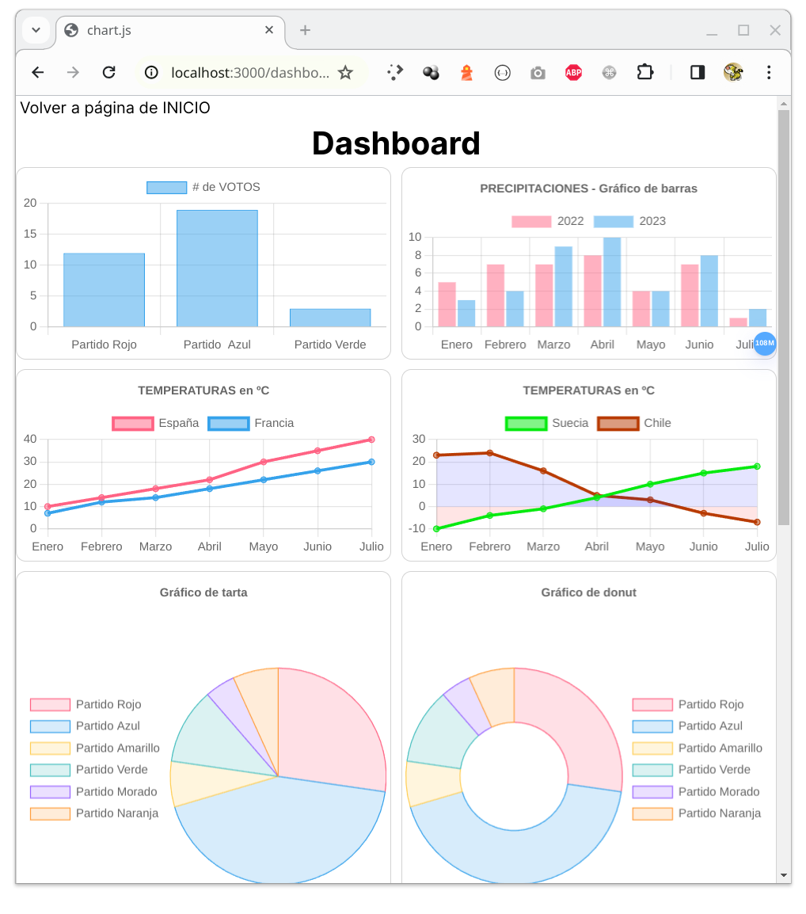
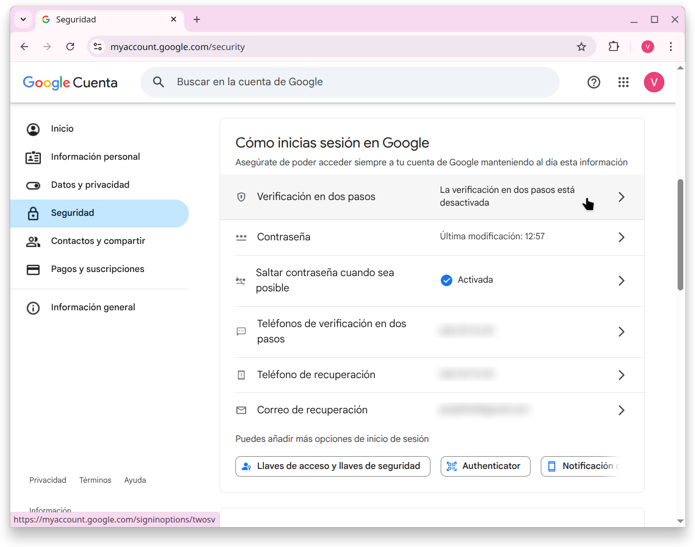
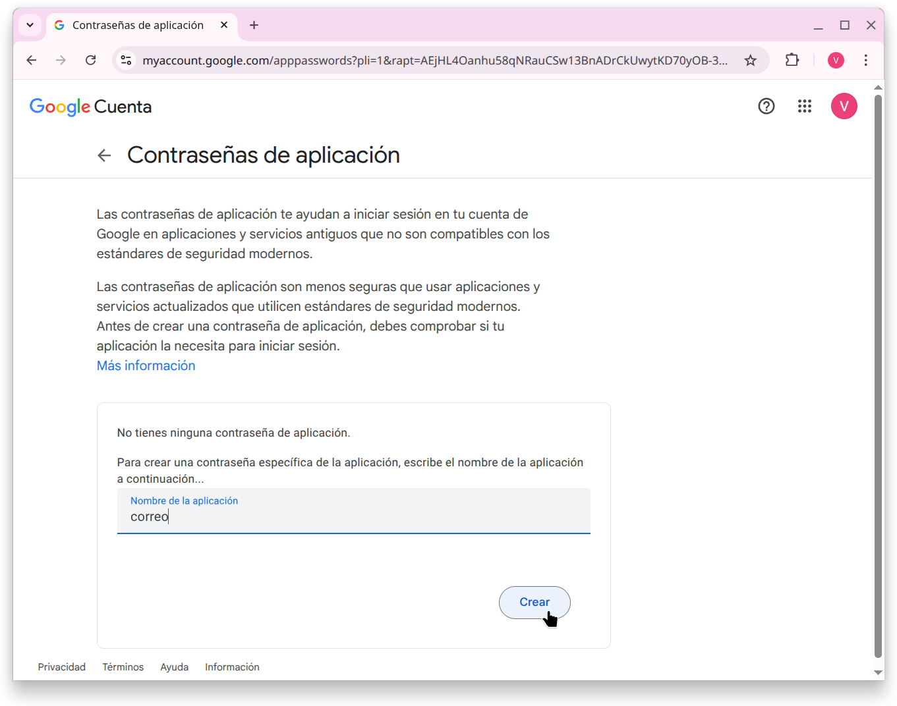
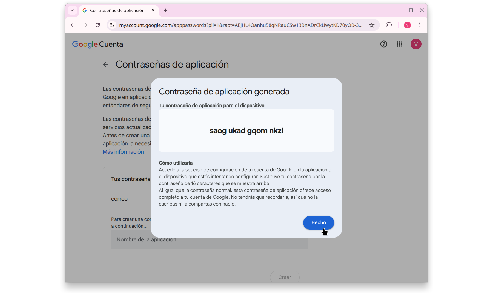
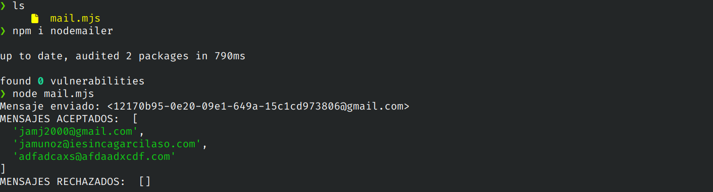
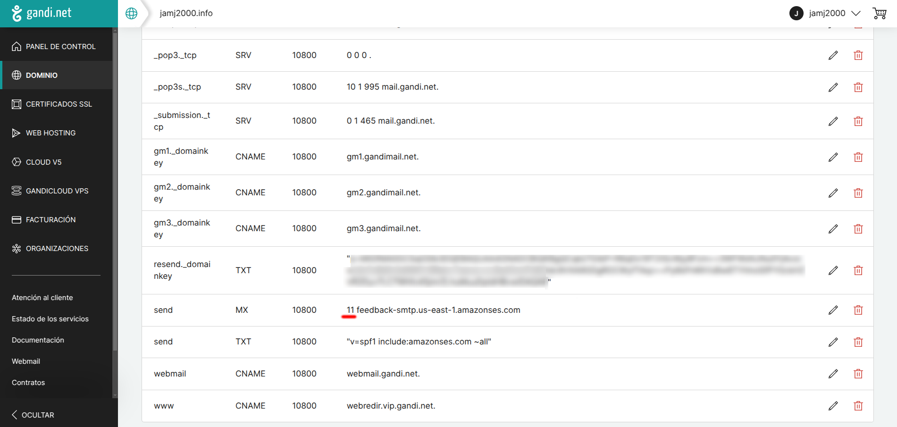

> DESARROLLO WEB EN ENTORNO SERVIDOR

# Tema 7: APIs REST <!-- omit in toc -->
> Programación de servicios Web
> APIs, BIBLIOTECAS DE UTILIDAD.

**[`PROYECTOS DE EJEMPLO`](PROYECTOS.md)**


---
- [1. Introducción](#1-introducción)
- [2. APIs REST](#2-apis-rest)
  - [2.1. Route Handlers](#21-route-handlers)
  - [2.2. Métodos HTTP admitidos](#22-métodos-http-admitidos)
  - [2.3. Parámetros de URL](#23-parámetros-de-url)
  - [2.4. Creación de API REST](#24-creación-de-api-rest)
  - [2.5. API REST con datos en memoria RAM](#25-api-rest-con-datos-en-memoria-ram)
  - [2.6. API REST con datos en BD MongoDB](#26-api-rest-con-datos-en-bd-mongodb)
  - [2.7. Herramientas para probar la API](#27-herramientas-para-probar-la-api)
  - [2.8. CORS](#28-cors)
- [3. BIBLIOTECAS](#3-bibliotecas)
  - [3.1. Datos ficticios](#31-datos-ficticios)
    - [3.1.1. Instalación de biblioteca](#311-instalación-de-biblioteca)
    - [3.1.2. Uso](#312-uso)
    - [3.1.3. Documentación](#313-documentación)
  - [3.2. Datos de archivos CSV](#32-datos-de-archivos-csv)
    - [3.2.1. Instalación de biblioteca](#321-instalación-de-biblioteca)
    - [3.2.2. Uso](#322-uso)
    - [3.2.3. Documentación](#323-documentación)
    - [3.2.4. Caso práctico y truco](#324-caso-práctico-y-truco)
  - [3.3. Arrastrar y Soltar (Drag \& Drop)](#33-arrastrar-y-soltar-drag--drop)
    - [3.3.1. Instalación de biblioteca](#331-instalación-de-biblioteca)
    - [3.3.2. Uso](#332-uso)
    - [3.3.3. Otras bibliotecas](#333-otras-bibliotecas)
    - [3.3.4. Documentación](#334-documentación)
  - [3.4. Gráficos](#34-gráficos)
    - [3.4.1. Instalación](#341-instalación)
    - [3.4.2. Uso](#342-uso)
    - [3.4.3. Flujo de datos (streaming)](#343-flujo-de-datos-streaming)
      - [3.4.3.1. Los modelos de provisión de datos](#3431-los-modelos-de-provisión-de-datos)
      - [3.4.3.2. Ejemplo](#3432-ejemplo)
      - [3.4.3.3. Colas de mensajes](#3433-colas-de-mensajes)
      - [3.4.3.4. InfluxDB](#3434-influxdb)
    - [3.4.4. Documentación](#344-documentación)
    - [3.4.5. Curiosidad](#345-curiosidad)
    - [3.4.6. Otras bibliotecas](#346-otras-bibliotecas)
  - [3.5. Creación de PDFs](#35-creación-de-pdfs)
    - [3.5.1. Instalación](#351-instalación)
    - [3.5.2. Uso](#352-uso)
    - [3.5.3. Documentación](#353-documentación)
  - [3.6. Envío de correos](#36-envío-de-correos)
    - [3.6.1. Instalación](#361-instalación)
    - [3.6.2. Uso](#362-uso)
      - [3.6.2.1. Usando una cuenta de Gmail](#3621-usando-una-cuenta-de-gmail)
      - [3.6.2.2. Usando servidor de correo propio](#3622-usando-servidor-de-correo-propio)
    - [3.6.3. Documentación](#363-documentación)
  - [3.7. Pagos por internet](#37-pagos-por-internet)
    - [3.7.1. Instalación](#371-instalación)
    - [3.7.2. Uso](#372-uso)
    - [3.7.3. Documentación](#373-documentación)
  - [3.8. Mapas](#38-mapas)
    - [3.8.1. Instalación](#381-instalación)
    - [3.8.2. Uso](#382-uso)
    - [3.8.3. Documentación](#383-documentación)
  - [3.9. Editor WYSIWYG](#39-editor-wysiwyg)
    - [3.9.1. Instalación](#391-instalación)
    - [3.9.2. Uso](#392-uso)
    - [3.9.3. Documentación](#393-documentación)
    - [3.9.4. Curiosidad](#394-curiosidad)
  - [3.10. Coloreado de código](#310-coloreado-de-código)
    - [3.10.1. Instalación](#3101-instalación)
    - [3.10.2. Uso](#3102-uso)
    - [3.10.3. Documentación](#3103-documentación)


--- 


# 1. Introducción

En este tema veremos con trabajar con 

- **APIs REST**

Y tambien veremos cómo añadir nuevas funcionalidades a nuestra aplicación web. En concreto, se estudiarán las siguientes funcionalidades:

- **Datos ficticios**
- **Datos de archivos CSV**
- **Gráficos**
- **Creación de PDFs**
- **Envío de correos**
- **Pagos por internet**
- **Mapas**
- **Editor WYSIWYG**
- **Coloreado de código**


# 2. APIs REST

Una de las funcionalidades más habituales que puede proporcionar un backend desde el lado servidor es la puesta a disposición de información, normalmente en formato JSON y extraida de alguna base de datos, destinada a ser consumida por diversos clientes. 

Esta funcionalidad se proporciona mediante una [API de tipo REST](https://blog.hubspot.es/website/que-es-api-rest).

En NextJS para la creación de este tipo de APIs hacemos uso de manejadores de rutas o `route handlers`.

## 2.1. Route Handlers

Los `controladores de ruta` permiten crear controladores de solicitudes personalizados para una ruta determinada mediante las APIs web [`Request`](https://developer.mozilla.org/docs/Web/API/Request) y [`Response`](https://developer.mozilla.org/docs/Web/API/Response).

Los controladores de ruta sólo están disponibles dentro del directorio `app`. A menudo se suelen utilizar para la creación de `APIs REST`.


Los controladores de ruta se definen en un archivo `route.js|ts` dentro del directorio `app`:

```typescript
// app/api/route.ts
export async function GET(request: Request) {}
```

> [!NOTE]
> 
> No puede haber un archivo `route.js` en el mismo nivel de segmento de ruta que `page.js`.


## 2.2. Métodos HTTP admitidos

Los siguientes métodos HTTP son compatibles: **GET**, **POST**, **PUT**, **PATCH**, **DELETE**, **HEAD**, y **OPTIONS**. Si se llama a un método no compatible, Next.js devolverá una respuesta *405 Method Not Allowed*.


**Referencias:**

- https://nextjs.org/docs/app/building-your-application/routing/route-handlers
- https://nextjs.org/docs/app/api-reference/functions/next-request
- https://nextjs.org/docs/app/api-reference/functions/next-response


## 2.3. Parámetros de URL

Los parámetros de URL o **`URL Parameters`** son partes de la URL en las cuales los valores que aparecen pueden variar de una petición a otra, aunque la estructura de la URL se mantiene.

En los `route handlers` también podemos acceder a los 2 tipos que existen:

- **Parámetros de ruta** `Path Parameters`
- **Parámetros de consulta** `Query Parameters` o `Query Strings` 


Si tenemos la siguiente ruta:

**`http://localhost:3000/api/products/bristol/books?sort=author&skip=1`**


Y el siguiente código en `src/app/api/products/[store]/[category]/route.js`


```js
export async function GET(request, { params }) {
    console.log( request.nextUrl.origin )
    console.log( request.nextUrl.pathname )

    // Params
    const { store, category } = await params
    console.log( store )
    console.log( category )

    // SearchParams
    const sort = request.nextUrl.searchParams.get("sort")
    const skip = request.nextUrl.searchParams.get("skip")
    console.log( sort )
    console.log( skip )

    // ...
}
```

Producirá la siguiente salida:

```
http://localhost:3000
/api/products/bristol/books
bristol
books
author
1
``` 


## 2.4. Creación de API REST

Como se ha comentado anteriormente, la principal aplicación que tienen los route handlers (`controladores de ruta`) es la implentación de APIs. Suele ser habitual el intercambio de información mediante el formato JSON.

A continuación tienes 2 proyectos donde se implementa una API sencilla de este tipo. En ambos casos, los *endpoints* disponibles son:

- `/api/users` Métodos **GET** y **POST**
- `/api/users/[id]` Métodos **GET**, **PUT** y **DELETE**

**Estructura de archivos en `app`**

```
app
├── api
│   └── users
│       ├── [id]
│       │   └── route.js
│       └── route.js
├── favicon.ico
├── globals.css
├── layout.js
└── page.js

```


## 2.5. API REST con datos en memoria RAM

**Estructura de archivos en `src`**

```
.
├── app
│   ├── api
│   │   └── users
│   │       ├── [id]
│   │       │   └── route.js
│   │       └── route.js
│   ├── favicon.ico
│   ├── globals.css
│   ├── layout.js
│   └── page.js
└── lib
    └── users.js
```

Gestión de datos en archivo `lib/users.js`.

- [Código fuente](https://github.com/jamj2000/nxapi-memory)


## 2.6. API REST con datos en BD MongoDB

**Estructura de archivos en `src`**

```
.
├── app
│   ├── api
│   │   └── users
│   │       ├── [id]
│   │       │   └── route.js
│   │       └── route.js
│   ├── favicon.ico
│   ├── globals.css
│   ├── layout.js
│   └── page.js
└── lib
    └── mongodb.js
```

Gestión de datos en archivo `lib/mongodb.js`.

- [Código fuente](https://github.com/jamj2000/nxapi-mongodb)


## 2.7. Herramientas para probar la API

Para comprobar el correcto funcionamiento de la API, tenemos muchas herramientas. Las más conocidas son:

- [Postman](https://www.postman.com/)
- [Insomnia](https://insomnia.rest/)
- [Rest Client (plugin para VSCode)](https://marketplace.visualstudio.com/items?itemName=humao.rest-client)


Una herramienta muy interesante es [HTTPie](https://httpie.io/), en especial su [CLI](https://httpie.io/cli), debido a su accesibilidad e inmediatez.


```sh
# Ejemplos
http -b GET    https://nxapi-mongodb.vercel.app/api/users
http -b POST   https://nxapi-mongodb.vercel.app/api/users nombre='Jose' edad=22
http -b PUT    https://nxapi-mongodb.vercel.app/api/users/67ad04ef7152afc8f3d0d1f9 nombre='José' edad=23
http -b DELETE https://nxapi-mongodb.vercel.app/api/users/67ad04ef7152afc8f3d0d1f9
```

Aunque también dispone de su versión [GUI](https://httpie.io/desktop)


## 2.8. CORS

El **intercambio de recursos entre orígenes** -Cross-Origin Resource Sharing (CORS)- es una característica de seguridad que te permite controlar qué sitios pueden acceder a tus recursos. Puedes configurar el encabezado `Access-Control-Allow-Origin` para permitir que un origen específico acceda a sus controladores de ruta.

En NextJS existen 2 formas sencillas de habilitar CORS:

1. [Usando la API Web estándar para un controlador de ruta](https://nextjs.org/docs/app/building-your-application/routing/route-handlers#cors)
2. [Agregando encabezados CORS a múltiples controladores de ruta](https://nextjs.org/docs/app/api-reference/next-config-js/headers#cors)

A continuación se muestra como se haría de la primera forma:

```js
export async function GET(request: Request) {
  return new Response('Hello, Next.js!', {
    status: 200,
    headers: {
      'Access-Control-Allow-Origin': '*',
      'Access-Control-Allow-Methods': 'GET, POST, PUT, DELETE, OPTIONS',
      'Access-Control-Allow-Headers': 'Content-Type, Authorization',
    },
  })
}
```

Para la segunda forma, deberemos editar el archivo `next.config.mjs`. Esta última forma nos permite establecer CORS para múltiples rutas. Por ejemplo:

```js
const nextConfig = {
  async headers() {
    return [
      {
        source: "/api/(.*)",
        headers: [
          {
            key: "Access-Control-Allow-Origin",
            value: "*",
          },
          {
            key: "Access-Control-Allow-Methods",
            value: "GET, POST, PUT, DELETE, OPTIONS",
          },
          {
            key: "Access-Control-Allow-Headers",
            value: "Content-Type, Authorization",
          },
        ],
      },
    ];
  }  
} 
```

**Referencia:**

- [CORS: Qué es y cómo funciona el Cross-Origin Resource Sharing](https://okitup.com/blog/que-es-y-como-funciona-el-cors)
- [Una tercera forma de habilitar CORS usando Middleware](https://nextjs.org/docs/app/building-your-application/routing/middleware#cors)


# 3. BIBLIOTECAS

Aquí se exponen someramente algunas de las bibliotecas que proporcionan funcionalidades que en ciertas circunstancias pueden ser de nuestro interés.

## 3.1. Datos ficticios

Durante el desarrollo de una aplicación a menudo necesitamos datos *fake* para probar su funcionalidad. Para ello disponemos de la biblioteca **[faker.js](https://fakerjs.dev/)**, la cual nos provee de este tipo de datos. 

Esta biblioteca puede usarse desde el lado cliente y desde el lado servidor.

### 3.1.1. Instalación de biblioteca

Instalamos como **dependencia de desarrollo**. Aparecerá en la sección `devDependencies` en el archivo `package.json`.


```console
npm install -D @faker-js/faker
```

> [!IMPORTANT]
>
> Esta biblioteca ocupa unos cuantos MB.


### 3.1.2. Uso


```js
import { faker } from '@faker-js/faker';

// Algunos datos disponibles.
// Para ver un listado exhaustivo, consulta la API
faker.number.int()
faker.number.int({ min: 10, max: 100 })
faker.number.float() 
faker.number.float({ min: 10, max: 100, multipleOf: 0.02 }) 
faker.person.firstName() 
faker.person.firstName('female') 
faker.person.firstName('male') 
faker.person.lastName()
faker.person.fullName()
faker.person.bio()
faker.internet.email()
faker.internet.email({ firstName: 'Jeanne', lastName: 'Doe' }) // 'Jeanne_Doe63@yahoo.com'
faker.internet.email({ firstName: 'Jeanne', lastName: 'Doe', provider: 'example.dev' }) // 'Jeanne_Doe88@example.dev'
faker.animal.dog()   // 'Irish Water Spaniel'
faker.animal.cat()   // 'Singapura'
faker.animal.horse() // 'Swedish Warmblood'
faker.image.avatar()
faker.image.city()
```


### 3.1.3. Documentación

- [Guía](https://fakerjs.dev/guide/)
- [API. Tipos de datos proporcionados](https://fakerjs.dev/api/)


## 3.2. Datos de archivos CSV

Es posible que se te presente la posibilidad de realizar una aplicación que requiera el uso de datos de poca complejidad y de sólo lectura. En estos casos es problable que usar una BD sea algo parecido a *matar moscas a cañonazos*. 

Disponemos de una biblioteca  llamada **[Papa Parse](https://www.papaparse.com/)** que nos permite almacenar nuestros datos en uno o varios [archivos CSV](https://es.wikipedia.org/wiki/Valores_separados_por_comas), y realizar las consultas deseadas sobre ellos. 

Esta biblioteca puede usarse desde el lado cliente y desde el lado servidor.

### 3.2.1. Instalación de biblioteca

 ```sh
npm  install  papaparse
 ```


### 3.2.2. Uso


```js
import Papa from 'papaparse';

Papa.parse(file, config);
```

A continuación tienes los enlaces a 2 proyectos que hacen uso de esta biblioteca.

- [Aplicación de lado cliente para rellenar fichas semanales](https://github.com/jamj2000/semana-fct)
- [Aplicación de lado servidor para consultar biblioteca de libros](https://github.com/jamj2000/book-inventory)

La segunda aplicación contiene los datos en el archivo [book.csv](https://github.com/jamj2000/book-inventory/blob/main/books.csv). CUIDADO: son unos 70MB.

Para cargar grandes cantidades de datos desde CSV a una BD consulta el siguiente vídeo:

- [Loading Large CSVs into a Vercel Postgres Database](https://youtu.be/RbDcTraZwQA?si=PEv-tX-Q6L3QHtrS)


### 3.2.3. Documentación

- [Sitio oficial](https://www.papaparse.com/)
- [Repositorio en Github](https://github.com/mholt/PapaParse?tab=readme-ov-file)


### 3.2.4. Caso práctico y truco

Si tenemos un archivo `localidades.csv` con los datos en formato CSV, podemos convertirlos fácilmente a datos JSON con algún conversor, como [csvjson.com](https://csvjson.com/) y guardarlos en un archivo `localidades.json`.

Los datos CSV siguientes

```csv
"id","nombre","temp_ext_ver","hr_ext_ver","temp_ext_inv","hr_ext_inv","altitud","zona_climatica"
1,"Álava (Vitoria / Aeropuerto de Foronda)",30.1,49,-2.4,96,508,"D"
2,"Albacete (Los Llanos-Base Aérea)",34.2,25,-3,92.3,704,"D"
3,"Albacete (Hellín)",36.7,27,1.5,70.4,520,"D"
```

se convertirán en los datos JSON siguientes

```json
[
    {
        "id": 1,
        "nombre": "Álava (Vitoria / Aeropuerto de Foronda)",
        "temp_ext_ver": 30.1,
        "hr_ext_ver": 49,
        "temp_ext_inv": -2.4,
        "hr_ext_inv": 96,
        "altitud": 508,
        "zona_climatica": "D"
    },
    {
        "id": 2,
        "nombre": "Albacete (Los Llanos-Base Aérea)",
        "temp_ext_ver": 34.2,
        "hr_ext_ver": 25,
        "temp_ext_inv": -3,
        "hr_ext_inv": 92.3,
        "altitud": 704,
        "zona_climatica": "D"
    },
    {
        "id": 3,
        "nombre": "Albacete (Hellín)",
        "temp_ext_ver": 36.7,
        "hr_ext_ver": 27,
        "temp_ext_inv": 1.5,
        "hr_ext_inv": 70.4,
        "altitud": 520,
        "zona_climatica": "D"
    }
]
```


**NextJS tiene soporte nativo para datos JSON**. Por ejemplo, podemos hacer

``` js
import localidades from '@/lib/localidades.json'  

// ...

console.log( localidades.find ( localidad => localidad.id == 1 ) )  // Mostramos localidad con id 1
```

De esta forma tan sencilla, nos ahorramos tener que usar papaparse, y así reducir dependencias y simplificar el desarrollo.


## 3.3. Arrastrar y Soltar (Drag & Drop)

La funcionalidad de arrastrar y soltar es propia del lado cliente y por tanto deberá ser usada desde componentes cliente. Además de poder realizarla con Vanilla JS, también disponemos de 2 bibliotecas interesantes, que son:

- **[DnD Kit](https://docs.dndkit.com/)**
- **[React DnD](https://react-dnd.github.io/react-dnd/docs/overview)**

A diferencia de muchas bibliotecas de arrastrar y soltar, **DnD Kit** no está construido intencionalmente sobre la API de arrastrar y soltar HTML5. Esta fue una decisión arquitectónica deliberada, que conlleva desventajas que debe conocer antes de decidir usarla. Para la mayoría de las aplicaciones web, creemos que los beneficios superan las desventajas.

La API de arrastrar y soltar de HTML5 tiene algunas limitaciones severas. No es compatible con dispositivos táctiles, lo que significa que las bibliotecas que se construyen sobre ella deben exponer una implementación completamente diferente para admitir dispositivos táctiles.

La principal desventaja de que **DnD Kit** no use la API de arrastrar y soltar de HTML5 es que no podrá arrastrar desde el escritorio o entre ventanas. 
Si el caso de uso de arrastrar y soltar que tiene en mente implica este tipo de funcionalidad, definitivamente querrá usar una biblioteca que esté construida sobre la API de arrastrar y soltar de HTML5. 
Le recomendamos que consulte [`react-dnd`](https://react-dnd.github.io/react-dnd/about) para obtener una biblioteca de React que tenga un backend de arrastrar y soltar de HTML5 nativo.

|           | Soporta pantallas táctiles | DnD desde escritorio y entre ventanas |
| --------- | :------------------------: | :-----------------------------------: |
| DnD Kit   |             ✓              |                   𐄂                   |
| React DnD |             𐄂              |                   ✓                   |


### 3.3.1. Instalación de biblioteca

```sh
npm  install  react  react-dom  @dnd-kit/core 
```

```sh
npm  install  react  react-dom  react-dnd  react-dnd-html5-backend
```

### 3.3.2. Uso

- Para DnD Kit seguir la siguiente guía: https://docs.dndkit.com/introduction/getting-started
- Para React DnD seguir el siguiente tutorial: https://react-dnd.github.io/react-dnd/docs/tutorial 


### 3.3.3. Otras bibliotecas

Otras herramientas que nos permiten hacer DnD son:

- [Swapy](https://swapy.tahazsh.com/)
- [Dockview](https://dockview.dev/)
- [React Mosaic](https://github.com/nomcopter/react-mosaic#readme)


### 3.3.4. Documentación

- [DnD Kit](https://docs.dndkit.com/)
- [React DnD](https://react-dnd.github.io/react-dnd/docs/overview)
  

## 3.4. Gráficos

Esta biblioteca debe ser usada desde el lado cliente.

Otra de las funcionalidades que a menudo es requerida es la de presentación de información en forma gráfica. Suele tratarse de diagramas para la exposición de datos o de monitorización de ellos (en algunos casos en tiempo real). En este último caso, los gráficos suelen estar incorporados en un Dashboard o Panel del usuario. 

La web W3Schools tiene una [introdución a los gráficos](https://www.w3schools.com/ai/ai_graphics.asp) explicando brevemente las bibliotecas más habituales para el trabajo con gráficos.

Nosotros usaremos la biblioteca [chart.js](https://www.chartjs.org/) por ser una de las más populares. Además es sencilla de usar y tiene licencia MIT, la cual es muy permisiva.

Hay una [demo disponible en Vercel](https://nxchart.vercel.app). El código fuente está disponible en:

- [Código fuente](https://github.com/jamj2000/nxchart)




> [!NOTE]
> 
> Otra biblioteca muy interesante es [`plotly para javascript`](https://plotly.com/javascript/). Es una biblioteca originalmente desarrollada para el lenguaje Python.
> 
> 
> ```sh
> npm  install  plotly.js-dist-min
> ```
> Características:
> - Mayor cantidad de gráficas de chart.js
> - Mayor interactividad
> - Buena integración con datos en tiempo real
>
> A pesar de sus interesantes características, una desventaja muy importante es que su integración con NextJS es bastante mala. Sin embargo funciona muy bien con Vanilla JS.
>
> Más documentación:
> - [Fundamentos](https://plotly.com/javascript/plotly-fundamentals/)
> - [Integración con React](https://plotly.com/javascript/react/) (`npm  install  react-plotly.js  plotly.js`)


### 3.4.1. Instalación

```console
npm  install  chart.js  react-chartjs-2
```

El segundo paquete (`react-chartjs-2`) nos permitirá usar directamente componentes de React, en lugar de Vanilla JS.


### 3.4.2. Uso


La forma más rápida y directa de empezar a usar esta biblioteca es usando el siguiente esquema. 

```js
import { Chart } from 'chart.js/auto'   // versión 4 de chartjs
import { Line } from 'react-chartjs-2';

const options = {
  plugins: {
    title:   /* ... */,
    legend:  /* ... */,
  },
  scales:    /* ... */,
}

const data = {
    labels:  /* ... */,
    datasets: [
        {
            label: /* ... */,
            data:  /* ... */,
        },
        {
            label: /* ... */,
            data:  /* ... */,
        }
    ],
};

export default function grafico() {
    return (
        <div className='contenedor '>
            <Line options={options} data={data} />
        </div>
    )
}
```

Sin embargo, para despliegue en producción, en lugar de usar `import { Chart } from 'chart.js/auto'` es recomendable usar la forma que aparece a continuación, puesto que reducirá el peso del código resultante. En este segundo caso deberemos importar los componentes especificos que vayamos a necesitar y además realizar un registro de ellos.

```js
// Esto es un ejemplo para un gráfico tipo Scatter.
// Para otro tipo de gráfico necesitarás importar otros componentes.
import {
  Chart,
  LinearScale,
  PointElement,
  Tooltip,
  Legend,
} from 'chart.js';

Chart.register(LinearScale, PointElement, Tooltip, Legend);
```


Haciendo uso del paquete `react-chartjs-2` importamos el tipo de gráfico deseado. En el ejemplo que viene a continuación importamos un gráfico de tipo `Scatter`.

Luego seguimos el siguiente procedimiento:

1. Definimos un constante `options` con la configuración general del gráfico.
2. Definimos una constante `data` con la configuración específica del gráfico.
3. Usamos el componente pasándole las propiedades anteriores.


```js
import { Scatter } from 'react-chartjs-2';

const options = {
    scales: {
        y: {
            beginAtZero: true,
        },
    },
};

const data = {
    datasets: [
        {
            label: 'Puntos aleatorios',   
            data: Array.from({ length: 100 }, () => ({  // 100 puntos 
                x: Math.random(),
                y: Math.random(),
            })),
            backgroundColor: 'rgba(255, 99, 132, 1)',
        },
    ],
};

export default function grafico() {
    return (
        <div className='contenedor '>
            <Scatter options={options} data={data} />
        </div>
    )
}
```

El gráfico debe estar dentro de un **elemento contenedor**. El contenedor padre debe cumplir los siguientes requisitos para que el comportamiento sea [responsive](https://www.chartjs.org/docs/latest/configuration/responsive.html):

- Tener `position: relative` en su estilo CSS. 
- Dedicarse únicamente al lienzo del gráfico.

Chart.js usa su contenedor principal para actualizar el renderizado del lienzo (`canvas`) y los tamaños de visualización. Sin embargo, este método requiere que el contenedor esté relativamente posicionado y dedicado únicamente al lienzo del gráfico.


> [!IMPORTANT]
>
> La página donde vaya a incrustarse el gráfico debe contener la directiva **`'use client'`**


### 3.4.3. Flujo de datos (streaming)

En algunos casos deseamos que la gráfica muestre un flujo de datos (**streaming**) obtenido de alguna fuente. Para ello podemos usar el plugin [chartjs-plugin-streaming](https://nagix.github.io/chartjs-plugin-streaming/latest/). Su página web dispone de varios [ejemplos](https://nagix.github.io/chartjs-plugin-streaming/latest/samples/charts/line-horizontal.html).

El sitio oficial también dispone de una [guía](https://nagix.github.io/chartjs-plugin-streaming/latest/guide/) bastante detallada.

Entre toda la información podemos destacar:

1. [Los modelos de provisión de datos](https://nagix.github.io/chartjs-plugin-streaming/latest/guide/data-feed-models.html)
2. [El tutorial para crear app en React, también aplicable a Next.js](https://nagix.github.io/chartjs-plugin-streaming/latest/tutorials/react/app.html)

#### 3.4.3.1. Los modelos de provisión de datos

El paquete `chartjs-plugin-streaming` soporta obtención de datos mediante los modos **pull** y **push**. Para mayor información consulta la [documentación oficial](https://nagix.github.io/chartjs-plugin-streaming/latest/guide/data-feed-models.html#push-model-listening-based)


#### 3.4.3.2. Ejemplo

Hay disponible una aplicación de ejemplo con [código fuente disponible en Github](https://github.com/jamj2000/nxchart-streaming).


**Ejecución en entorno de desarrollo**

```console
git clone  https://github.com/jamj2000/nxchart-streaming.git
cd  nxchart-streaming
npm install
npm run dev
```

**Ejecución en entorno de producción**

> [!IMPORTANT]
> 
> El grafico6 hace uso del plugin `chartjs-plugin-zoom` para ofrecer funcionalidad de zoom y pan. Sin embargo este plugin provoca un error en el proceso de construcción. Por tanto el comando `npm run build` fallará. Si deseas llevar esta aplicación a producción, elimina este plugin del archivo `src/components/grafico6.js`.
> 


**Resumen del proceso de desarrollo**

```console
npm  install  chart.js@3 react-chartjs-2@4 luxon chartjs-adapter-luxon chartjs-plugin-streaming chartjs-plugin-zoom chartjs-plugin-annotation@1 --legacy-peer-deps
```

> [!IMPORTANT] 
>
> **A fecha de Abril de 2024, este plugin de streaming no soporta chartjs v4, por tanto debemos instalar los paquetes más antiguos usando el comando anterior**

Los paquetes instalados son los siguientes:

- `luxon`: biblioteca para manejo de fechas y horas
- `chartjs-adapter-luxon`: adaptador de la biblioteca anterior
- `chartjs-plugin-annotation`: plugin para realizar anotaciones en el gráfico
- `chartjs-plugin-streaming`: plugin para hacer streaming
- `chartjs-plugin-zoom`: plugin opcional. Para hacer zoom y pan 


```js
'use client'
import { Line } from 'react-chartjs-2';
import Chart from 'chart.js/auto';         // IMPORTANTE: versión 3 de chartjs. La forma de importar es distinta
import annotationPlugin from 'chartjs-plugin-annotation';

import 'chartjs-adapter-luxon';
import ChartStreaming from 'chartjs-plugin-streaming';


const onRefresh = (chart) => {
 /* ... */
};


const options = {
  responsive: true,
  plugins: {
    title: /* ... */,
    legend: /* ... */,
    annotation: { annotations: {} }  // necesario para ocultar gráfica al pulsar leyenda
  },
  scales: {
    x: {
      type: 'realtime',
      realtime: {
        duration: 20000,
        refresh: 1000,
        delay: 2000,
        onRefresh: onRefresh
      }
    },
    y: {
      title: {
        display: true,
        text: 'Valores'
      }
    }
  },
  interaction: /* ... */,
}


const data = /* ... */;


function grafico() {
  Chart.register(annotationPlugin, ChartStreaming);

  return (
    <div className='contenedor'>
      <Line options={options} data={data} />
    </div>
  );
}

export default grafico
```


#### 3.4.3.3. Colas de mensajes

Una forma de recuperar los datos para realizar las gráficas es mediante el uso de una cola de mensajes.

Una cola de mensajes es una forma de comunicación asíncrona entre múltiples procesos que necesitan transmitirse diferentes datos. De esta forma un sistema añade un mensaje a la cola que se persistirá hasta que otro sistema lo consuma y lo procese. 

La principal ventaja de utilizar las colas de mensajes es desacoplar diferentes sistema. También pueden ser de utilidad cuando quieres procesar múltiples operaciones en lotes, de forma que evites que se produzcan picos en la utilización de tu plataforma y se pueda degradar el servicio.

Herramientas para trabajar con colas de mensajes hay muchas: RabbitMQ, Amazon SQS, algunas más complejas para flujos de eventos como Apache Kafka o Amazon Kinesis, pero realmente puedes utilizar incluso un buffer en memoria aprovechando herramientas como Redis, o incluso MySQL como se indica en la siguiente referencia (incluye vídeo).


**Referencia**:

- [Pirobits: Cola de mensajes usando MySQL: SELECT * FOR UPDATE](https://www.pirobits.com/es/post/cola-de-mensajes-usando-mysql-select-for-update)

#### 3.4.3.4. InfluxDB

No podemos dejar de nombrar al SGBD InfluxDB que es un sistema especialmente diseñado desde cero para trabajar con **base de datos de series temporales**.

InfluxDB ofrece muchas alternativas a la hora de recopilar datos, como puede apreciarse en la siguiente imagen:


Puedes [instalar InfluxDB con Docker](https://github.com/jamj2000/Docker/tree/master/influxdb), y luego realizar la configuración accediendo a http://localhost:8086.


Referencias:

- [Sitio oficial](https://www.influxdata.com/)
- [Qué es InfluxDB y primeros pasos](https://openwebinars.net/blog/que-es-influxdb-y-primeros-pasos/)
- [Compare InfluxDB to SQL databases](https://docs.influxdata.com/influxdb/v1/concepts/crosswalk/#influxql)
- [Paquete de npm para InfluxDB](https://www.npmjs.com/package/@influxdata/influxdb-client)
- [Monitorizando datos con InfluxDB, Telegraf y Grafana](https://openwebinars.net/blog/monitorizando-datos-con-influxdb-telegraf-y-grafana/)  


### 3.4.4. Documentación

- [Código fuente de ejemplo](https://github.com/jamj2000/nxchart)
- [Código fuente de ejemplo con streaming](https://github.com/jamj2000/nxchart-streaming)
- [Componentes](https://react-chartjs-2.js.org/components/)
- [Ejemplos de react-chartjs-2](https://github.com/reactchartjs/react-chartjs-2/tree/master/sandboxes)
- [Documentación Plugin Streaming](https://nagix.github.io/chartjs-plugin-streaming/latest/)
- [Documentación Plugin Annotation](https://www.chartjs.org/chartjs-plugin-annotation/latest/)
- [Documentación Plugin Zoom](https://www.chartjs.org/chartjs-plugin-zoom/latest/)
- [Más gráficos, plugins,... - Awesome Chart.js](https://github.com/chartjs/awesome/blob/master/README.md)
- [Otra biblioteca de Charts](https://recharts.org)


### 3.4.5. Curiosidad

Existe un biblioteca para *charting* llamada **`roughViz`**. Como su nombre indica realiza la visualización de forma algo bruta. Sirve para dar un toque de originalidad en detrimento de la exactitud en la representación gráfica.


La [documentación oficial](https://github.com/jwilber/roughViz) nos informa de los tipos de gráficos soportados y de las propiedades que podemos emplear en ellos. Algunas de estas propiedades son las que se muestran a continuación:


Existe [integración para React](https://github.com/Chris927/react-roughviz).


```js
npm  install  react-roughviz
```

```js
'use client'
import {Bar, Pie } from 'react-roughviz'
// ...

    <h3>Bar</h3>
    <Bar
      data='https://raw.githubusercontent.com/jwilber/random_data/master/flavors.csv'
      labels='flavor'
      values='price'
    />
    <h3>Pie</h3>
    <Pie
      data={{
        labels: ['North', 'South', 'East', 'West'],
        values: [10, 5, 8, 3]
      }}
      title='Regions'
      colors={['red', 'orange', 'blue', 'skyblue']}
      roughness={8}
    />

```

### 3.4.6. Otras bibliotecas

Existen numerosas bibliotecas para la realización de gráficas. Algunas de ellas son:

- [Recharts](https://recharts.org/)
- [Highcharts]( https://www.highcharts.com/ )
- [Nivo](https://nivo.rocks/) 
- [D3.js](https://d3js.org): Una de las más potentes. Requiere de conocimientos avanzados.


## 3.5. Creación de PDFs 

De las muchas bibliotecas disponibles para trabajar con archivos PDF, una de las más interesantes y potentes es [pdf-lib](https://www.npmjs.com/package/pdf-lib).

Permite crear nuevos documentos y modificar los existentes. Permite trabajar en todos los entornos de JavaScript, no solo en Node o el navegador.

Esta biblioteca puede usarse desde el lado cliente y desde el lado servidor.


> [!NOTE] 
>
> Otras bibliotecas que merecen atención son las siguientes:
>
> - [jsPDF](https://github.com/parallax/jsPDF) (lado cliente y servidor)	
> - [html2pdf.js](https://ekoopmans.github.io/html2pdf.js/) (sólo lado cliente)
> - [React PDF](https://react-pdf.org/) (lado cliente y servidor)
> - [Puppeteer](https://pptr.dev/guides/pdf-generation) (sólo lado cliente)
>
> Un ejemplo de uso de las 3 últimas bibliotecas se muestra en [este vídeo de Youtube](https://youtu.be/4V5HbqYJCVI?si=CVMqYt8l7thVbhrv), en inglés y nivel medio-avanzado. Su código fuente del ejemplo está disponible en [Github](https://github.com/colbyfayock/my-pdf). También hay un [artículo publicado por el autor](https://spacejelly.dev/posts/generate-a-pdf-from-html-in-javascript). 
>
> Las 3 bibliotecas nos permiten convertir HTML a PDF incluido html2pdf.js que nos permite convertir un árbol HTML a PDF, React PDF para renderizar un PDF y Puppeteer para generar un PDF a partir de una página en vivo.
>
> Según la documentación oficial de Puppeteer, se trata de una biblioteca de JavaScript que proporciona una API de alto nivel para controlar Chrome o Firefox a través del protocolo DevTools o WebDriver BiDi. Puppeteer se ejecuta en la interfaz de usuario sin cabeza (sin interfaz de usuario visible) de forma predeterminada, pero se puede configurar para que se ejecute en un navegador visible ("con cabeza"). Es decir, la principal finalidad de esta biblioteca no es trabajar con PDF, aunque tiene una parte que ofrece esta funcionalidad.
>
> **Ejemplo muy básico**
>
> ```sh
> mkdir  puppeteer
> cd     puppeteer
> npm  init -y
> ```
>
> ```sh
> npm  install  puppeteer
> ```
>
> ```js
> import puppeteer from 'puppeteer';
> 
> const browser = await puppeteer.launch();
> const page = await browser.newPage();
> await page.goto('https://spacejelly.dev');
> const pdf = await page.pdf({path: './example.pdf', format: 'A4', printBackground: true});
> await browser.close();
> ```
> 


### 3.5.1. Instalación

```sh
mkdir  pdf-lib
cd     pdf-lib
npm  init -y
```

```sh
npm  install  pdf-lib
```

### 3.5.2. Uso

Haremos una primera prueba desde NodeJS, sin necesidad de crear un proyecto completo en NextJS. Para ello crea el archivo **pdf.mjs** y ejecútalo directamente con Node. 

```js
// pdf.mjs
import { PDFDocument, StandardFonts, rgb } from 'pdf-lib'
import fs from 'node:fs/promises'

async function createPDF() {
  const pdfDoc = await PDFDocument.create()
  const timesRomanFont = await pdfDoc.embedFont(StandardFonts.TimesRoman)

  const page = pdfDoc.addPage()
  const { width, height } = page.getSize()
  const fontSize = 30
  page.drawText('Creating PDFs in JavaScript is awesome!', {
    x: 50,
    y: height - 4 * fontSize,
    size: fontSize,
    font: timesRomanFont,
    color: rgb(0, 0.53, 0.71),
  })

  const pdfBytes = await pdfDoc.save()

  try {
    await fs.writeFile('example.pdf', pdfBytes);
  } catch (err) {
    console.log(err);
  } 
}

createPDF()
```


> [!NOTE]
> 
> Una vez hayas comprobado que funciona correctamente, puedes reutilizar la función anterior `createPDF` como *server action* dentro de un proyecto NextJS. 


A continuación tienes los enlaces a 2 proyectos que hacen uso de esta biblioteca.

- [Aplicación de lado cliente para rellenar fichas semanales](https://github.com/jamj2000/semana-fct)
- [Aplicación de tickets de supermercado -por realizar-](#)

### 3.5.3. Documentación

- [Ejemplos de la Documentación oficial](https://pdf-lib.js.org/#examples)


## 3.6. Envío de correos

El envío de correos desde una aplicación NodeJS es muy sencillo si usamos el paquete `nodemailer`. La dificultad suele provenir de la configuración del servidor de correo y la cuenta asociada. Realizaremos el envío de correos desde el lado servidor de nuestra aplicación, usando node.js.

> [!NOTE]
> 
> Lo que se aplica para NodeJS, también se aplica para NextJS desde el lado servidor.


### 3.6.1. Instalación

```sh
npm  install  nodemailer
```

### 3.6.2. Uso

Vamos a ver 2 opciones para enviar correos desde nuestra aplicación:

- Usando una cuenta de Gmail
- Usando un servidor de correo propio


####  3.6.2.1. Usando una cuenta de Gmail

Podemos usar una cuenta de Gmail para permitir que nuestra aplicación pueda enviar correos. Google ha ido modificando este tipo de soporte, cambiando la forma de realizar la configuración a lo largo del tiempo. Actualmente para configurar este tipo de funcionalidad debemos cumplir 2 requisitos:

1. **tener habilitada la verificación en dos pasos** en dicha cuenta
2. **poseer una contraseña de aplicación**

Una contraseña de aplicación es una contraseña especial de 16 caracteres que te da Google para permitir que aplicaciones externas (como tu app Node.js) se conecten a tu cuenta sin usar tu contraseña principal. 

Los pasos que debemos seguir para conseguir nuestro objetivo son:

**Paso 1: Activar la verificación en dos pasos**

Ve a: https://myaccount.google.com/security

En la sección "Cómo inicias sesión en Google", haz clic en "Verificación en dos pasos" y actívala si aún no lo está.





**Paso 2: Generar una contraseña de aplicación**

Una vez activada la verificación en dos pasos, ve a https://myaccount.google.com/apppasswords

Escribe un nombre para la aplicación, por ejemplo "correo"



Copia la contraseña generada de 16 caracteres (sin espacios). Ejemplo: abcd efgh ijkl mnop




**Paso 3: Instalar Nodemailer**

Desde tu terminal:

```sh
npm install nodemailer
```

**Paso 4: Probar código de ejemplo con contraseña de aplicación**

Haremos una primera prueba desde NodeJS, sin necesidad de crear un proyecto completo en NextJS. Para ello crearemos el archivo **mail.mjs** y lo ejecutaremos directamente con Node. 


```js
// mail.mjs
import nodemailer from 'nodemailer'

var transporter = nodemailer.createTransport({
  host: 'smtp.gmail.com',
  port: 587,
  secure: false,       // true para 465, false para 587
  auth: {
    user: "jamj2000.vercel.app@gmail.com", // coloca aquí tu usuario
    pass: "saogukadgqomnkzl", // La contraseña de aplicación (16 caracteres sin espacios)
  }
});


// async..await no está permitido en el global scope, debemos usar un wrapper
async function sendMail() {
  // send mail with defined transport object
  const info = await transporter.sendMail({
    from: '"José Antonio Muñoz Jiménez 👻" <jamj2000.vercel.app@gmail.com>',
    to: "jamj2000@gmail.com, jamunoz@iesincagarcilaso.com, adfadcaxs@afdaadxcdf.com",
    subject: "Ejemplo con Nodemailer ✔",
    text: "Mensaje de prueba. Ignoralo.",
    html: "<h1>Mensaje de prueba</h1><p>Ignoralo</p>"
  });

  console.log("Mensaje enviado: %s", info.messageId);
  // Mensaje enviado: <d786aa62-4e0a-070a-47ed-0b0666549519@jamj2000.eu>
  console.log('MENSAJES ACEPTADOS: ', info.accepted);
  console.log('MENSAJES RECHAZADOS: ', info.rejected);
}

sendMail().catch(console.error);
``` 



> [!NOTE]
> 
> Una vez hayas comprobado que el envío de correo funciona correctamente, puedes reutilizar la función anterior `sendMail` como *server action* dentro de un proyecto NextJS. 


#### 3.6.2.2. Usando servidor de correo propio

Otra manera más profesional de gestionar correos es usar alguno de los servidores de correo transaccional, entre ellos:

- [Brevo](https://brevo.com)
- [Resend](https://resend.com)
- [Sendgrid](https://sendgrid.com)
- [Mailtrap](https://mailtrap.io/)

> [!NOTE]
>
> Una alternativa gratuita y sencilla, máximo 200 correos mensuales, es usar la biblioteca [EmailJS](https://www.emailjs.com/). Aquí tienes un [vídeo de ejemplo](https://youtu.be/dgcYOm8n8ME?si=kd7cjfq1R6zKeVb0) y aquí [otro vídeo](https://youtu.be/mMnxn_hmLuI?si=bxl38WyOr7jevez5).


La configuración de un correo transaccional no suele ser demasiado complicada, pero la integración con el dominio puede dar algunos problemas. Por ejemplo, en mi caso, al tener ya configurado previamente un servidor de correo con prioridad 10, tuve que dar de alta [resend](https://resend.com) con prioridad 11 en [gandi](https://gandi.net).




A continuación se explica **como enviar correos sin necesidad de usar un servidor de correo transaccional**. Los pasos son:


**Paso 1: Registrar un dominio con algún proveedor que ofrezca además servidor de correo.**

Por ejemplo, [gandi](https://gandi.net) ofrece servidor de correo con 2 cuentas de correo. Los dominios `.eu` suelen ser bastante baratos.


**Paso 2: Usar los parámetros de conexión para enviar correos con nuestra aplicación.**  


Si lo deseas, puedes crear alias. Son cuentas de correo adicionales asociadas a la cuenta principal.


**Paso 3: Instalar Nodemailer**

Desde tu terminal:

```sh
npm install nodemailer
```

**Paso 4: Probar código de ejemplo con contraseña de aplicación**

Haremos una primera prueba desde NodeJS, sin necesidad de crear un proyecto completo en NextJS. Para ello crea el archivo **mail.mjs** y ejecútalo directamente con Node. 

```js
// mail.mjs
import nodemailer from 'nodemailer'

var transporter = nodemailer.createTransport({
  host: "mail.gandi.net",     // coloca aquí tu servidor de correo
  port: 465,
  auth: {
    user: "info@jamj2000.eu", // coloca aquí tu usuario
    pass: "tu_contraseña",    // coloca aquí tu contraseña
  }
});


// async..await no está permitido en el global scope, debemos usar un wrapper
async function sendMail() {
  // send mail with defined transport object
  const info = await transporter.sendMail({
    from: '"José Antonio Muñoz Jiménez 👻" <soporte@jamj2000.eu>', 
    to: "jamj2000@gmail.com, jamunoz@iesincagarcilaso.com, adfadcaxs@afdaadxcdf.com", 
    subject: "Ejemplo con Nodemailer ✔", 
    text: "Mensaje de prueba. Ignoralo.", 
    html: "<h1>Mensaje de prueba</h1><p>Ignoralo</p>"
  });

console.log("Mensaje enviado: %s", info.messageId);
  // Mensaje enviado: <d786aa62-4e0a-070a-47ed-0b0666549519@jamj2000.eu>
console.log('MENSAJES ACEPTADOS: ', info.accepted);
console.log('MENSAJES RECHAZADOS: ', info.rejected);
}

sendMail().catch(console.error);
```


> [!NOTE]
> 
> Una vez hayas comprobado que el envío de correo funciona correctamente, puedes reutilizar la función anterior `sendMail` como *server action* dentro de un proyecto NextJS. 


### 3.6.3. Documentación

- [Nodemailer](https://www.nodemailer.com/)
- [react-email](https://react.email/)
- [Resend: Video en español](https://www.youtube.com/watch?v=orYsGPYwkXQ)
- [Resend: Video en inglés](https://www.youtube.com/watch?v=UqQxfpTQBaE)
- [Resend: Video en inglés](https://www.youtube.com/watch?v=T2xaiw7VK4A)


## 3.7. Pagos por internet


stripe

### 3.7.1. Instalación


### 3.7.2. Uso


### 3.7.3. Documentación


## 3.8. Mapas


Si deseamos hacer uso de los Mapas de Google, podemos usar la biblioteca [@googlemaps/js-api-loader](https://www.npmjs.com/package/@googlemaps/js-api-loader).

> [!NOTE]
> 
> Deberás obtener una API KEY de Google.

Esta biblioteca solo puede usarse desde el lado cliente.


### 3.8.1. Instalación

```sh
npm  install  @googlemaps/js-api-loader
npm  install  @types/google.maps          # Sólo necesario si vamos a usar Typescript
``` 

### 3.8.2. Uso

**`.env`**

```sh
NEXT_PUBLIC_MAPS_API_KEY="YOUR API KEY"
```


**`src/components/GoogleMaps.js`**

```js
'use client';

import { useEffect, useRef } from 'react';
import { Loader } from '@googlemaps/js-api-loader';


export default function GoogleMaps() {
	const mapRef = useRef(null);

	useEffect(() => {
		const initializeMap = async () => {
			const loader = new Loader({
				apiKey: process.env.NEXT_PUBLIC_MAPS_API_KEY,
				version: "quarterly",
				libraries: ["places"]
			});

			const { Map } = await loader.importLibrary('maps');

			const locationInMap = {
				lat: 37.57869021751064,
				lng: -4.6471375471961025
			};

			// MARKER
			const { AdvancedMarkerElement: Marker } = await loader.importLibrary("marker")

			const options = {
				center: locationInMap,
				zoom: 10,
				mapId: 'DEMO_MAP_ID',
			};

			const map = new Map(mapRef.current, options);

			// add the marker in the map
			const marker = new Marker({
				map: map,
				position: locationInMap,
			});
		};

		initializeMap();
	}, []);

	return <div className="h-[600px]" ref={mapRef} />;
}
``` 

**`src/app/page.js`**

```js
import GoogleMaps from "@/components/GoogleMaps";

export default function Home() {
  return (
    <div className="mx-auto container w-8/12">
    <GoogleMaps />
    </div>
  );
}
```

### 3.8.3. Documentación

- [Video: Nextjs Google Maps Tutorial](https://youtu.be/q4LhRp1RaPA?si=-XPRnGbokS0E4tPC)
- [Video: Add Google Maps to your Next JS application - Easy way](https://www.youtube.com/watch?v=2xI2RKC4niY)
- [Código fuente del video anterior](https://github.com/MG95Developer/google-maps-tutorial)
- [Documentación oficial](https://googlemaps.github.io/js-api-loader/index.html)
- [Bibliotecas disponibles](https://developers.google.com/maps/documentation/javascript/libraries?hl=es-419)


## 3.9. Editor WYSIWYG


**Tiptap - Editor WYSIWYG** ( [sitio oficial](https://tiptap.dev/) )


### 3.9.1. Instalación


```sh
npm  install  @tiptap/react  @tiptap/pm  @tiptap/starter-kit
```
```sh
# Algunas extensiones interesantes
npm  install  @tiptap/extension-color  @tiptap/extension-list-item  @tiptap/extension-text-style
```


### 3.9.2. Uso 

```js
import { useEditor, EditorContent } from '@tiptap/react'
import StarterKit from '@tiptap/starter-kit'

const Tiptap = () => {
  const editor = useEditor({
    extensions: [
      StarterKit,
    ],
    content: '<p>Hello World! 🌎️</p>',
  })

  return (
    <EditorContent editor={editor} />
  )
}

export default Tiptap
```

### 3.9.3. Documentación

- [Ejemplo 1](https://tiptap.dev/docs/editor/examples/default)
- [Ejemplo 2](https://github.com/jamj2000/nxeditor-icons)
- [Ejemplo 3](https://github.com/tumetus/tiptap-nextjs-example.git)
- [Vídeo del ejemplo 3](https://youtu.be/mKIQZNKdU2w?si=Dvt7GcPneI5LS8_q)


**Otros editores interesantes**

- [Jodit](https://xdsoft.net/jodit/)
- [Quill](https://quilljs.com/)
  

### 3.9.4. Curiosidad

Al usar bibliotecas com Tiptap es muy probable que te encuentres ante la necesidad de rellenar un elemento <div> con datos provenientes de un **editor de texto enriquecido**. En este caso es de gran utilidad la propiedad **`dangerouslySetInnerHTML`**.

Esta propiedad en una aplicación React es equivalente al atributo `innerHTML` en el DOM del navegador. En JavaScript estándar, `innerHTML` es un atributo de los elementos DOM que permite obtener o configurar el contenido HTML dentro de un elemento y forma parte de la API DOM estándar, no es específica de React.

Como sustituto de `innerHTML`, React dispone de `dangerouslySetInnerHTML` que es una propiedad que se puede usar en elementos HTML de una aplicación React para configurar su contenido mediante programación. En lugar de usar un selector para obtener el elemento HTML y luego configurar su `innerHTML`, se puede usar esta propiedad directamente en el elemento.

Cuando se usa `dangerouslySetInnerHTML`, React también sabe que el contenido de ese elemento específico es dinámico y, para los hijos de ese nodo, simplemente omite la comparación con el DOM virtual para obtener un rendimiento adicional.

Imagina que tienes una página web donde se pueden enviar comentarios usando un editor de texto enriquecido. En este caso, el resultado de dicho editor probablemente será HTML con etiquetas como `<p>`, `<b>` e ``.

Cuando se usa `dangerouslySetInnerHTML`, React toma conciencia de las etiquetas HTML y las procesa correctamente.

```js
  const data = 'lorem <b>ipsum</b>';

  return (
    <div dangerouslySetInnerHTML={{__html: data}}  />
    // ...
  )
```

Hay que tener en cuenta que el valor pasado a `dangerouslySetInnerHTML` debe ser un objeto con la clave `__html`. Además, el elemento en el que se utilice la propiedad **`dangerouslySetInnerHTML` no debe tener hijos**, de ahí el uso del elemento **`<div>`**  con etiqueta de cierre automático.

Como sugiere el nombre de la propiedad, usar `dangerouslySetInnerHTML` puede ser peligroso, ya que expone el código a ataques de scripts entre sitios (XSS). Esto puede convertirse en un problema especialmente grave si se obtienen datos de una fuente externa o se renderiza contenido enviado por los usuarios.


## 3.10. Coloreado de código

En el muy poco probable caso de que tengamos que incorporar visualización de código fuente en nuestra aplicación, podemos usar la biblioteca [bright](https://bright.codehike.org/).

Esta biblioteca debe usarse en el lado servidor, aunque es probable que también pueda emplearse en la lado cliente (no la he utilizado).


### 3.10.1. Instalación

```sh
npm  install  bright
``` 

### 3.10.2. Uso

```js
import { Code } from "bright"

const myCode = `
let hello = "hello brightness"
console.log(hello, "my old friend")
`.trim()

Code.theme = "github-dark"

export default function Page() {
  return (
    <Code lang="js" title="example.js" lineNumbers>
      {myCode}
    </Code>
  )
}
```


### 3.10.3. Documentación

- [Documentación oficial](https://bright.codehike.org/)
- [Código en Github](https://github.com/code-hike/bright?tab=readme-ov-file)


