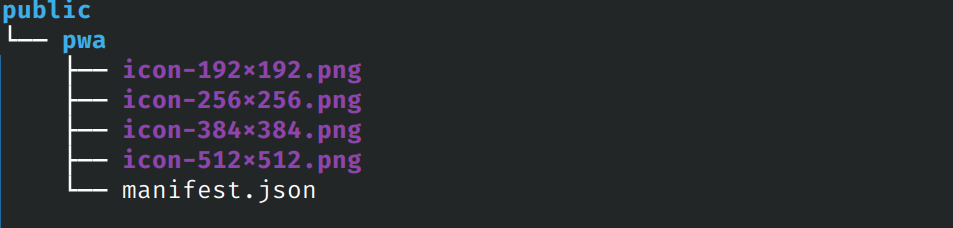

> DESARROLLO WEB EN ENTORNO SERVIDOR

# Tema 9: APLICACIONES WEB PROGRESIVAS <!-- omit in toc -->
> Desarrollo de aplicaciones Web híbridas  
> PWA: PROGRESSIVE WEB APP. WEB MANIFEST. SERVICE WORKER.

**[`PROYECTOS DE EJEMPLO`](PROYECTOS.md)**


---

- [1. Introducción](#1-introducción)
- [2. Características de una PWA](#2-características-de-una-pwa)
- [3. Pasos a seguir](#3-pasos-a-seguir)
  - [3.1. Generar manifest.json e iconos](#31-generar-manifestjson-e-iconos)
  - [3.2. Añadir manifest.js al layout principal](#32-añadir-manifestjs-al-layout-principal)
- [4. Instalar / desinstalar PWA](#4-instalar--desinstalar-pwa)
- [5. Profundizando en las PWA](#5-profundizando-en-las-pwa)
- [6. Herramientas para auditoría](#6-herramientas-para-auditoría)
- [7. Otras propiedades de metadata](#7-otras-propiedades-de-metadata)
- [8. Favicon](#8-favicon)
- [9. Optimización](#9-optimización)
- [10. CASOS PRÁCTICOS AVANZADOS](#9-casos-prácticos-avanzados)
  - [10.1. Panel de gestión de escuela (Parte 2 de 2)](#91-panel-de-gestión-de-escuela-parte-2-de-2)
- [11. Referencias](#10-referencias)


--- 

# 1. Introducción

En este tema veremos como convertir nuestra aplicación web en una PWA.

Una [aplicación web progresiva (PWA)](https://es.wikipedia.org/wiki/Aplicaci%C3%B3n_web_progresiva) es una aplicación creada utilizando tecnologías de plataforma web, pero que proporciona una experiencia de usuario similar a la de una aplicación específica de una plataforma.

Al igual que un sitio web, una PWA puede ejecutarse en múltiples plataformas y dispositivos desde una única base de código. Al igual que una aplicación específica de una plataforma, se puede instalar en el dispositivo, puede funcionar sin conexión y en segundo plano, y puede integrarse con el dispositivo y con otras aplicaciones instaladas.


# 2. Características de una PWA

Las aplicaciones web progresivas combinan las mejores características de los sitios web tradicionales y las aplicaciones específicas de la plataforma.

Las PWA tienen los beneficios de los sitios web, que incluyen:

- Las PWA se desarrollan utilizando tecnologías de plataforma web estándar, por lo que pueden ejecutarse en múltiples sistemas operativos y clases de dispositivos desde una única base de código.
- Se puede acceder a las PWA directamente desde la web.

Las PWA también tienen muchos de los beneficios de las aplicaciones específicas de la plataforma, que incluyen:

- **Se pueden instalar PWA en el dispositivo**. Esto significa:
  - La PWA se puede instalar desde la tienda de aplicaciones de la plataforma o directamente desde la web.
  - La PWA se puede instalar como una aplicación específica de la plataforma y puede personalizar el proceso de instalación.
  - Una vez instalada, la PWA obtiene un ícono de aplicación en el dispositivo, junto con aplicaciones específicas de la plataforma.
  - Una vez instalada, la PWA se puede iniciar como una aplicación independiente, en lugar de como un sitio web en un navegador.

- **Las PWA pueden funcionar en segundo plano y sin conexión**: un sitio web típico solo está activo mientras la página está cargada en el navegador. Una PWA puede:
  - Funcionar mientras el dispositivo no tenga conectividad de red.
  - Actualizar contenido en segundo plano.
  - Responder a los mensajes push del servidor.
  - Mostrar notificaciones utilizando el sistema de notificaciones del sistema operativo.
  
- **Las PWA pueden usar toda la pantalla**, en lugar de ejecutarse en la interfaz de usuario del navegador.
- Las PWA se pueden integrar en el dispositivo, registrarse como destinos y fuentes compartidos y acceder a las funciones del dispositivo.
- Las PWA se pueden distribuir en tiendas de aplicaciones, así como abiertamente a través de la web.

# 3. Pasos a seguir

A continuación se muestran los pasos a seguir para convertir nuestra aplicación web en una aplicación web progresiva.

## 3.1. Generar manifest.json e iconos

Deberemos generar un archivo `manifest.json` (también puede llamarse `manifest.webmanifest`) e iconos de varios tamaños. Para ello podemos hacer uso de alguno de los generadores de *app manifest* disponibles en la web.

Un buen sitio para generar el `manifest` era [simicart](https://www.simicart.com/manifest-generator.html/)


Al generador deberemos proporcinarle, además de los datos de configuración, una imagen con fondo transparente y un tamano de 512x512 píxeles. A partir de ella, el generador nos proporcionará varias imagenes de menor tamaño.

> **IMPORTANTE**: En el apartado Display es muy recomendable establecer el valor `standalone`. Esto hará que nuestra aplicación se muestre en una ventana propia, sin mostrar en ningún momento el navegador subyacente.

A continuación descargaremos los archivos a nuestro PC o portátil.


Una vez descargados los archivos, los colocaremos en la carpeta **`/public`** de nuestro proyecto. 


**IMPORTANTE:**

Teniendo en cuenta que la aplicación anterior ya no está disponible en Internet y que las aplicaciones que sí están disponibles no funcionan correctamente, podemos recurrir a la solución directa, que consiste en los 2 pasos siguientes:

1. Usar un archivo **manifest.json** previo como base para elaborar el nuestro
2. Generar los distintos tamaños de los iconos con alguna herramienta de escritorio u on-line (p. ej: [derivv](https://derivv.com/) )

Para el **primer paso**, aquí tienes el contenido de un manifest.json de ejemplo:

```json
{
    "theme_color": "#2e30a1",
    "background_color": "#3e586f",
    "display": "standalone",
    "scope": "/",
    "start_url": "/",
    "name": "NextJS Cloudinary CRUD",
    "short_name": "nxcloudinary-crud",
    "description": "NextJS Photo Gallery App using Cloudinary",
    "icons": [
        {
            "src": "icons/icon-192x192.png",
            "sizes": "192x192",
            "type": "image/png"
        },
        {
            "src": "icons/icon-256x256.png",
            "sizes": "256x256",
            "type": "image/png"
        },
        {
            "src": "icons/icon-384x384.png",
            "sizes": "384x384",
            "type": "image/png"
        },
        {
            "src": "icons/icon-512x512.png",
            "sizes": "512x512",
            "type": "image/png"
        }
    ]
}
```

Para el **segundo paso**, busca una imagen con un tamaño **512x512** y genera los siguientes tamaños adicionales:

- **384x384**
- **256x256**
- **192x192**

Por último deberás renombrar las imágenes para que su nombre y ruta coincida con el indicado en el archivo manifest.json previo, y subir todo a la carpeta public del proyecto. 



## 3.2. Añadir manifest.js al layout principal

Indicaremos a nuestra aplicación que haga uso del manifiesto anterior.

**`src/app/layout.js`**

```js
import '@/app/globals.css'
// otros imports

export const metadata = {
  title: 'ORM Prisma',
  description: 'Generated by create next app',
  manifest: '/manifest.json'
}
```

# 4. Instalar / desinstalar PWA

Si abrimos la aplicación con Chrome, nos apareceráen la parte derecha de la barra de direcciones  un icono para instalar la app.


Una vez instalada, se nos creará un acceso directo en el escritorio. 


También es posible instalar la aplicación en un dispositivo móvil.


En el escritorio de PC o portátil pulsamos en los 3 puntos de la barra de título para realizar la desinstalación.


# 5. Profundizando en las PWA

Una PWA puede proporcionar otras funcionalidades más allá de la simple instalación en un sistema anfitrión. 

Más información en el siguiente enlace:

- https://www.dosmedia.com/que-son-progressive-web-apps/


# 6. Herramientas para auditoría

Una herramienta muy conocida que suele venir integrada en las *dev tools* del navegador Chrome es **Lighthouse**. Al aplicar la auditoría a nuestra aplicación nos dará información acerca de las siguientes características:

- Rendimiento
- Accesibilidad
- Prácticas recomendadas
- SEO
- PWA (actualmente este apartado ha sido dado de baja)

Lo mismo puede realizarse a través de la web [https://pagespeed.web.dev/](https://pagespeed.web.dev/)


> **IMPORTANTE:** Para obtener una información más fiable se recomienda lanzar la auditoría en modo incógnito, puesto que no se cargan plugins que puedan interferir en la medida.


# 7. Otras propiedades de metadata

La propiedad `manifest` forma parte del objeto `metadata`. Puedes encontrar otras propiedades como [openGraph](https://nextjs.org/docs/app/api-reference/functions/generate-metadata#opengraph), [robots](https://nextjs.org/docs/app/api-reference/functions/generate-metadata#robots), ... en el siguiente enlace:

- https://nextjs.org/docs/app/api-reference/functions/generate-metadata#metadata-fields


# 8. Favicon

Independientemente de la PWA, para generar los distintos tamaños del [**`favicon.ico`**](https://es.wikipedia.org/wiki/Favicon) podemos usar la herramienta web [convertico.com](https://convertico.com/es/)


# 9. Optimización

Algunas técnicas novedosas para optimizar nuestra aplicación Next, pueden verse en los siguientes enlaces:

- [Demo](https://next-faster.vercel.app/)
- [Código fuente](https://github.com/ethanniser/NextFaster)
- [Vídeo explicativo en inglés](https://youtu.be/fWfIf7Vfjec?si=xe_aIduZKmF6XLAB)


# 10. CASOS PRÁCTICOS AVANZADOS

En los temas previos dispones de algunos [proyectos de ejemplo](proyectos) que hacen uso bases de datos. Son proyectos básicos que pretenden ser didácticos, no ser extensos ni exhaustivos.        

Para que compruebes las posibilidades que tienes a tu disposición, puedes consultar el siguiente proyecto, que está desarrollado y explicado (en inglés) con cierta profundidad. 

## 10.1. Panel de gestión de escuela (Parte 2 de 2)

- [Vídeo: Next.js Full-Stack School Management App Full Tutorial](https://youtu.be/6sfiAyKy8Jo?si=mjEALft8TuO-3fg7)
- [Código fuente del video anterior](https://github.com/safak/full-stack-school)


# 11. Referencias

- [Web App Manifest Generator: simicart](https://www.simicart.com/manifest-generator.html/)
- [Web App Manifest Generator: netlify](https://manifest-gen.netlify.app/) 
- [❤️ Convertidor PNG a ICO ❤️](https://convertico.com/)
- [Web App Manifest Generator: progressier](https://progressier.com/pwa-manifest-generator) 
- [MDN PWA](https://developer.mozilla.org/en-US/docs/Web/Progressive_web_apps)
- [Web Manifest](https://developer.mozilla.org/es/docs/Web/Manifest)
- [Video - Crear PWA de forma muy sencilla](https://youtu.be/Sb0_k0gaWX0?si=178qFPPH5DzuVs2h)
- [Aplicación Demo](https://nxprisma-crud-negocio.vercel.app/)
