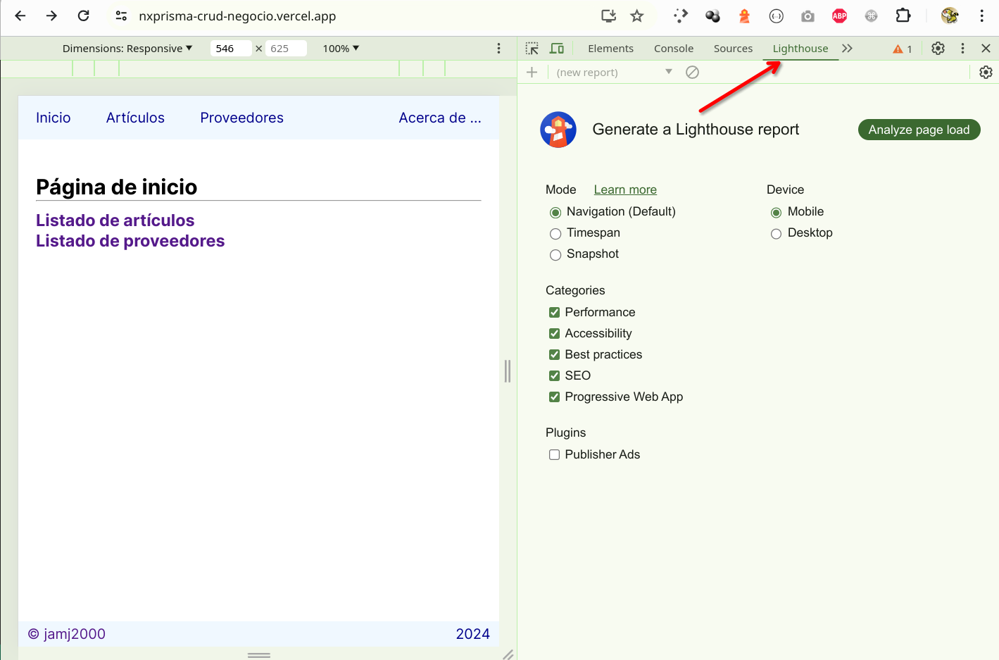
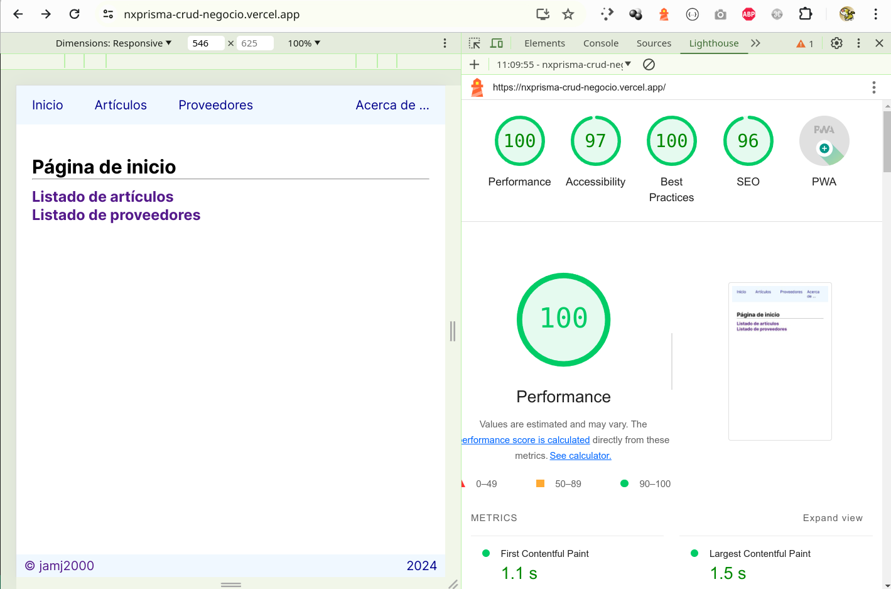

# Recursos y Referencias

Aquí encontrarás una recopilación de recursos que pueden ser de utilidad de forma trasversal a lo largo de todo el módulo.

  
<strong>State of Javascript</strong>

  <a href="https://stateofjs.com/en-US">State of Javascript</a>
  

    Estadísticas anuales de las características, herramientas y frameworks relacionadas con el lenguaje, basadas en encuestas realizadas a la comunidad.
  

  

    Puede resultar de utilidad para tener una orientación a la hora de considerar para su uso o dejar de considerar ciertas tecnologías.
  

  
<strong>BundlePhobia</strong>
  
  <a href="https://bundlephobia.com/">BundlePhobia</a>
  

    ¿Cuánto ocupa cada paquete de npm?
  

  

  
<strong>Roadmap</strong>
  
  <a href="https://roadmap.sh/">Roadmap</a>
  

    Sitio que pretende ofrecer una <i>hoja de ruta</i> a la hora de abordar un perfil profesional dentro del sector de la informática. 
  

  

    No debe interpretarse de forma rígida, puesto que a menudo los conocimientos necesarios pueden adquirirse en distinto orden al indicado. Además, en algunos casos, sólo es necesario adquirir el 10% de ellos para manejarnos en dicho sector. Las tecnologías mostradas  nos servirán para tener una visión de conjunto de todas las opciones posibles, pero en ningún caso significa que debemos aprender todas ellas para considerarnos competentes en dicho sector. Algunas tecnologías estan próximas a su reemplazo por otras por lo que no merece la pena invertir tiempo en ellas.
  

  

  
<strong>Lighthouse</strong>

  

    Herramienta para desarrolladores incorporada en el navegador Chrome que nos permite realizar auditoría de aplicaciones web.
  

  
  

