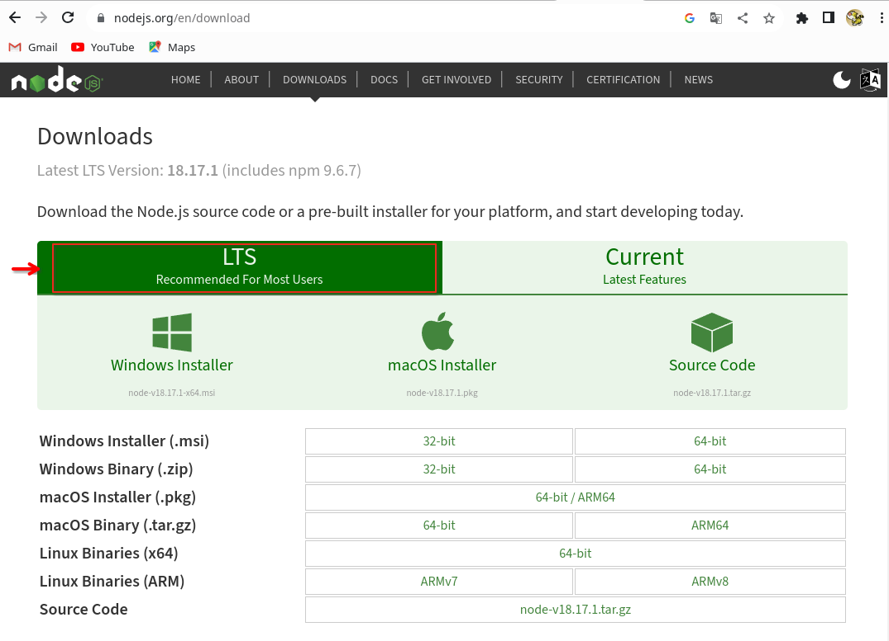

# ENTORNO DE EJECUCIÓN NODEJS <!-- omit in toc -->
> NODE, MÓDULOS INCORPORADOS, NPM, NPX, LINTER, ESLINT

**[`CÓDIGO DE EJEMPLO`](codigo)**


---

- [1. Introducción](#1-introducción)
  - [1.1. Lenguajes de servidor](#11-lenguajes-de-servidor)
- [2. NodeJS](#2-nodejs)
  - [2.1. Instalación del entorno de ejecución NodeJS](#21-instalación-del-entorno-de-ejecución-nodejs)
  - [2.2. Probando Node](#22-probando-node)
  - [2.3. Probando VSCode](#23-probando-vscode)
  - [2.4. Inicializar un proyecto](#24-inicializar-un-proyecto)
  - [2.5. Archivo package.json](#25-archivo-packagejson)
  - [2.6. Ejecución de paquetes sin necesidad de instalar](#26-ejecución-de-paquetes-sin-necesidad-de-instalar)
  - [2.7. Módulos incorporados (built-in) en Node](#27-módulos-incorporados-built-in-en-node)
- [3. Linter para Javascript (y también para CSS)](#3-linter-para-javascript-y-también-para-css)
- [4. Configuración de usuario en VSCode](#4-configuración-de-usuario-en-vscode)
  - [4.1. Atajos imprescindibles del teclado](#41-atajos-imprescindibles-del-teclado)
  - [4.2. Archivo settings.json](#42-archivo-settingsjson)
  - [4.3. Archivo keybindings.json](#43-archivo-keybindingsjson)
  - [4.4. Plugins](#44-plugins)
- [5. Referencias](#5-referencias)


---

# 1. Introducción

En el desarrollo de backend son muy numerosos los lenguajes de programación y frameworks que podemos usar. Actualmente las tecnologías web desarrolladas con Javascript están en plena efervescencia tanto en la parte *frontend* como *backend*. Es un ecosistema muy dinámico y con ideas novedosas e innovadoras.

El gran interés despertado se debe, entre muchas otras cosas, a:

1. Javascript puede usarse tanto en frontend, como backend. De esta forma no es necesario aprender 2 lenguajes.
2. Javascript permite ejecución asíncrona de código desde hace tiempo, algo muy necesario en las aplicaciones web.
3. Es un lenguaje muy eficiente y rápido. Más aún si se sabe utilizar adecuadamente.
4. Está soportado por todos los navegadores en el frontend. Existen numerosos sitios donde desplegar aplicaciones basadas en NodeJS para el backend.
5. Existe gran cantidad de software y paquetes escritos en Javascript.
6. Existe gran cantidad de documentación y desarrolladores.

Como desventajas, pueden señalarse las siguientes:

1. Existen tantos frameworks basados en Javascript que resulta abrumador.
2. Cada framework ofrece una forma de desarrollo y campo de aplicación diferentes, lo cual genera confusión entre los recién llegados.
3. Es difícil seguir el ritmo de las tecnologías que van surgiendo. 
   

En el lado servidor usaremos **NodeJS como entorno de ejecución** y como framework del lado servidor usaremos **NextJS 13**.

> **NOTA**
>
> Actualmente, no existe un único entorno de ejecución, sino 3:
>
> **Node**: https://nodejs.org
>
> **Deno**: https://deno.com/ 
>
> **Bun**: https://bun.sh/


## 1.1. Lenguajes de servidor

A continuación se muestra un ejemplo de código de una pequeña aplicación desarrollada en distintos lenguajes de servidor.

Los lenguajes son:

- PHP
- .NET
- JSP
- JAVA
- PYTHON
- NODEJS
  

**PHP**

```php
<!DOCTYPE html>
<!-- PHP: /var/www/html/hello.php => http://localhost/hello.php -->
<!-- Servidor Apache2 con módulo libapache2-mod-php en Linux -->
<html>
<body>

<?php

$color = "red";
echo "My car is " . $color . "<br>";
echo "My house is " . $color . "<br>";
echo "My boat is " . $color . "<br>";

?>

</body>
</html>
```


**ASP.NET**

```csharp
<%@ Page Language="C#" %>
<!DOCTYPE html>
<!-- ASP.NET: /var/www/html/hello.aspx => http://localhost/hello.aspx -->
<!-- Servidor Apache2 con módulo libapache2-mod-mono en Linux -->
<html>
<body>

<%

string color = "red";
Response.Write("My car is " + color + "<br>");
Response.Write("My house is " + color + "<br>");
Response.Write("My boat is " + color + "<br>");

%>

</body>
</html>
```

**JSP**

```jsp
<!DOCTYPE html>
<!-- JSP: /var/lib/tomcat9/webapps/ROOT/hello.jsp  => http://localhost:8080/hello.jsp -->
<!-- Servidor Tomcat9 en Linux -->
<html>
<body>

<%

String color = "red";
out.println("My car is " + color + "<br>");
out.println("My house is " + color + "<br>");
out.println("My boat is " + color + "<br>");

%>

</body>
</html>
```

**PYTHON/DJANGO**

```python
<!-- PYTHON/DJANGO -->
<!DOCTYPE html>
<html>
<body>


  My car is {{ color }} <br>
  My house is {{ color }} <br>
  My boat is {{ color }} <br>


</body>
</html>
```

**JAVA**

```java
// JAVA SERVLET
import java.io.IOException;
import java.io.PrintWriter;
import jakarta.servlet.ServletException;
import jakarta.servlet.annotation.WebServlet;
import jakarta.servlet.http.HttpServlet;
import jakarta.servlet.http.HttpServletRequest;
import jakarta.servlet.http.HttpServletResponse;

@WebServlet("/MyServlet")
public class MyServlet extends HttpServlet {
    protected void doGet(HttpServletRequest request, HttpServletResponse response)
    throws ServletException, IOException {
        response.setContentType("text/html");
        PrintWriter out = response.getWriter();

        String color = "red";
        out.println("<!DOCTYPE html>");
        out.println("<html>");
        out.println("<body>");
        out.println("My car is " + color + "<br>");
        out.println("My house is " + color + "<br>");
        out.println("My boat is " + color + "<br>");
        out.println("</body>");
        out.println("</html>");
    }
}
```


**NODEJS**

```javascript
const express = require('express');
const app = express();
const port = 3000;

app.get('/', (req, res) => {
  const color = "red";
  const html = `
    <!DOCTYPE html>
    <html>
    <body>
      <p>My car is ${color}</p>
      <p>My house is ${color}</p>
      <p>My boat is ${color}</p>
    </body>
    </html>
  `;
  res.send(html);
});

app.listen(port, () => {
  console.log(`Server is running on http://localhost:${port}`);
});
```


**NEXTJS**
```javascript
import React from 'react';

const Home = () => {
  const color = "red";

  return (
    <html>
      <body>
        <p>My car is {color}</p>
        <p>My house is {color}</p>
        <p>My boat is {color}</p>
      </body>
    </html>
  );
};

export default Home;
```

# 2. NodeJS


Node.js es un **entorno en tiempo de ejecución** multiplataforma, de código abierto, para la capa del servidor basado en el lenguaje de programación **JavaScript**, asíncrono, con E/S de datos en una arquitectura orientada a eventos y **basado en el motor V8 de Google**.


Este entorno nos permitirá desarrollar aplicaciones en el servidor usando Javascript. También es muy utilizado como plataforma de desarrollo para frameworks del lado cliente.

Posee un extenso repositorio de paquetes para prácticamente cualquier funcionalidad que deseemos. 

Trabajaremos con la version LTS, por ser más estable y tener soporte a largo plazo. 


## 2.1. Instalación del entorno de ejecución NodeJS



La instalación de NodeJS es bastante sencilla. Existen instaladores para Windows y Mac. 

En el caso de Linux lo haremos desde el terminal de texto. Aquí tienes los comandos. Es copiar y pegar.

```bash
# instalamos nvm (Node Version Manager)
curl -o- https://raw.githubusercontent.com/nvm-sh/nvm/v0.40.0/install.sh | bash

# descargamos e instalamos Node.js (después necesitarás reiniciar el terminal)
nvm install 22
```

Los versiones instaladas se guardarán en la carpeta del usuario, en `~/.nvm/versions/node/`


Una vez realizada la instalación dispondremos de 3 utilidades:

- **node**:  es el entorno de ejecución propiamente dicho.
- **npm**:  es el gestor de paquetes.
- **npx**:  es el lanzador de paquetes ejecutables.

Podemos comprobar que se han instalado correctamente y la version de cada utilidad:

```bash
node --version
npm  --version
npx  --version
nvm  --version
```

Si nos muestra la versión de cada uno, es que la instalación fue exitosa.


## 2.2. Probando Node

Podemos lanzar el intérprete de node, simplemente ejecutando en un terminal el comando `node`:

```bash
node 
Welcome to Node.js v18.17.1.
Type ".help" for more information.
> 
```

Algunos comandos: 


```javascript
console.log("Hola mundo")
```

```javascript
for (let i=0; i<10; i++) console.log (i)
```

```javascript
let desarrolladores = [
    { nombre: 'Juan', tipo: 'móvil', edad: 24 },
    { nombre: 'Inma', tipo: 'móvil', edad: 31 },
    { nombre: 'Ana',  tipo: 'web',   edad: 25 },
    { nombre: 'Eva',  tipo: 'web',   edad: 30 },
    { nombre: 'José', tipo: 'móvil', edad: 33 }
];

console.table(desarrolladores)
```

```javascript
const fs = require('fs')

// Creación de archivo leeme.txt
const datos = `
Este contenido ha sido generado desde Javascript
y escrito en un archivo desde NodeJS.

Chao.
`

fs.writeFile ("leeme.txt", datos, (error) => {
  if (error)
    console.log(error);
  else 
    console.log("Archivo creado exitosamente");
})
```

```javascript
const fs = require('fs')

// Lectura de archivo leeme.txt
fs.readFile('leeme.txt', 'utf8', (error, datos) => {
  if (error) 
    console.error(error);
  else
    console.log(datos);
})
```


> **ACTIVIDAD**
>
> Escribe `os.` y pulsa tabulador 2 veces
>
> Te aparecerán todas las propiedades y métodos disponibles en este módulo.
>
> Ejecuta los siguientes y haz una captura de pantalla:
> 
> `os.type()`
> 
> `os.platform()`
> 
> `os.arch()`
>
> `os.release()`
>
> `os.cpus()`
>
> `os.totalmem()`
>
> `os.freemem()`
>
> `os.uptime()`
>
> `os.networkInterfaces()`
>
> `os.userInfo()`


> **ACTIVIDAD**
>
> Escribe `process.` y pulsa tabulador 2 veces
>
> Te aparecerán todas las propiedades y métodos disponibles en este módulo.
>
> Ejecuta los siguientes y haz una captura de pantalla:
>
> `process.env`
>
> `process.pid`
>
> `process.ppid`
> 
> `process.uptime()`


Para salir de Node, escribimos `.exit` o pulsamos las teclas `Ctrl+D`.

## 2.3. Probando VSCode

La manera anterior de trabajar es muy incómoda. Nos sirve para tareas muy simples, pero si deseamos trabajar más cómoda podemos hacer uso de un editor o IDE. En la captura de más abajo se muestra un ejemplo de uso de VSCode. En el terminal lanzamos **`node  --watch  codigo.js`**, lo cual dejará a Node escuchando los cambios en el archivo `codigo.js`, y cada vez que guardemos los cambios a disco se ejecutará su código.


## 2.4. Inicializar un proyecto

Normalmente, node no se suele ejecutar de la forma que hemos realizado previamente, sino que se crean proyectos que se ejecutan en node.

Para crear un proyecto, creamos una carpeta, entramos en ella y ejecutamos `npm init -y`
```bash
mkdir proyecto-node  &&  cd proyecto-node

npm  init  -y 
```

> **NOTA**
> 
> La opción -y (--yes) de `npm init` crea un archivo **package.json** con opciones por defecto, sin hacer preguntas al usuario.

> **NOTA**
> 
> El comando `npm` (**Node Package Manager**) es muy importante. Nos permitirá:
> - Inicializar proyectos. 
> - Instalar paquetes.
> - Desinstalar paquetes.
> - Ejecutar diversos scripts: lanzamiento de entorno de desarrollo, generación de la compilación, tests, ...


## 2.5. Archivo package.json

Una vez inicializado un proyecto, se nos generará un archivo parecido al siguiente:

```json
{
  "name": "proyecto-node",
  "version": "1.0.0",
  "description": "",
  "main": "index.js",
  "scripts": {
    "test": "echo \"Error: no test specified\" && exit 1"
  },
  "keywords": [],
  "author": "",
  "license": "ISC"
}
```
Podemos instalar módulos externos con `npm`. Por ejemplo:

```console
npm install express     # Dependencia de aplicación
npm install nodemon -D  # Dependencia de desarrollo (dev)
```

Al realizar las instalaciones anteriores, se insertarán automáticamente las siguientes líneas en el archivo anterior:

```json
  "dependencies": {
    "express": "^4.16.4"
  },
  "devDependencies": {
    "nodemon": "^1.18.4"
  }
```

> **NOTA:** La versión de cada paquete puede diferir de la que tu tengas.


El archivo `package.json` contiene los metadatos del proyecto, entre estos están 3 cosas muy importantes:

- **scripts**:  tareas que podremos invocar, por ejemplo `npm run test` 
- **dependencies**: paquetes que nuestra aplicación necesita para ofrecer la funcionalidad deseada y serán incorporados a la aplicación final. 
- **devDependencies**: paquetes que sólo usaremos durante el desarrollo, no se incorporan a la aplicación final.


## 2.6. Ejecución de paquetes sin necesidad de instalar

Si no tenemos permisos para instalar paquetes en el sistema, podemos usar la herramienta **npx**. Características:

- Es una herramienta de ejecución de paquetes.
- **Ejecuta** paquetes ejecutables de `node.js` sin necesidad de instalarlos.
- Es más cómodo que usar `sudo npm install -g ...`
- Ejemplo (lanzar servidor web):
  
**Usando `sudo npm install -g ...`**

  ```bash
  sudo npm  install  -g  http-server
  http-server
  ```
**Usando `npx  ...`**
 
  ```bash
  npx  http-server
  ```

**Ejemplos**

```
npx  serve                     # Inicia un servidor web
npx  http-server               # Inicia otro servidor web
npx  live-server               # Inicia otro servidor web con recarga de archivos modificados
npx  servor                    # Inicia otro servidor web con recarga de archivos modificados

npx  @angular/cli  new         nombre-proyecto  # Iniciar proyecto de Angular 
npx  create-react-app          nombre-proyecto  # Iniciar proyecto de React 
npx  @vue/cli  create          nombre-proyecto  # Iniciar proyecto de Vue
npx  degit  sveltejs/template  nombre-proyecto  # Iniciar proyecto de Svelte   
```


## 2.7. Módulos incorporados (built-in) en Node

- No es necesario instalarlos.
- Ya vienen con node.js.
- Ejemplos:
  - **fs**:  Sistema de archivos
  - **http**:  Servidor HTTP
  - **https**:  Servidor HTTPS
  - **os**:  Sistema operativo
  - **path**:  Rutas de archivos
  - **process**:  Información y control del proceso actual
  - ...

Mas info: https://www.w3schools.com/nodejs/ref_modules.asp


# 3. Linter para Javascript (y también para CSS)

Un linter es un software que se encarga de examinar el código del programador y lo ayuda cuando detecta errores de sintaxis, código incorrecto, malas prácticas o incluso promueve a seguir unas normas de estilo. 

Dos linter muy conocidos son:
- **eslint** (para Javascript)
- **stylelint** (para CSS)


Podemos configurar un linter básico de Javascript haciendo:

```javascript
npm  init  -y               # Inicialización de proyecto
npm  init  @eslint/config   # Asistente de configuración de ESLint
```

Más información en https://lenguajejs.com/javascript/calidad-de-codigo/eslint/

Otra forma más directa, aunque menos configurable, es realizar:

```javascript
npm  init  -y                                        # Inicialización de proyecto
npm  install -D standard  stylelint-config-standard  # Instalamos el conjunto de reglas standard
```

E insertamos en `package.json`

```json
"eslintConfig": {
  "extends": [ "standard" ]
},
"stylelint": {
  "extends": "stylelint-config-standard",
  "rules": {
     "indentation": 2
  }
},
``` 

# 4. Configuración de usuario en VSCode

## 4.1. Atajos imprescindibles del teclado

- `Ctrl+K`, `Ctrl+S`: Configuración de atajos del teclado
- `Ctrl+,`: Prefeencias del usuario
- `Ctrl+P`: Ir a archivo, ...
- `Ctrl+Shift+P`: Paleta de comandos

**Referencias**:

- [keyboard-shortcuts-windows](https://code.visualstudio.com/shortcuts/keyboard-shortcuts-windows.pdf)
- [keyboard-shortcuts-linux](https://code.visualstudio.com/shortcuts/keyboard-shortcuts-linux.pdf)
- [keyboard-shortcuts-macos](https://code.visualstudio.com/shortcuts/keyboard-shortcuts-macos.pdf)


## 4.2. Archivo settings.json

La configuración de usuario se guarda en un archivo **`settings.json`**, dentro de la carpeta del usuario, en la subcarpeta `.config/Code/User`.

Para acceder al archivo anterior y realizar las configuraciones deseadas, pulsamos **`Ctrl+Shift+P`** para acceder a la paleta de comandos de VSCode, y luego escribimos `user settings json`. Abrimos el archivo, y editamos las opciones de configuración deseadas. 

Por ejemplo, mi configuración es la siguiente:

```json
{
    "workbench.colorTheme": "Default Light+",
    "workbench.iconTheme": "material-icon-theme",
    // Tailwind autofold 
    "tailwind-fold.autoFold": true,
    // Actualizar etiquetas de cierre de HTML y JSX
    "editor.linkedEditing": true,
    // Fuente con ligaduras
    "editor.fontLigatures": true,
    "editor.fontVariations": false,
    "editor.fontFamily": "'Fira Code', monospace",
    "svg.preview.mode": "svg",
    // Desactivamos validación CSS por defecto de VSCode
    "css.validate": false,
    "less.validate": false,
    "scss.validate": false,
    // Activamos stylelint para CSS
    "stylelint.enable": true,
    // linters: activamos eslint para Javascript
    "javascript.validate.enable": true,
    "eslint.validate": [
        "javascript"
    ],
    "eslint.enable": true,
    // linters: arreglamos código CSS + Javascript al guardar a disco
    "editor.codeActionsOnSave": {
        "source.fixAll.eslint": true,
        "source.fixAll.stylelint": true,
    },
    // Desactivamos la opción siguiente para no interferir con los linters
    // "editor.formatOnSave": true,
    "extensions.ignoreRecommendations": true,
    // Permite la edición simultánea de inicio y cierre de etiquetas HTML y JSX
    "editor.linkedEditing": true,
    // Soporte de Emmet para JSX
    "emmet.includeLanguages": {
        "javascript": "javascriptreact"
    },
}
```

Básicamente, la configuración hace lo siguiente:

- Se usa fuente con ligaduras [`Fira Code`](https://github.com/tonsky/FiraCode). Dicha fuente tiene que estar instalada previamente en el sistema.
- Se activa el [`lint`](https://es.wikipedia.org/wiki/Lint) para CSS y Javascript.
- Al guardar los cambios a disco, se arregla ( *fix* ) el código. Algunos errores requerirán la intervención del usuario al no poder solucionarse automáticamente.
- Se activa la edición enlazada, que permite modificar las 2 etiqueta HTML de una sola vez.   

> **IMPORTANTE:**
>
> Para que la configuración anterior sea efectiva es necesario cumplir los 3 requisitos siguientes:
> - Tener la fuente Fira Code instalada en el sistema.
> - Tener el plugin ESLint instalado en VSCode
> - Tener el plugin Stylelint instalado en VSCode


## 4.3. Archivo keybindings.json

La configuración de usuario para atajos de teclado se guarda en un archivo **`keybindings.json`**, dentro de la carpeta del usuario, en la subcarpeta `.config/Code/User`.


Por ejemplo, mi configuración es la siguiente:

```json
// Coloque sus atajos de teclado en este archivo para sobreescribir los valores predeterminados
[
    {
        "key": "ctrl+l",
        "command": "editor.action.insertSnippet",
        "when": "editorTextFocus",
        "args": {
          "snippet": "console.log(${TM_SELECTED_TEXT}$1);"
        }
      }
]
```

Esta configuración me permite seleccionar un texto o variable y envolverla dentro de `console.log`. Es muy útil para realizar tareas de depuración.


> [!NOTE]
>
> Los archivos de configuración de VSCode en realidad no son JSON, sino **JSONC** (JSON con comentarios). JSONC no es un estándar oficial. A continuación se muestra una tabla comparativa de características de JSON, JSONC y JSON5. 
> 
>
> | Característica              | JSON | JSONC         | JSON5         |
> |----------------------------|------|---------------|---------------|
> | Comentarios                | ❌   | ✅            | ✅            |
> | Claves sin comillas        | ❌   | ❌            | ✅            |
> | Comillas simples           | ❌   | ❌            | ✅            |
> | Notación JS extra          | ❌   | ❌            | ✅ (`NaN`, etc.) |
> | Coma en la última línea    | ❌   | ❌            | ✅            |
> | Compatible con APIs        | ✅   | ❌            | ❌ (generalmente) |
> | Soporte general            | 🔥   | 😐            | 😐            |
>
> Por otro lado, JSON5 es poco usuado y no es nativamente compatible con todos los lenguajes. Para usarlo necesitas una librería que lo interprete.


## 4.4. Plugins

Existen numerosos plugins para VSCode que nos permiten adaptar el entorno de desarrollo a nuestras necesidades. Para el desarrollo web suelen ser habituales, aunque pueden instalarse muchos otros, los siguientes:

**Spanish Language Pack for Visual Studio Code**

Para cambiar el idioma de VSCode a español. 


**Material Icon Theme**

Permite mostrar un icono por cada carpeta y archivo.


**Multiple cursor case preserve**

Nos permite preservar mayúsculas y minúsculas cuando editamos con cursor múltiple (Ctrl+D)


**ESLint**

Para hacer *lint* de Javascript.


**Stylelint**

Para hacer *lint* de CSS.


**Error Lens** 

Para mostrar los errores en la línea en la que ocurren.
Este plugin puede considerarse opcional, según el caso. De cualquier modo, una vez instalado, puede deshabilitarse si lo consideramos intrusivo.


**Console Ninja**

Este plugin es opcional, pero recomendado para realizar tareas de depuración de código. Nos permite mostrar dentro del propio VSCode los mensajes producidos por `console.log()` sin tener que recurrir al terminal constantemente.


**REST Client**

Este plugin es opcional. Es útil cuando deseamos *testear endpoints* de una API REST.


**Svg Preview**

Este plugin es opcional, pero recomendado si trabajamos con imagenes vectoriales `.svg`. Permite su visualización gráfica.


**Markdown All in One**

Este plugin es opcional, pero recomendado si trabajamos con Markdown. Permite numerar automáticamente los títulos y crear índice de contenido, entre otras funcionalidades.


**ES7+ React/Redux/React-Native snippets**

Este plugin es opcional, pero recomendado si trabajamos con React y/o NextJS.


**Prisma**

Este plugin es opcional. Recomendado si trabajamos con ORM Prisma.


**Tailwind CSS IntelliSense** y **Tailwind Fold**

Plugins opcionales. Recomentados si trabajamos con framework CSS Tailwind.


**Codeium**

Plugin opcional. Asistente de IA muy potente.


**Supermaven**

Plugin opcional. Asistente de IA muy rápido.


# 5. Referencias

- [Apuntes de Javascript](https://github.com/jamj2000/Javascript)
- [Vídeo: ¡Trucazos de Visual Studio Code para Programadores Web!](https://www.youtube.com/live/UdIcAdQtiws?si=nON_1sTZNnTQP1ZB)
