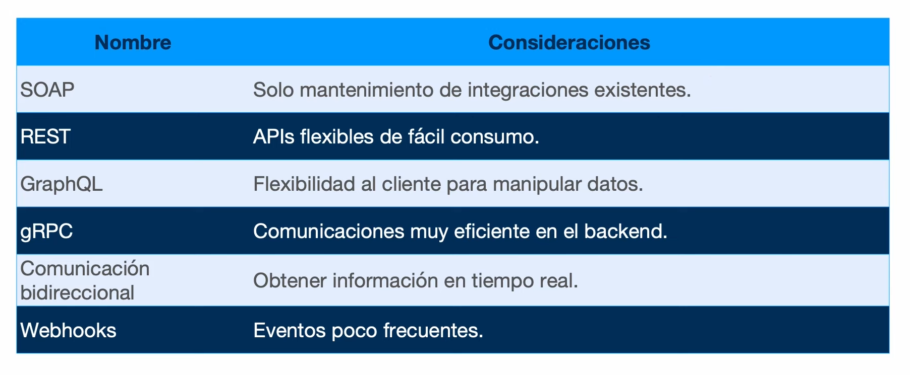

# ASPECTOS AVANZADOS <!-- omit in toc -->
> COMUNICACIÓN EN TIEMPO REAL, WEB WORKERS

---

- [1. Introducción](#1-introducción)
- [2. Comunicación Cliente-Servidor en tiempo real](#2-comunicación-cliente-servidor-en-tiempo-real)
- [3. Background Threads in Web Applications](#3-background-threads-in-web-applications)
- [4. Despliegue](#4-despliegue)

---

# 1. Introducción

A continuación encontrarás una serie de características y funcionalidades avanzadas, muchas no relacionadas directamente con NextJS, pero sí con el lenguaje Javascript. 

# 2. Comunicación Cliente-Servidor en tiempo real

- Long Polling
- Server Sent Events
- WebSockets

**Referencias:**

- [Estilos arquitectónicos](https://youtu.be/vjKxkNyTfoU?si=BuVtg9ioYfPVOrbC&t=95)
- [SSE: Server-Sent Events Crash Course](https://youtu.be/4HlNv1qpZFY?si=sQ6uuZAJ97Ty4q1l)
- [Server-Sent Events (SSE) - Implement Client and Server (Express.js)](https://www.youtube.com/watch?v=piEYV-fsYbA)
- [Don't Use Websockets (Until You Try This…)](https://youtu.be/6QnTNKOJk5A?si=QB2nEo8kHj6pddMJ)
- [Server Sent Events and Websockets. How to implement in NodeJS and HTMX](https://youtu.be/aPrrfVs9mDc?si=xC2RCy3208LDKRFf)

# 3. Background Threads in Web Applications

- [Web Workers Vs. Service Workers in JavaScript](https://www.dhiwise.com/post/web-workers-vs-service-workers-in-javascript)

# 4. Despliegue

Los servicios web de [Render](https://render.com) son compatibles con Websockets, que son esenciales para las aplicaciones modernas en tiempo real, como el chat y los juegos en línea. [Vercel](https://vercel.com) no admite Websockets debido a su arquitectura sin servidor. Para utilizar la comunicación en tiempo real en una aplicación Vercel, debe integrarse con un proveedor externo.