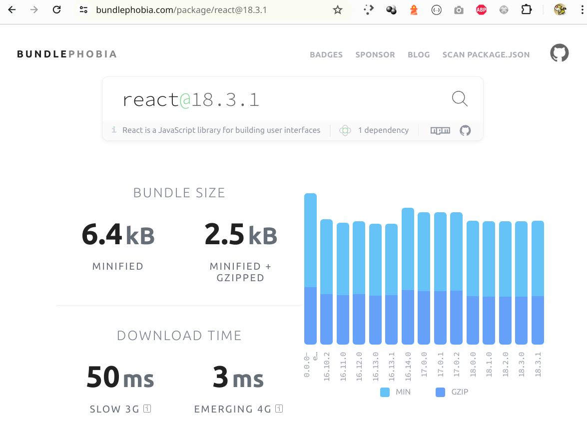

# ANEXO

Aquí encontrarás una recopilación de recursos que pueden ser de utilidad de forma trasversal a lo largo de todo el módulo.

  

    <strong>State of Javascript</strong>
  

  <a href="https://stateofjs.com/en-US" target="_blank">State of Javascript</a>
  

    Estadísticas anuales de las características, herramientas y frameworks relacionadas con el lenguaje, basadas en encuestas realizadas a la comunidad.
  

  

    Puede resultar de utilidad para tener una orientación a la hora de considerar para su uso o dejar de considerar ciertas tecnologías.
  

  

    <strong>BundlePhobia</strong>
  

    <a href="https://bundlephobia.com/">BundlePhobia</a>
  

    ¿Cuánto ocupa cada paquete de npm?
  

  

  

  <strong>Lighthouse</strong>
  

  

    Herramienta para desarrolladores incorporada en el navegador Chrome que nos permite realizar auditoría de aplicaciones web.
  

  
  

