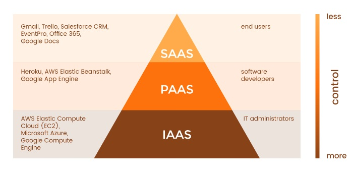
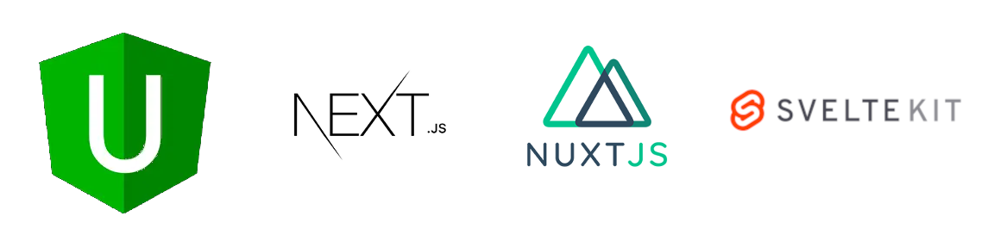
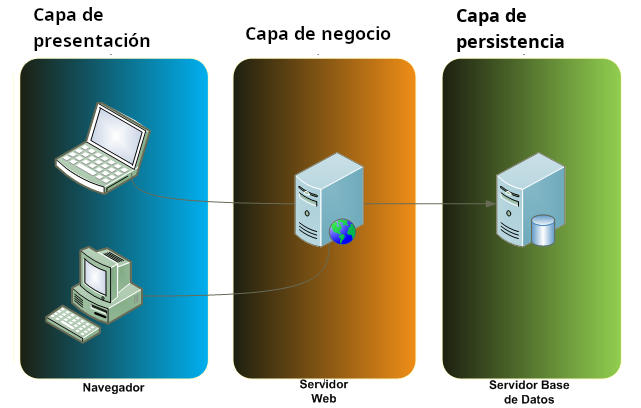

> DESARROLLO WEB EN ENTORNO SERVIDOR

# Tema 1: Selección de arquitecturas y herramientas de programación <!-- omit in toc -->
> CONCEPTOS, BACKEND, FRONTEND, MVC, MPA, SPA, LENGUAJES, FRAMEWORKS


- [1. Introducción](#1-introducción)
  - [1.1. La base de la web](#11-la-base-de-la-web)
  - [1.2. Partes de una aplicación web](#12-partes-de-una-aplicación-web)
- [2. Arquitectura Cliente/Servidor](#2-arquitectura-clienteservidor)
  - [2.1. Protocolo HTTP/HTTPS](#21-protocolo-httphttps)
  - [2.2. Clientes web](#22-clientes-web)
  - [2.3. Servidores web](#23-servidores-web)
    - [2.3.1. Servidores de contenido estático](#231-servidores-de-contenido-estático)
    - [2.3.2. Servidores de cómputo](#232-servidores-de-cómputo)
- [3. Tecnologías para el backend](#3-tecnologías-para-el-backend)
  - [3.1. Lenguajes del lado del servidor](#31-lenguajes-del-lado-del-servidor)
  - [3.2. Frameworks del lado servidor](#32-frameworks-del-lado-servidor)
  - [3.3. Resumen](#33-resumen)
- [4. Tecnologías para el frontend](#4-tecnologías-para-el-frontend)
  - [4.1. Lenguajes del lado del cliente](#41-lenguajes-del-lado-del-cliente)
  - [4.2. Frameworks del lado cliente](#42-frameworks-del-lado-cliente)
  - [4.3. Resumen](#43-resumen)
- [5. Tecnologías Javascript Fullstack](#5-tecnologías-javascript-fullstack)
  - [5.1. Frameworks para servidor y cliente](#51-frameworks-para-servidor-y-cliente)
- [6. MVC o SPA](#6-mvc-o-spa)
  - [6.1. Modelo-Vista-Controlador](#61-modelo-vista-controlador)
  - [6.2. Single Page Application](#62-single-page-application)
  - [6.3. MVC vs SPA](#63-mvc-vs-spa)
  - [6.4. Arquitectura de 3 capas](#64-arquitectura-de-3-capas)
- [7. Persistencia de los datos](#7-persistencia-de-los-datos)
  - [7.1. Bases de datos relacionales](#71-bases-de-datos-relacionales)
  - [7.2. Bases de datos no relacionales (noSQL)](#72-bases-de-datos-no-relacionales-nosql)
- [8. Viajando al futuro, que ya es presente](#8-viajando-al-futuro-que-ya-es-presente)
  - [8.1. WebAssembly (Wasm)](#81-webassembly-wasm)
  - [8.2. Apps en Wasm](#82-apps-en-wasm)


---

# 1. Introducción

En este tema abordaremos conceptos generales relacionados con las aplicaciones web:

- Arquitectura Cliente/Servidor 
- Lenguajes utilizados
- Frameworks disponibles


## 1.1. La base de la web


- **HTML**: Estructura del documento. `HTML5`. `2014`
- **CSS**: Formato/apariencia del documento. `CSS3`. 
- **Javascript**: Funcionalidad del documento. `ECMAScript6`. `2015`

> **NOTA**  
> 
> Al final de línea se muestra la versión más relevante actualmente y el año de su aparición oficial.


## 1.2. Partes de una aplicación web


- **Backend**: parte que se ejecuta en el servidor.
  - Se encarga de atender las peticiones de los clientes.
  - Suele tener soporte de almacenamiento de datos.
  - También se denomina capa de acceso a datos
- **Frontend**: parte que se ejecuta en el cliente.
  - Se encarga de la experiencia del usuario (UX).
  - Puede tener soporte de cache de datos.
  - También se denomina capa de presentación.


# 2. Arquitectura Cliente/Servidor

Uno de los servicios más populares de Internet es el servicio WWW o web. Existen otros servicios como correo electrónico y mensajería, entre otros, pero la tendencia es hacia su integración con la WWW.

Cada servicio tiene su protocolo propio (o protocolos). Así tenemos:

- Web: HTTP
- Correo: SMTP, POP, IMAP
- Mensajería: XMPP y otros
- Intercambio de archivo: FTP, BitTorrent

Muchos de los protocolos de Internet, sobre todo los más veteranos, son del tipo **Cliente/Servidor**, frente a algunos más novedosos, como BitTorrent, que son **PeerToPeer (P2P)**.

La principal diferencia entre estos 2 modos es la siguiente:

- Cliente/Servidor: Un dispositivo actúa como Cliente o como Servidor de forma exclusiva.
- PeerToPeer: Un dispositivo actual como Cliente y como Servidor a la vez.

El protocolo HTTP es un protocolo Cliente/Servidor, en el cual la comunicación sigue el siguiente proceso:

1. El cliente realiza una petición (**request**) al servidor.
2. El servidor devuelve una respuesta (**response**) al cliente.


## 2.1. Protocolo HTTP/HTTPS

Referencias:

- [Protocolo HTTP - Wikipedia](https://es.wikipedia.org/wiki/Protocolo_de_transferencia_de_hipertexto)
- [Protocolo HTTP - MDN](https://developer.mozilla.org/es/docs/Web/HTTP/Basics_of_HTTP)
- [Protocolo HTTP - CodeAndCoke](https://datos.codeandcoke.com/apuntes:http)

El protocolo usado mayoritariamente para la transferencia de información web es el protocolo HTTP (o su versión segura HTTPS). Se trata de un protocolo de texto, en el cual la información entre cliente y servidor se transmite en texto plano.

A continuación se muestra un ejemplo de una petición y un ejemplo de una respuesta.


**Petición del cliente**

```
GET / HTTP/1.1
Host: developer.mozilla.org
Accept-Language: es-ES
User-Agent: Mozilla/5.0 (X11; Linux x86_64; rv:45.0) Gecko/20100101 Firefox/45.0
Connection: keep-alive
[Línea en blanco]
```


**Respuesta del servidor**

```
HTTP/1.1 200 OK
Date: Sat, 09 Oct 2010 14:28:02 GMT
Server: Apache
Last-Modified: Tue, 01 Dec 2009 20:18:22 GMT
ETag: "51142bc1-7449-479b075b2891b"
Accept-Ranges: bytes
Content-Length: 29769
Content-Type: text/html

<!DOCTYPE html... (aquí estarían los 29769 bytes de la página web pedida)
```

> **NOTA:**
>
> Un cliente web, además de realizar peticiones GET, también puede hacer peticiones de tipo POST. Por ejemplo, al enviar al servidor información de un formulario:
>
> ```
> POST /contact_form.php HTTP/1.1
> Host: developer.mozilla.org
> Content-Length: 64
> Content-Type: application/x-www-form-urlencoded
> 
> name=Juan%20Garcia&request=Envieme%20uno%20de%20sus%20catalogos
> ```

**Formato de peticiones y respuestas**

El formato que siguen tanto las peticiones como las respuestas es el siguiente:

- **Línea inicial**
- **Cabeceras**
- **Línea en blanco**
- **Cuerpo** (opcional en las peticiones)
  


## 2.2. Clientes web


## 2.3. Servidores web


### 2.3.1. Servidores de contenido estático


### 2.3.2. Servidores de cómputo




> **NOTA:**
>
> También existe **DBaaS** (Base de datos como servicio). Se puede considerar equivalente al PaaS, pero aplicado a bases de datos.

Algunos proveedores de estos servicios son:

- [IaaS (Infraestructura como servicio)](https://es.wikipedia.org/wiki/Infraestructura_como_servicio)
  - Amazon: mediante EC2 (Elastic Compute Cloud )
  - Digital Ocean: mediante Droplets
- [PaaS (Plataforma como servicio)](https://en.wikipedia.org/wiki/Platform_as_a_service)
  - Heroku
  - Vercel

Una variante de los servidores de cómputo son los [serverless](https://www.cloudflare.com/es-es/learning/serverless/what-is-serverless/)

[](https://www.cloudflare.com/es-es/learning/serverless/glossary/serverless-vs-paas/)

# 3. Tecnologías para el backend


## 3.1. Lenguajes del lado del servidor


- **PHP**: PHP Hypertext Preprocessor. Uno de los lenguajes más utilizados para la creación de todo tipo de CMS.
- **JSP**: JavaServer Pages. Es la propuesta de Java, y uno de los más demandados.
- **ASP**: Active Server Pages. Es el lenguaje de desarrollo web de Microsoft. 
- **Java**: es un lenguaje multiplataforma propiedad de Oracle.
- **Ruby**: es un lenguaje de programación interpretado, reflexivo y orientado a objetos.
- **Python**: es un lenguaje de programación multiparadigma que hace hincapié en el código legible. 
- **Javascript (Node.js)**: cada vez más popular puesto que se usa también en el lado cliente.


## 3.2. Frameworks del lado servidor 


- PHP: **Laravel**, **Symfony**.
- JSP, Java: **Spring**.
- ASP: **ASP.NET**, **ASP.NET Core**.
- Ruby: **Ruby on rails**.
- Python: **Django**.
- Node.js: **Express**. 


## 3.3. Resumen


# 4. Tecnologías para el frontend


## 4.1. Lenguajes del lado del cliente


## 4.2. Frameworks del lado cliente


- **Angular**
- **React**
- **Vue**
- **Svelte** (compilador)


## 4.3. Resumen


# 5. Tecnologías Javascript Fullstack


## 5.1. Frameworks para servidor y cliente 



- **Universal**
- **Next**
- **Nuxt**
- **SvelteKit**


# 6. MVC o SPA


## 6.1. Modelo-Vista-Controlador


- patrón de diseño arquitectónico
- se ejecuta casi toda la lógica de aplicación en el backend. 
- el servidor sirve múltiples vistas, cada vista es una página HTML. 
- es una aplicación de múltiples páginas (MPA). 

https://es.wikipedia.org/wiki/Modelo%E2%80%93vista%E2%80%93controlador 


## 6.2. Single Page Application


- se ejecuta gran parte de la lógica de la aplicación en el frontend. 
- el servidor sirve datos mediante una API web. 
- principalmente se usan 2 formatos para el intercambio de datos:
  - **XML**
  - **JSON** 


## 6.3. MVC vs SPA


## 6.4. Arquitectura de 3 capas




# 7. Persistencia de los datos

- Uso de archivos
- Bases de datos relacionales
  - Subtipo importante: **BBDD objeto-relacionales**.
- Bases de datos no relacionales
  - Subtipo importante: **BBDD noSQL**.


## 7.1. Bases de datos relacionales


## 7.2. Bases de datos no relacionales (noSQL)


# 8. Viajando al futuro, que ya es presente


- [WebAssembly](https://es.wikipedia.org/wiki/WebAssembly)


## 8.1. WebAssembly (Wasm)

- Formato binario pequeño y rápido que promete un rendimiento casi nativo para las aplicaciones web.
- Los principales navegadores son compatibles con WebAssembly.
- Los desarrolladores escriben en el lenguaje de su elección (C, C++, ...), que luego se compila en bytecode WebAssembly.
- Para casos de uso intensivo de rendimiento, como juegos, transmisión de música, edición de vídeo y aplicaciones CAD.


- [WebAssembly explicado](https://www.ciospain.es/liderazgo--gestion-ti/que-es-webassembly-la-plataforma-web-de-proxima-generacion-explicada)


## 8.2. Apps en Wasm


- [Algunas aplicaciones desarrolladas para WebAssembly](https://www.campusmvp.es/recursos/post/8-proyectos-espectaculares-que-utilizan-webassembly.aspx)
