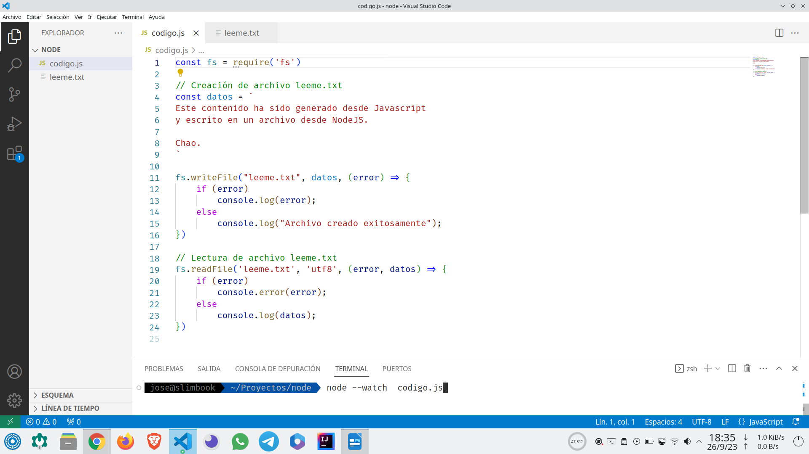
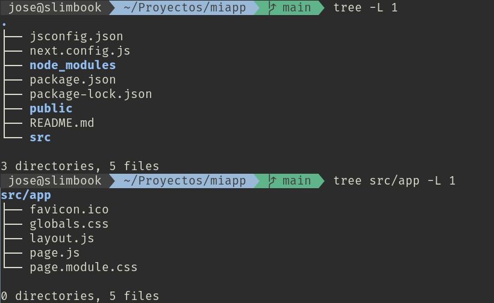

> DESARROLLO WEB EN ENTORNO SERVIDOR

# Tema 2: Inserción de código en páginas Web <!-- omit in toc -->

- [1. Introducción](#1-introducción)
  - [1.1. Lenguajes de servidor](#11-lenguajes-de-servidor)
- [2. NodeJS](#2-nodejs)
  - [2.1. Instalación del entorno de ejecución NodeJS](#21-instalación-del-entorno-de-ejecución-nodejs)
  - [2.2. Probando Node](#22-probando-node)
  - [2.3. Inicio de un proyecto](#23-inicio-de-un-proyecto)
  - [2.4. Archivo package.json](#24-archivo-packagejson)
  - [2.5. Instalación de módulos](#25-instalación-de-módulos)
  - [2.6. Opciones de NPM](#26-opciones-de-npm)
  - [2.7. Desinstalación de módulos](#27-desinstalación-de-módulos)
  - [2.8. Ejecución de paquetes sin necesidad de instalar](#28-ejecución-de-paquetes-sin-necesidad-de-instalar)
  - [2.9. Módulos incorporados (built-in) en Node](#29-módulos-incorporados-built-in-en-node)
  - [2.10. El servidor web](#210-el-servidor-web)
- [3. NextJS](#3-nextjs)
  - [3.1. Creación de un proyecto](#31-creación-de-un-proyecto)
  - [Carpetas y archivos del proyecto](#carpetas-y-archivos-del-proyecto)
  - [](#)
- [4. Referencias](#4-referencias)


---
# 1. Introducción

En el desarrollo de backend son muy numerosos los lenguajes de programación y frameworks que podemos usar. Actualmente las tecnologías web desarrolladas con Javascript está en plena efervescencia tanto en la parte *frontend* como *backend*. Es un ecosistema muy dinámico y con ideas novedosas e innovadoras.

El gran interés despertado se debe, entre muchas otras cosas, a:

1. Javascript puede usarse tanto en frontend, como backend. De esta forma no es necesario aprender 2 lenguajes.
2. Javascript permite ejecución asíncrona de código desde hace tiempo, algo muy necesario en las aplicaciones web.
3. Es un lenguaje muy eficiente y rápido. Más aún si se sabe utilizar adecuadamente.
4. Está soportado por todos los navegadores en el frontend. Existen numerosos sitios donde desplegar aplicaciones basadas en NodeJS para el backend.
5. Existe gran cantidad de software y paquetes escritos en Javascript.
6. Existe gran cantidad de documentación y desarrolladores.

Como desventajas, pueden señalarse las siguientes:

1. Existen tantos frameworks basados en Javascript que resulta abrumador.
2. Cada framework ofrece una forma de desarrollo y campo de aplicación diferentes, lo cual genera confusión entre los recién llegados.
3. Es difícil seguir el ritmo de las tecnologías que van surgiendo. 
   

En el lado servidor usaremos **NodeJS como entorno de ejecución** y como framework del lado servidor usaremos **NextJS 13**.

> **NOTA**
>
> Actualmente, no existe un único entorno de ejecución, sino 3:
>
> **Node**: https://nodejs.org/es
>
> **Deno**: https://deno.com/ 
>
> **Bun**: https://bun.sh/


## 1.1. Lenguajes de servidor

A continuación se muestra un ejemplo de código de una pequeña aplicación desarrollada en distintos lenguajes de servidor.

**PHP**

```php
<!DOCTYPE html>
<!-- PHP: /var/www/html/hello.php => http://localhost/hello.php -->
<!-- Servidor Apache2 con módulo libapache2-mod-php en Linux -->
<html>
<body>

<?php

$color = "red";
echo "My car is " . $color . "<br>";
echo "My house is " . $color . "<br>";
echo "My boat is " . $color . "<br>";

?>

</body>
</html>
```


**ASP.NET**

```csharp
<%@ Page Language="C#" %>
<!DOCTYPE html>
<!-- ASP.NET: /var/www/html/hello.aspx => http://localhost/hello.aspx -->
<!-- Servidor Apache2 con módulo libapache2-mod-mono en Linux -->
<html>
<body>

<%

string color = "red";
Response.Write("My car is " + color + "<br>");
Response.Write("My house is " + color + "<br>");
Response.Write("My boat is " + color + "<br>");

%>

</body>
</html>
```

**JSP**

```jsp
<!DOCTYPE html>
<!-- JSP: /var/lib/tomcat9/webapps/ROOT/hello.jsp  => http://localhost:8080/hello.jsp -->
<!-- Servidor Tomcat9 en Linux -->
<html>
<body>

<%

String color = "red";
out.println("My car is " + color + "<br>");
out.println("My house is " + color + "<br>");
out.println("My boat is " + color + "<br>");

%>

</body>
</html>
```

**PYTHON/DJANGO**

```python
<!-- PYTHON/DJANGO -->
<!DOCTYPE html>
<html>
<body>


  My car is {{ color }} <br>
  My house is {{ color }} <br>
  My boat is {{ color }} <br>


</body>
</html>
```

**JAVA**

```java
// JAVA SERVLET
import java.io.IOException;
import java.io.PrintWriter;
import jakarta.servlet.ServletException;
import jakarta.servlet.annotation.WebServlet;
import jakarta.servlet.http.HttpServlet;
import jakarta.servlet.http.HttpServletRequest;
import jakarta.servlet.http.HttpServletResponse;

@WebServlet("/MyServlet")
public class MyServlet extends HttpServlet {
    protected void doGet(HttpServletRequest request, HttpServletResponse response)
    throws ServletException, IOException {
        response.setContentType("text/html");
        PrintWriter out = response.getWriter();

        String color = "red";
        out.println("<!DOCTYPE html>");
        out.println("<html>");
        out.println("<body>");
        out.println("My car is " + color + "<br>");
        out.println("My house is " + color + "<br>");
        out.println("My boat is " + color + "<br>");
        out.println("</body>");
        out.println("</html>");
    }
}
```


**NODEJS**

```javascript
const express = require('express');
const app = express();
const port = 3000;

app.get('/', (req, res) => {
  const color = "red";
  const html = `
    <!DOCTYPE html>
    <html>
    <body>
      <p>My car is ${color}</p>
      <p>My house is ${color}</p>
      <p>My boat is ${color}</p>
    </body>
    </html>
  `;
  res.send(html);
});

app.listen(port, () => {
  console.log(`Server is running on http://localhost:${port}`);
});
```


**NEXTJS**
```javascript
import React from 'react';

const Home = () => {
  const color = "red";

  return (
    <html>
      <body>
        <p>My car is {color}</p>
        <p>My house is {color}</p>
        <p>My boat is {color}</p>
      </body>
    </html>
  );
};

export default Home;
```

# 2. NodeJS


Node.js es un **entorno en tiempo de ejecución** multiplataforma, de código abierto, para la capa del servidor basado en el lenguaje de programación **JavaScript**, asíncrono, con E/S de datos en una arquitectura orientada a eventos y **basado en el motor V8 de Google**.


Este entorno nos permitirá desarrollar aplicaciones en el servidor usando Javascript. También es muy utilizado como plataforma de desarrollo para frameworks del lado cliente.

Posee un extenso repositorio de paquetes para prácticamente cualquier funcionalidad que deseemos. 

Trabajaremos con la version LTS, por ser más estable y tener soporte a largo plazo. 


## 2.1. Instalación del entorno de ejecución NodeJS


La instalación de NodeJS es bastante sencilla. Existen instaladores para Windows y Mac. En el caso de Linux no es tan sencilla, pero aún así no tiene excesiva dificultad.

Se siguen los siguientes pasos:

1. Se descarga archivo comprimido.
2. Se descomprime el archivo anterior.
3. Se copian a `/usr` las subcarpetas `bin`, `lib`, `include` y `share`.

Aquí tienes los comandos. Es copiar y pegar.

```bash
wget https://nodejs.org/dist/v18.17.1/node-v18.17.1-linux-x64.tar.xz
tar xvf node-v18.17.1-linux-x64.tar.xz
cd node-v18.17.1-linux-x64
sudo  cp  -r   bin  lib  include  share  /usr
```

Para comprobar que se ha instalado correctamente hacemos

```bash
ls /usr/bin/{node,npm,npx} -l
```

Deben aparecer 3 ejecutables:

- **node**:  es el entorno de ejecución propiamente dicho.
- **npm**:  es el gestor de paquetes.
- **npx**:  es el lanzador de paquetes ejecutables.

También podemos comprobar que se han instalado correctamente si ejecutamos

```bash
node --version
npm  --version
npx  --version
```

Si nos muestra la versión de cada uno, es que la instalación fue exitosa.


## 2.2. Probando Node

Podemos lanzar el intérprete de node, simplemente ejecutando en un terminal el comando `node`:

```bash
node 
Welcome to Node.js v18.17.1.
Type ".help" for more information.
> 
```

Algunos comandos: 


```javascript
console.log("Hola mundo")
```

```javascript
for (let i=0; i<10; i++) console.log (i)
```

```javascript
let desarrolladores = [
    { nombre: 'Juan', tipo: 'móvil', edad: 24 },
    { nombre: 'Inma', tipo: 'móvil', edad: 31 },
    { nombre: 'Ana',  tipo: 'web',   edad: 25 },
    { nombre: 'Eva',  tipo: 'web',   edad: 30 },
    { nombre: 'José', tipo: 'móvil', edad: 33 }
];

console.table(desarrolladores)
```

```javascript
// Creación de archivo leeme.txt
const datos = `
Este contenido ha sido generado desde Javascript
y escrito en un archivo desde NodeJS.

Chao.
`

fs.writeFile ("leeme.txt", datos, (error) => {
  if (error)
    console.log(error);
  else 
    console.log("Archivo creado exitosamente");
})
```

```javascript
// Lectura de archivo leeme.txt
fs.readFile('leeme.txt', 'utf8', (error, datos) => {
  if (error) 
    console.error(error);
  else
    console.log(datos);
})
```


> **ACTIVIDAD**
>
> Escribe `os.` y pulsa tabulador 2 veces
>
> Te aparecerán todas las propiedades y métodos disponibles en este módulo.
>
> Ejecuta los siguientes y haz una captura de pantalla:
> 
> `os.type()`
> 
> `os.platform()`
> 
> `os.arch()`
>
> `os.release()`
>
> `os.cpus()`
>
> `os.totalmem()`
>
> `os.freemem()`
>
> `os.uptime()`
>
> `os.networkInterfaces()`
>
> `os.userInfo()`


> **ACTIVIDAD**
>
> Escribe `process.` y pulsa tabulador 2 veces
>
> Te aparecerán todas las propiedades y métodos disponibles en este módulo.
>
> Ejecuta los siguientes y haz una captura de pantalla:
>
> `process.env`
>
> `process.pid`
>
> `process.ppid`
> 
> `process.uptime()`


Para salir de Node, escribimos `.exit` o pulsamos las teclas `Ctrl+D`.

## Probando VSCode

La manera anterior de trabajar es muy incómoda. Nos sirve para tareas muy simples, pero si deseamos trabajar más cómoda podemos hacer uso de un editor o IDE. En la captura de más abajo se muestra un ejemplo de uso de VSCode. En el terminal lanzamos **`node  --watch  codigo.js`**, lo cual dejará a Node escuchando los cambios en el archivo `codigo.js`, y cada vez que guardemos los cambios a disco se ejecutará su código.




## 2.3. Inicio de un proyecto

Normalmente, node no se suele ejecutar de la forma que hemos realizado previamente, sino que se crean proyectos que se ejecutan en node.

Para crear un proyecto, creamos una carpeta, entramos en ella y ejecutamos `npm init -y`
```bash
mkdir proyecto-node  &&  cd proyecto-node

npm  init  -y 
```

> **NOTA**
> 
> La opción -y (--yes) de `npm init` crea un archivo **package.json** con opciones por defecto, sin hacer preguntas al usuario.

> **NOTA**
> 
> El comando `npm` (Node Package Manager) es muy importante. Nos permitirá:
> - Inicializar proyectos. 
> - Instalar paquetes.
> - Desinstalar paquetes.
> - Ejecutar diversos scripts: lanzamiento de entorno de desarrollo, generación de la compilación, tests, ...


## 2.4. Archivo package.json

Una vez inicializado un proyecto, se nos generará un archivo parecido al siguiente:

```json
{
  "name": "proyecto-node",
  "version": "1.0.0",
  "description": "nodejs backend app",
  "main": "index.js",
  "scripts": {
    "test": "echo \"Error: no test specified\" && exit 1"
  },
  "keywords": [],
  "author": "jamj2000",
  "license": "ISC",
  "dependencies": {
    "express": "^4.16.4"
  },
  "devDependencies": {
    "nodemon": "^1.18.4"
  }
}
```
Este es el archivo que los tiene metadatos del proyecto, así como 3 cosas muy importantes:

- **scripts**:  tareas que podremos invocar, por ejemplo `npm run test` 
- **dependencies**: paquetes que nuestra aplicación necesita para ofrecer la funcionalidad deseada y serán incorporados a la aplicación final. 
- **devDependencies**: paquetes que sólo usaremos durante el desarrollo, no se incorporan a la aplicación final.


## 2.5. Instalación de módulos

```bash
     npm  install  express      -S  
     npm  install  nodemon      -D  
sudo npm  install  json-server  -g  
```

o de forma más corta

```bash
     npm  i  express     -S  
     npm  i  nodemon     -D  
sudo npm  i  json-server -g
```

## 2.6. Opciones de NPM

**-S,  --save**
- dependencia de aplicación. Añade entrada en archivo `package.json`. En las últimas versiones de `npm` no es necesaria esta opción.

**-D,  --save-dev**
- dependencia de desarrollo. Añade entrada en archivo `package.json`.

**-g,  --global**
- instala en el sistema de forma global. Se usa normalmente para paquetes ejecutables.


## 2.7. Desinstalación de módulos

```bash
     npm  remove  express
     npm  remove  nodemon     -D 
sudo npm  remove  json-server -g 
```   
o de forma más corta

```bash
     npm  r  express 
     npm  r  nodemon     -D  
sudo npm  r  json-server -g
```


## 2.8. Ejecución de paquetes sin necesidad de instalar

Si no tenemos permisos para instalar paquetes en el sistema, podemos usar la herramienta **npx**. Características:

- Es una herramienta de ejecución de paquetes.
- **Ejecuta** paquetes ejecutables de `node.js` sin necesidad de instalarlos.
- Es más cómodo que usar `sudo npm install -g ...`
- Ejemplo (lanzar servidor web):
  
**Usando `sudo npm install -g ...`**

  ```bash
  sudo npm  install  -g  http-server
  http-server
  ```
**Usando `npx  ...`**
 
  ```bash
  npx  http-server
  ```

**Ejemplos**

```
npx  serve                     # Inicia un servidor web
npx  http-server               # Inicia otro servidor web
npx  live-server               # Inicia otro servidor web con recarga de archivos modificados
npx  json-server               # Inicia un servidor JSON (API REST). Consultar https://www.npmjs.com/package/json-server

npx  @angular/cli  new         nombre-proyecto  # Iniciar proyecto de Angular 
npx  create-react-app          nombre-proyecto  # Iniciar proyecto de React 
npx  @vue/cli  create          nombre-proyecto  # Iniciar proyecto de Vue
npx  degit  sveltejs/template  nombre-proyecto  # Iniciar proyecto de Svelte   
```


## 2.9. Módulos incorporados (built-in) en Node

- No es necesario instalarlos.
- Ya vienen con node.js.
- Ejemplos:
  - **fs**:  Sistema de archivos
  - **http**:  Servidor HTTP
  - **https**:  Servidor HTTPS
  - **os**:  Sistema operativo
  - **path**:  Rutas de archivos
  - **process**:  Información y control del proceso actual
  - ...

Mas info: https://www.w3schools.com/nodejs/ref_modules.asp


## 2.10. El servidor web

- Node.js nos permite desarrollar un servidor web desde cero.
- Para ello puede usarse los módulos incorporados `http` y `https`.
- Sin embargo es más recomendable, por su sencillez, usar el **framework `express`**.


**Un servidor web sencillo**

```javascript
// server.js
// --- IMPORTACIONES
const path     = require('path');
const express  = require('express');

const app      = express();

// Archivos estáticos. Deberás crear un archivo public/index.html para ver el resultado
app.use(express.static(path.join(__dirname , 'public')));

// Ruta /hola
app.get ('/hola', (req, res) => { 
    res.send ('Hola mundo') 
});

// Ruta /hola/loquesea, p. ej:  /hola/jose,  /hola/ana, ...
app.get ('/hola/:usuario', (req, res) => { 
    res.send (`<h1>Buenos días, ${req.params.usuario}</h1>`); 
});

app.listen (3000);
```

Ejecutaremos:

```bash
node  server
```


# 3. NextJS

Next es un **framework fullstack JavaScript**, que emplea React para crear componentes. Y ya no solo componentes de frontend. Gracias a los "**React Server Components (RSC)**" podemos tener componentes que sólo se ejecuten en un entorno de servidor o backend.
Con Next lo que hacemos son aplicaciones Server Side Rendering (SSR), y con los RSC lo que tenemos es Streaming-SSR, una evolución del mismo que nos permite mezclar lo mejor de muchos "mundos".


> **IMPORTANTE**
>
> **Usaremos la versión NextJS 13 o superior.**
>
> En Internet hay mucha documentación de versiones anteriores, pero la forma de trabajar en ellas es ligeramente diferente.


## 3.1. Creación de un proyecto

Para crear proyecto llamado `miapp`

```bash
npx  create-next-app  miapp
```

Nos aparecerá un asistente solicitando las funcionalidades con las que vamos a trabajar. En principio, pulsaremos `Intro` para todo, instalando sólo 3 dependencias: `react`, `react-dom` y `next`.


 

Para entrar dentro del proyecto

```bash
cd  miapp
```

Para editar el código con VSCode

```bash
code  .
```

## Carpetas y archivos del proyecto



Los archivos que aparecen dentro de la carpeta `src/app` son:

- `favicon.ico`: icono de la aplicación
- `globals.css`: estilos CSS globales
- `layout.js`: plantilla o layout de la aplicación
- `page.js`: página inicial
- `page.module.css`: estilos CSS para la página principal


## 


# 4. Referencias

- [Apuntes de Javascript](https://github.com/jamj2000/Javascript)
