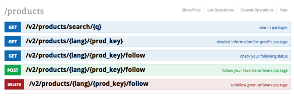

> DESARROLLO WEB EN ENTORNO SERVIDOR

# Tema 3: Programación basada en lenguajes de marcas con código embebido <!-- omit in toc -->
> NODE, MÓDULOS EXTERNOS, EXPRESS, APIs REST, FETCH 

- [1. Introducción](#1-introducción)
- [2. Módulos externos](#2-módulos-externos)
  - [2.1. Instalación de módulos externos](#21-instalación-de-módulos-externos)
  - [2.2. Opciones de NPM](#22-opciones-de-npm)
  - [2.3. Desinstalación de módulos externos](#23-desinstalación-de-módulos-externos)
- [3. El framework EXPRESS](#3-el-framework-express)
- [4. Módulos CommonJS](#4-módulos-commonjs)
- [5. Módulos ECMAScript](#5-módulos-ecmascript)
- [6. Parámetros de URL](#6-parámetros-de-url)
  - [6.1. Parámetros de ruta (Path Parameters)](#61-parámetros-de-ruta-path-parameters)
  - [6.2. Parámetros de consulta (Query Parameters o Query Strings)](#62-parámetros-de-consulta-query-parameters-o-query-strings)
- [7. Fetch desde el servidor](#7-fetch-desde-el-servidor)
- [8. Creando nuestra propia API REST](#8-creando-nuestra-propia-api-rest)
- [9. Formularios](#9-formularios)
  - [9.1. application/x-www-form-urlencoded](#91-applicationx-www-form-urlencoded)
  - [9.2. multipart/form-data](#92-multipartform-data)
  - [9.3. JSON](#93-json)
- [10. Referencias](#10-referencias)


---

# 1. Introducción

En este tema necesitaras consultar los recursos que aparecen a continuación para entender los **Arrays**, **Objetos** y **Arrow functions**, requisito imprescindible para trabajar en NodeJS y Javascript:

- [SINTAXIS DE JAVASCRIPT](https://github.com/jamj2000/Javascript/blob/master/02.SINTAXIS.md)
- [FUNCIONES](https://github.com/jamj2000/Javascript/blob/master/03.FUNCIONES.md)
- [ARRAYS](https://github.com/jamj2000/Javascript/blob/master/04.ARRAYS.md)
- [OBJETOS](https://github.com/jamj2000/Javascript/blob/master/05.OBJETOS.md)
- [AJAX](https://github.com/jamj2000/Javascript/blob/master/07.AJAX.md)


# 2. Módulos externos

NodeJS viene con numerosos módulos internos incorporados (built-in): `fs`, `os`, `process`, `path`, `http`, `https`, ...

Además NodeJS permite la instalación de módulos externos. Algunos de ellos, bastante populares, son `express`, `node-fetch`, `cors`, `live-server`, `react`, `react-dom`, ... Pueden consultarse en https://www.npmjs.com.

Para instalar estos módulos externos usamos la herramienta `npm`.

> **IMPORTANTE:** Antes de instalar módulos deberemos haber inicializado previamente el proyecto con
>
> `npm  init  -y`
>


## 2.1. Instalación de módulos externos

```bash
     npm  install  express      -S  
     npm  install  nodemon      -D  
sudo npm  install  json-server  -g  
```

o de forma más corta

```bash
     npm  i  express     -S  
     npm  i  nodemon     -D  
sudo npm  i  json-server -g
```

## 2.2. Opciones de NPM

**-S,  --save**
- dependencia de aplicación. Añade entrada en archivo `package.json`. En las últimas versiones de `npm` no es necesaria esta opción.

**-D,  --save-dev**
- dependencia de desarrollo. Añade entrada en archivo `package.json`.

**-g,  --global**
- instala en el sistema de forma global. Se usa normalmente para paquetes ejecutables.


## 2.3. Desinstalación de módulos externos
```bash
     npm  remove  express
     npm  remove  nodemon     -D 
sudo npm  remove  json-server -g 
```   
o de forma más corta

```bash
     npm  r  express 
     npm  r  nodemon     -D  
sudo npm  r  json-server -g
```


# 3. El framework EXPRESS

- Node.js nos permite desarrollar un servidor web desde cero.
- Para ello puede usarse los módulos incorporados `http` y `https`.
- Sin embargo es más recomendable, por su sencillez, usar el **framework `express`**.


# 4. Módulos CommonJS

Tradicionalemente NodeJS trabajaba y aún trabaja con **módulos CommonJS**. En este caso, para importar los módulos se hace con **`require`**. 

**Ejemplo de servidor con express y módulos CommonJS**


```bash
npm init -y
npm install express
```


```javascript
// server.js
// --- IMPORTACIONES
const path     = require('path');
const express  = require('express');

const app      = express();

// Archivos estáticos. Deberás crear un archivo public/index.html para ver el resultado
app.use(express.static(path.join(__dirname , 'public')));

// Ruta /hola
app.get ('/hola', (request, response) => { 
    response.send ('Hola mundo') 
});

// Ruta /hola/loquesea, p. ej:  /hola/jose,  /hola/ana, ...
app.get ('/hola/:usuario', (request, response) => { 
    response.send (`<h1>Buenos días, ${request.params.usuario}</h1>`); 
});

app.listen (3000);
```

Ejecutaremos:

```bash
node  server
```
> **NOTA:** 
> 
> Los objetos `request` y `response` son instancias de [`Request`](https://developer.mozilla.org/en-US/docs/Web/API/Request) y [`Response`](https://developer.mozilla.org/en-US/docs/Web/API/Request) respectivamente.
>
> Por tanto, poseen las propiedades y métodos correspondientes.

# 5. Módulos ECMAScript

Una forma de importar módulos más moderna y, que además es usada también en el lado cliente, es trabajar con **módulos ECMAScript**. En este caso para importar los módulos se hace con **`import`**. Es la forma recomendada de cara al futuro.


**Ejemplo de servidor con express y módulos ECMAScript**

```bash
npm init -y
```

Para poder trabajar con **módulos ES (ECMAScript)** debemos insertar la línea **`"type": "module"`** en `package.json` para indicar que trabajaremos con este tipo de módulos.

```json
{
  "name": "example",
  "version": "1.0.0",
  "description": "",
  "main": "index.js",
  "type": "module",
  "scripts": {
     "test": "echo \"Error: no test specified\" && exit 1"
  },
  "keywords": [],
  "author": "",
  "license": "ISC"
}
```

Instalamos las dependecias:

```bash
npm install express
npm install -D standard  # Para trabajar con el linter eslint de Javascript
```

Insertamos en `package.json` las siguientes líneas:

```json
  "scripts": {
    "dev": "node --watch server.js"
  },
  "eslintConfig": {
    "extends": [
      "standard"
    ]
  },
```

Con lo cual, el archivo `package.json` quedaría así:

```json
{
  "name": "example",
  "version": "1.0.0",
  "description": "",
  "main": "index.js",
  "type": "module",
  "scripts": {
    "dev": "node --watch server.js"
  },
  "eslintConfig": {
    "extends": [
      "standard"
    ]
  },
  "keywords": [],
  "author": "",
  "license": "ISC",
  "devDependencies": {
    "standard": "^17.1.0"
  },
  "dependencies": {
    "express": "^4.18.2"
  }
}
```

Y el archivo `server.js` quedaría así:

```javascript
// server.js
// --- IMPORTACIONES
import path from 'path'
import express from 'express'

const app = express()

// Archivos estáticos. Deberás crear un archivo public/index.html para ver el resultado
app.use(express.static(path.join(process.cwd(), 'public')))

// Ruta /hola
app.get('/hola', (request, response) => {
  response.send('Hola mundo')
})

// Ruta /hola/loquesea, p. ej:  /hola/jose,  /hola/ana, ...
app.get('/hola/:usuario', (request, response) => {
  response.send(`<h1>Buenos días, ${request.params.usuario}</h1>`)
})

app.listen(3000)
```

Para lanzar el servidor, hacemos:

```bash
npm run dev
```


# 6. Parámetros de URL

Los parámetros de URL o **`URL Parameters`** son partes de la URL en las cuales los valores que aparecen pueden variar de una petición a otra, aunque la estructura de la URL se mantiene.

Existen 2 tipos:

- **Parámetros de ruta** `Path Parameters`
- **Parámetros de consulta** `Query Parameters` o `Query Strings`

> **NOTA**:
> 
> A menudo se usa el término `Query Strings` como sinónimo de `URL Parameters`, lo cual no es del todo cierto como se acaba de ver y provoca confusiones.


## 6.1. Parámetros de ruta (Path Parameters)

Son parámetros que están incorporados dentro de la ruta de la URL. Son parámetros de solicitud adjuntos a una URL que apuntan a un recurso de `API REST` específico.


Los parámetros de ruta son parte del *endpoint* y son obligatorios. Por ejemplo en `/users/{id}`, `{id}` es el parámetro de ruta del *endpoint* `/users`; apunta a un registro de usuario específico. 

Un *endpoint* puede tener varios parámetros de ruta, como en el ejemplo `/organizations/{orgId}/members/{memberId}`. Esto apuntaría al registro de un miembro específico dentro de una organización específica, y tanto `{orgID}` como `{memberID}` requerirían variables.

Los parámetros de ruta son muy usados en `API REST`.




## 6.2. Parámetros de consulta (Query Parameters o Query Strings)

Son parámetros que están al final de la ruta de la URL, tras el signo `?` y están separados unos de otros mediante `&`

Tienen la forma siguiente:


Los parámetros de consulta a menudo se utilizan para solicitar operaciones de clasificación, paginación, ordenación o filtrado.


**En una misma URL pueden aparecer tanto parámetros de ruta como parámetros de consulta.**

Ejemplos:

- **`https://api.github.com/orgs/{organización}/repos?{parámetros de consulta}`**
- `https://api.github.com/orgs/google/repos?per_page=10&page=1`
- `https://api.github.com/orgs/microsoft/repos?per_page=1&page=2`
- **`https://api.github.com/users/{usuario}/repos?{parámetros de consulta}`**
- `https://api.github.com/users/jamj2000/repos?sort=updated`
- `https://api.github.com/users/jamj2000/repos?sort=created&direction=asc`


# 7. Fetch desde el servidor


Se entiende **`fetch`** como la **recuperación de datos solicitados a un servidor**. Es habitual que el formato de los datos sea **`JSON`**.

La [`API fetch`](https://developer.mozilla.org/es/docs/Web/API/Fetch_API) se introdujo en 2015 como un reemplazo más contemporáneo de XMLHttpRequest. Desde entonces se ha convertido en el estándar de facto para la realización de llamadas asincrónicas en aplicaciones web.

Aunque la `API Fetch` lleva tiempo disponible para su uso en navegadores web en el lado cliente, no estaba disponible para su uso desde el lado servidor debido a varias limitaciones.

Desde NodeJS v17.5.0, `fetch` se hizo disponible como función experimental para su uso desde el lado servidor.

Existen incontables APIs de tipo REST de innumerables tipos de las que podemos obtener información en formato JSON.

Algunos ejemplos de APIs muy minimalistas para realizar pruebas son:

- https://reqres.in/
- https://jsonplaceholder.typicode.com/
- https://randomuser.me

Un listado más extenso de APIs profesionales puede encontrarse en:

- https://github.com/public-apis/public-apis
- https://rapidapi.com/collection/list-of-free-apis


**Ejemplo**

```javascript
// Recuperación de datos de https://randomuser.me
// Documentación: https://randomuser.me/documentation 
fetch('https://randomuser.me/api/?results=4&nat=es&inc=name,location,phone,picture').
  then(res => res.json()).
  then(data => console.log(data.results))
```

**Ejemplo completo**

> **Aplicación para realizar consultas a la API de Github**
> - Documentación: https://docs.github.com/en/rest/repos/repos
> - Código: https://github.com/jamj2000/query-github

```javascript
import express from 'express'

const app = express()

/* Ejemplos
- http://localhost:3000/github/microsoft?pag=1
- http://localhost:3000/github/oracle?pag=2
- http://localhost:3000/github/google?pag=20
*/
app.get('/github/:organizacion', async (req, res) => {
    const org = req.params.organizacion  // Path parameter
    const pag = req.query.pag            // Query parameter (Query string)
    const data = await fetch(`https://api.github.com/orgs/${org}/repos?per_page=100&page=${pag}`)
    const json = await data.json()
    if (json.message) {
        // Ocurrió algún evento, como límite de peticiones excedido
        res.send(`<h1>${json.message}</h1> <h2>${json.documentation_url}</h2>`)
    } else {
        res.send(`
        <h1>Página ${pag}, ${json.length ?? 0} repositorios.</h1>
        <small>Máximo de resultados: 100</small><hr>              
        ${json.length
            &&
            json.map(repo => `
                <h4><a href="${repo.html_url}" target="_blank">${repo.name}</a></h4>
                <em>${repo.language}: </em>  <strong>${repo.description}</strong>
                <br><small>Creado en ${repo.created_at}. Último push en ${repo.pushed_at} </small>
                `)
                .join('<br><hr>')
            ||
            'Nada por aquí'
            }
        `)
    }
})

app.listen(3000)
```

# 8. Creando nuestra propia API REST

Con NodeJS+Express es realmente sencillo crear una `API REST`. 

A continuación se muestra un ejemplo de una `API REST` que proporciona respuestas en formato `JSON` y ofrece funcionalidad básica `CRUD`. Lo normal es que la información se registre en una base de datos. Pero, por simplificar, en este ejemplo se trabaja con memoria primaria.

Operación  | Método HTTP | Descripción
-----------|-------------|---------------------------------------------------------
**C**reate | **POST**    | Crear un recurso. Equivale a INSERT en una base de datos
**R**ead   | **GET**     | Leer un recurso. Equivale a SELECT en una base de datos 
**U**pdate | **PUT**     | Actualizar un recurso. Equivale a UPDATE en una base de datos
**D**elete | **DELETE**  | Eliminar un recurso. Equivale a DELETE en una base de datos

```javascript
import express from "express";
const app = express()

let Users = [
    { id: 0, nombre: "Jose", edad: 20 },
    { id: 1, nombre: "Juan", edad: 21 },
    { id: 2, nombre: "Eva", edad: 22 }
]

app.use(express.json())  // IMPORTANTE

// GET
app.get('/api/users', (request, response) => response.json(Users))

// POST 
app.post('/api/users', (request, response) => {
    if ( !request.is('json') )
        return response.json({ message: 'Debes proporcionar datos JSON' })

    let sig = Math.max( ...Users.map( u => u.id ))+1

    const { nombre, edad } = request.body
    Users.push({ id: sig, nombre, edad })
    return response.json(Users)
})

// GET 
app.get('/api/users/:id', (request, response) => {
    let usuario = Users.find(user => user.id == request.params.id)

    if (usuario !== undefined) { // Si es encontrado    
        return response.json(usuario)
    } else {
        response.json({ message: 'El elemento no ha sido encontrado' })
    }
})

// PUT
app.put('/api/users/:id', (request, response) => {
    if ( !request.is('json') )
        return response.json({ message: 'Debes proporcionar datos JSON' })

    const { id } = request.params
    const { nombre, edad } = request.body

    // Obtenemos posición    
    const pos = Users.findIndex(user => user.id == id)

    if (pos != -1) { // Si es encontrado
        Users.splice(pos, 1, { id, nombre, edad })
        return response.json(Users)
    } else { // Sino
        response.json({ message: 'El elemento no ha sido encontrado' })
    }
})

// DELETE
app.delete('/api/users/:id', (request, response) => {
    // Obtenemos posición    
    const pos = Users.findIndex(user => user.id == request.params.id)

    if (pos != -1) { // Si es encontrado
        Users.splice(pos, 1)
        return response.json(Users)
    } else { // Sino
        response.json({ message: 'El elemento no ha sido encontrado' })
    }
})


app.listen(3000)
```


# 9. Formularios

Los formularios es el método principal para enviar información al servidor desde el lado cliente o navegador. Los formularios únicamente pueden enviar esta información mediante 2 métodos:

- `GET`
- `POST`

El método `POST` es el recomendado, puesto que no tiene limitación en la longitud del contenido y los valores transferidos no se muestran en la `url`.

Cuando se envía información desde un formulario, ésta puede codificarse de 3 maneras distintas:


enctype        | Descripción
---------------|------------------
**application/x-www-form-urlencoded**	| **Codificación por defecto**. No es necesario hacerla explícita. Todos los caracteres se codifican antes del envío (los espacios se convierten en símbolos "+" y los caracteres especiales se convierten en valores ASCII HEX)
**multipart/form-data**	| Esta codificación es necesaria si el usuario desea **subir un archivo** a través del formulario.
**text/plain** | **Desaconsejada**. Envía datos sin ningún tipo de codificación. 
*application/json* | *No disponible*.


> **Referencias**: 
> - https://codex.so/handling-any-post-data-in-express
> - https://blog.jim-nielsen.com/2022/browsers-json-formdata/


## 9.1. application/x-www-form-urlencoded

```javascript
const express = require('express');
const app = express();

/** Decode Form URL Encoded data */
app.use(express.urlencoded());

/** Show page with a form */
app.get('/', (req, res, next) => {
  res.send(`<form method="POST" action="/" enctype="application/x-www-form-urlencoded">
  <input type="text" name="username" placeholder="username">
  <input type="submit">
</form>`);
});

/** Process POST request */
app.post('/', function (req, res, next) {
  res.send(JSON.stringify(req.body));
});

/** Run the app */
app.listen(3000);
```

## 9.2. multipart/form-data

```javascript
const express = require('express');
const app = express();

/** Require multer */
const multer = require('multer');

/** Show page with a form with a specific enctype */
app.get('/', (req, res, next) => {
  res.send(`<form method="POST" action="/" enctype="multipart/form-data">
  <input type="text" name="username" placeholder="username">
  <input type="submit">
</form>`);
});

/** Process POST request with a mutter's middleware */
app.post('/', multer().none(), function (req, res, next) {
  res.send(JSON.stringify(req.body));
});

/** Run the app */
app.listen(3000);
```

## 9.3. JSON

No existe la codificación `application/json` (~~enctype="application/json"~~). [Hubo una propuesta](https://www.w3.org/TR/html-json-forms/), pero quedó en nada.

Por tanto, en este caso no hay otra solución que usar Javascript en el lado cliente para gestionar las peticiones al servidor. Lo más frecuente es hacer uso de `fetch`.


```javascript
const express = require('express');
const app = express();

/** Decode JSON data */
app.use(express.json());

/** Show page with a input field, button and javascript */
app.get('/', (req, res, next) => {
  res.send(`
<script>
var send = function() {
  var username = document.getElementById('username').value;
  
  fetch('/', {
    method: 'POST',
    headers: { 'Content-Type': 'application/json' }
    body: { username: username }
  })
    .then(response => response.json())
    .then(data => console.log(data) )
    .catch(console.error);
}   
</script>

<input type="text" name="username" placeholder="username" id="username">
<button onclick="send()">Send</button>`);
});

/** Process POST request */
app.post('/', function (req, res, next) {
  res.send(JSON.stringify(req.body));
});

/** Run the app */
app.listen(3000);
```


# 10. Referencias

- [Apuntes de Javascript](https://github.com/jamj2000/Javascript)
- [CommonJS vs ES Modules](https://lenguajejs.com/automatizadores/introduccion/commonjs-vs-es-modules/)
