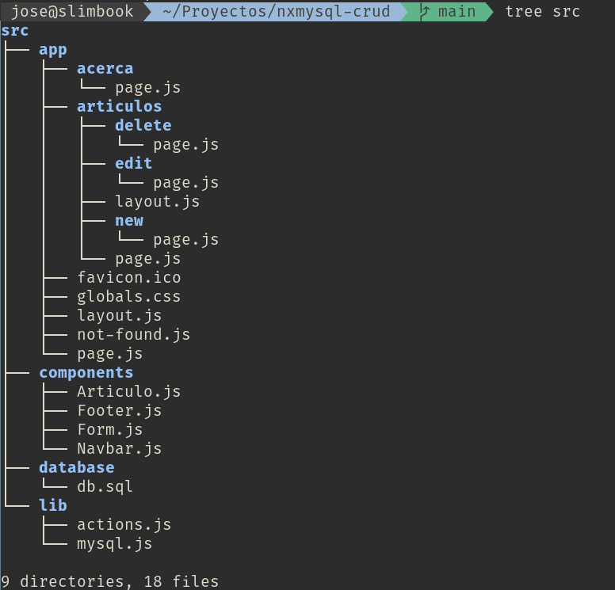

> DESARROLLO WEB EN ENTORNO SERVIDOR

# Tema 6: Utilización de técnicas de acceso a datos <!-- omit in toc -->
> BASES DE DATOS sin ORM.


--- 

# Introducción

En temas anteriores hemos trabajado un poco con bases de datos no relacionales, también llamadas noSQL. En concreto, en el tema 4, creamos una aplicación que proporcionaba una API REST hacia una base de datos documental como MongoDB. En adelante nos centraremos en las bases de datos relacionales. 

En este tema trabajaremos con algunas de estas bases de datos relacionales de uso habitual mediante comandos SQL.

En el tema siguiente trabajaremos con las mismas bases de datos, pero haciendo uso de ORM (Object-Relational Mapping), que es una técnica que nos permite realizar un mapeo objeto-relacional y evitar así tener que trabajar con el SQL específico de cada base de datos. 

# MySQL

MySQL/MariaDB es un sistema gestor de bases de datos ampliamente usado hoy en día. Para trabajar con él los haremos con el driver **`serverless-mysql`** y usando un entorno de desarrollo local, es decir un servidor de base de datos en `localhost:3306`.


## Proyecto

La estructura del proyecto es la siguiente:



El código fuente completo puede obtenerse desde el siguiente enlace:

- [Código fuente](https://github.com/jamj2000/nxmysql-crud)

Los archivos directamente relacionados con la Base de Datos, son:

- `src/database/db.sql`
- `src/lib/mysql.js`
- `src/lib/actions.js`


```sql
-- src/database/db.sql
CREATE TABLE articulos (
    id INT UNSIGNED AUTO_INCREMENT PRIMARY KEY,
    nombre VARCHAR(200) NOT NULL,
    descripcion VARCHAR(200),
    precio DECIMAL(10,2),
    createdAt TIMESTAMP DEFAULT CURRENT_TIMESTAMP
);

-- ALTER TABLE articulos ADD COLUMN imagen VARCHAR(200) AFTER descripcion;
```

```javascript
// src/lib/mysql.js
import mysql from 'serverless-mysql'

export const db = mysql({
    config: {
        host: 'localhost',
        user: 'root',
        password: 'root',
        port: 3306,
        database: 'datos'
    }
})
```

```javascript
'use server'
// src/lib/actions.js
import { db } from '@/lib/mysql'


export async function getArticulos() {

    // ...
    const results = await db.query('select * from articulos');
    // ...

}

export async function newArticulo(formData) {

    // ...
    const query = 'insert into articulos(nombre,descripcion,precio) values (?, ?, ?)';
    const results = await db.query(query, [nombre, descripcion, precio]);
    // ...

}


export async function editArticulo(formData) {

    // ...
    const query = 'update articulos set ? where id = ? ';
    const results = await db.query(query, [{nombre, descripcion, precio}, id]);
    // ...

}

export async function deleteArticulo(formData) {

    // ...
    const query = 'delete from articulos where id = ?';
    const results = await db.query(query, [id]);
    // ...

}
```

## Otros aspectos

El proyecto anterior, aunque simple, es muy adecuado desde un punto de vista didáctico, pues no sólo se muestra como trabajar con MySQL, sino que lo hace con un *driver* que permite acceso a base de datos *serverless*, lo cual es cada día más habitual. Por ejemplo, desde [PlanetScale](https://planetscale.com/features) podemos leer lo siguiente:

> *PlanetScale is a MySQL-compatible serverless database that brings you scale, performance, and reliability — without sacrificing developer experience.*

Pero también debemos resaltar que el código anterior es interesante por los siguientes motivos:

- No sólo es posible acceder a la base de datos desde `server actions`. También es posible hacerlo desde otros componentes del servidor como, por ejemplo, `src/app/articulos/edit/page.js` y `src/app/articulos/delete/page.js`
- El componente `src/components/Articulo.js` acepta propiedades, entre ellas el famoso **`children`**, que nos permite incrustar contenido JSX.
- El componente `src/components/Form.js` también acepta propiedades pero, en este caso, lo interesante es observar como el contenido JSX difiere del HTML tradicional.  


**src/components/Articulo.js**

Dentro del JSX, donde aparece `{children}`, podremos insertar botones a la hora de usar el componente `Articulo`.

```javascript
// src/components/Articulo.js
function Articulo({ children, articulo }) {
    return (
        <div style={{ 'border': '1px solid lightgrey', 'padding': '50px' }}>
            <p><strong>{articulo.nombre}</strong></p>
            <p>{articulo.descripcion}</p>
            <p>{articulo.precio} €</p>
            {children}
        </div>
    )
}

export default Articulo
```

**src/components/Form.js**

Cuando trabajamos con JSX es frecuente olvidar que no se trata de código HTML. Los siguientes atributos JSX son distintos a los usados en HTML:

Etiqueta  |  atributo HTML   |  atributo JSX
----------|------------------|------------------
`label`   | for              | **htmlFor**
`input`   | autofocus        | **autoFocus**
`input`   | value            | **defaultValue**


```javascript
// src/components/Form.js
function Form({ action, title, articulo, disabled }) {

    return (
        <form action={action} >
            <input type='hidden' name='id' value={articulo?.id} />
            <fieldset disabled={disabled}>
                <label htmlFor='nombre'>Nombre</label>
                <input type='text' id='nombre' name='nombre'
                    placeholder='Nombre'
                    defaultValue={articulo?.nombre} autoFocus ></input>
                <label htmlFor='descripcion'>Descripción</label>
                <input type='text' id='descripcion' name='descripcion'
                    placeholder='Descripción'
                    defaultValue={articulo?.descripcion} />
                <label htmlFor='precio'>Precio</label>
                <input type='number' id='precio' name='precio' min='0' step={0.01}
                    placeholder='precio'
                    defaultValue={articulo?.precio} />
            </fieldset>
            <button type='submit'>{title}</button>
        </form>
    )
}

export default Form
```


# SQLite

**SQLite es una biblioteca** en proceso que implementa un motor de base de datos SQL transaccional , autónomo y sin configuración . El código de SQLite es de dominio público y, por lo tanto, se puede utilizar de forma gratuita para cualquier fin, comercial o privado.

**SQLite es un motor de base de datos SQL integrado**. A diferencia de la mayoría de las otras bases de datos SQL, **SQLite no tiene un proceso de servidor separado**. SQLite lee y escribe directamente en archivos de disco normales. Una base de datos SQL completa con múltiples tablas, índices, activadores y vistas está contenida en un único archivo de disco. El formato del archivo de la base de datos es multiplataforma: puede copiar libremente una base de datos entre sistemas de 32 y 64 bits o entre arquitecturas big-endian y little-endian . 

Usaremos el driver **`sqlite3`**.

## Proyecto

## Otros aspectos

# Postgres (Vercel)

[Postgres](https://es.wikipedia.org/wiki/PostgreSQL) es un sistema gestor de bases de datos que está ganando bastante aceptación últimamente. Esto es debido principalmente a numerosos factores:

- Es software de código abierto.
- Uso gratuito, lo que la convierte en una opción rentable para muchas organizaciones. 
- Sigue de forma bastante fidedigna el estándar SQL.
- Ofrece amplia funcionalidad: transacciones, lenguaje procedimental, ...
- Existe bastante documentación.
- Cada vez existen más proveedores en la nube de este DBaaS.

Aunque usaremos la base de datos Postgres proporcionada por [Vercel](https://vercel.com/docs/storage/vercel-postgres), también disponemos de otras como [Supabase](https://supabase.com/docs/guides/database/overviews)

Para trabajar con él los haremos con el driver **`@vercel/postgres`** y usando el [DBaaS proporcionado por Vercel](https://vercel.com/storage/postgres).

## Proyecto

## Otros aspectos

# Referencias

- [MySQL API con NextJS](https://github.com/jamj2000/nxapi-mysql)
- [MySQL CRUD con NextJS](https://github.com/jamj2000/nxmysql-crud)
- [BD Serverless en PlanetScale](https://planetscale.com/docs/tutorials/planetscale-serverless-driver)
- [Usando SQLite con NextJS 13](https://plainenglish.io/blog/using-sqlite-with-next-js-13)