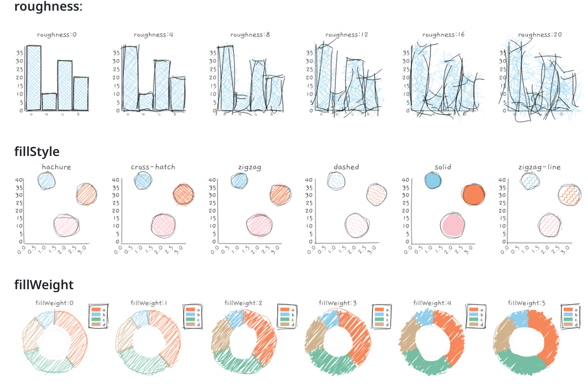

> DESARROLLO WEB EN ENTORNO SERVIDOR

# Tema 7: Programación de servicios Web <!-- omit in toc -->
> FUNCIONALIDADES EN LAS APP WEB.

**[`PROYECTOS DE EJEMPLO`](proyectos)**

---
- [1. Introducción](#1-introducción)
- [2. Datos ficticios](#2-datos-ficticios)
  - [2.1. Instalación de biblioteca](#21-instalación-de-biblioteca)
  - [2.2. Uso](#22-uso)
  - [2.3. Documentación](#23-documentación)
- [3. Datos de archivos CSV](#3-datos-de-archivos-csv)
  - [3.1. Instalación de biblioteca](#31-instalación-de-biblioteca)
  - [3.2. Uso](#32-uso)
  - [3.3. Documentación](#33-documentación)
- [4. Gráficos](#4-gráficos)
  - [4.1. Instalación](#41-instalación)
  - [4.2. Uso](#42-uso)
  - [4.3. Flujo de datos (streaming)](#43-flujo-de-datos-streaming)
    - [4.3.1. Los modelos de provisión de datos](#431-los-modelos-de-provisión-de-datos)
    - [4.3.2. Ejemplo](#432-ejemplo)
    - [4.3.3. Colas de mensajes](#433-colas-de-mensajes)
  - [4.4. Documentación](#44-documentación)
  - [4.5. Curiosidad](#45-curiosidad)
- [5. Creación de PDFs](#5-creación-de-pdfs)
  - [5.1. Instalación](#51-instalación)
  - [5.2. Uso](#52-uso)
  - [5.3. Documentación](#53-documentación)
- [6. Envío de correos](#6-envío-de-correos)
  - [6.1. Instalación](#61-instalación)
  - [6.2. Uso](#62-uso)
  - [6.3. Documentación](#63-documentación)
- [7. Pagos por internet](#7-pagos-por-internet)
  - [7.1. Instalación](#71-instalación)
  - [7.2. Uso](#72-uso)
  - [7.3. Documentación](#73-documentación)
- [8. Mapas](#8-mapas)
  - [8.1. Instalación](#81-instalación)
  - [8.2. Uso](#82-uso)
  - [8.3. Documentación](#83-documentación)
- [9. Coloreado de código](#9-coloreado-de-código)
  - [9.1. Instalación](#91-instalación)
  - [9.2. Uso](#92-uso)
  - [9.3. Documentación](#93-documentación)
- [10. Información flotante](#10-información-flotante)
  - [10.1. Instalación](#101-instalación)
  - [10.2. Uso](#102-uso)
  - [10.3. Documentación](#103-documentación)


--- 


> **IMPORTANTE: MATERIAL PARA EL PRÓXIMO CURSO 2024/25**
>
> El contenido previo de este tema ha sido movido al [Tema 6](../Tema6). Este contenido es nuevo, y está previsto su uso en el próximo curso.

 

# 1. Introducción

En este tema añadiremos nuevas funcionalidades a nuestra aplicación web. En concreto, se estudiarán las siguientes funcionalidades:

- **Datos ficticios**
- **Datos de archivos CSV**
- **Gráficos**
- **Creación de PDFs**
- **Envío de correos**
- **Pagos por internet**
- **Mapas**
- **Coloreado de código**
- **Información flotante**


# 2. Datos ficticios

Durante el desarrollo de una aplicación a menudo necesitamos datos *fake* para probar su funcionalidad. Para ello disponemos de la biblioteca **[faker.js](https://fakerjs.dev/)**, la cual nos provee de este tipo de datos. 

Esta biblioteca puede usarse desde el lado cliente y desde el lado servidor.

## 2.1. Instalación de biblioteca

Instalamos como **dependencia de desarrollo**. Aparecerá en la sección `devDependencies` en el archivo `package.json`.


```console
npm install -D @faker-js/faker
```

> **IMPORTANTE:**
>
> Esta biblioteca ocupa unos cuantos MB.


## 2.2. Uso


```js
import { faker } from '@faker-js/faker';

// Algunos datos disponibles.
// Para ver un listado exhaustivo, consulta la API
faker.number.int()
faker.number.int({ min: 10, max: 100 })
faker.number.float() 
faker.number.float({ min: 10, max: 100, multipleOf: 0.02 }) 
faker.person.firstName() 
faker.person.firstName('female') 
faker.person.firstName('male') 
faker.person.lastName()
faker.person.fullName()
faker.person.bio()
faker.internet.email()
faker.internet.email({ firstName: 'Jeanne', lastName: 'Doe' }) // 'Jeanne_Doe63@yahoo.com'
faker.internet.email({ firstName: 'Jeanne', lastName: 'Doe', provider: 'example.dev' }) // 'Jeanne_Doe88@example.dev'
faker.animal.dog()   // 'Irish Water Spaniel'
faker.animal.cat()   // 'Singapura'
faker.animal.horse() // 'Swedish Warmblood'
faker.image.avatar()
faker.image.city()
```


## 2.3. Documentación

- [Guía](https://fakerjs.dev/guide/)
- [API. Tipos de datos proporcionados](https://fakerjs.dev/api/)


# 3. Datos de archivos CSV

Es posible que se te presente la posibilidad de realizar una aplicación que requiera el uso de datos de poca complejidad y de sólo lectura. En estos casos es problable que usar una BD sea algo parecido a *matar moscas a cañonazos*. 

Disponemos de una biblioteca  llamada **[Papa Parse](https://www.papaparse.com/)** que nos permite almacenar nuestros datos en uno o varios [archivos CSV](https://es.wikipedia.org/wiki/Valores_separados_por_comas), y realizar las consultas deseadas sobre ellos. 

Esta biblioteca puede usarse desde el lado cliente y desde el lado servidor.

## 3.1. Instalación de biblioteca

 ```sh
npm  install  papaparse
 ```


## 3.2. Uso


```js
import Papa from 'papaparse';

Papa.parse(file, config);
```

A continuación tienes los enlaces a 2 proyectos que hacen uso de esta biblioteca.

- [Aplicación de lado cliente para rellenar fichas semanales](https://github.com/jamj2000/semana-fct)
- [Aplicación de lado servidor para consultar biblioteca de libros](https://github.com/jamj2000/book-inventory)

La segunda aplicación contiene los datos en el archivo [book.csv](https://github.com/jamj2000/book-inventory/blob/main/books.csv). CUIDADO: son unos 7OMB.

Para cargar grandes cantidades de datos desde CSV a una BD consulta el siguiente vídeo:

- [Loading Large CSVs into a Vercel Postgres Database](https://youtu.be/RbDcTraZwQA?si=PEv-tX-Q6L3QHtrS)


## 3.3. Documentación

- [Sitio oficial](https://www.papaparse.com/)
- [Repositorio en Github](https://github.com/mholt/PapaParse?tab=readme-ov-file)


# 4. Gráficos

Esta biblioteca debe ser usada desde el lado cliente.

Otra de las funcionalidades que a menudo es requerida es la de presentación de información en forma gráfica. Suele tratarse de diagramas para la exposición de datos o de monitorización de ellos (en algunos casos en tiempo real). En este último caso, los gráficos suelen estar incorporados en un Dashboard o Panel del usuario. 

La web W3Schools tiene una [introdución a los gráficos](https://www.w3schools.com/ai/ai_graphics.asp) explicando brevemente las bibliotecas más habituales para el trabajo con gráficos.

Nosotros usaremos la biblioteca [chart.js](https://www.chartjs.org/) por ser una de las más populares. Además es sencilla de usar y tiene licencia MIT, la cual es muy permisiva.

Hay una [demo disponible en Vercel](https://nxchart.vercel.app). El código fuente está disponible en:

- [Código fuente](https://github.com/jamj2000/nxchart)


## 4.1. Instalación

```console
npm  install  chart.js  react-chartjs-2
```

El segundo paquete (`react-chartjs-2`) nos permitirá usar directamente componentes de React, en lugar de Vanilla JS.


## 4.2. Uso


La forma más rápida y directa de empezar a usar esta biblioteca es usando el siguiente esquema. 

```js
import { Chart } from 'chart.js/auto'   // versión 4 de chartjs
import { Line } from 'react-chartjs-2';

const options = {
  plugins: {
    title:   /* ... */,
    legend:  /* ... */,
  },
  scales:    /* ... */,
}

const data = {
    labels:  /* ... */,
    datasets: [
        {
            label: /* ... */,
            data:  /* ... */,
        },
        {
            label: /* ... */,
            data:  /* ... */,
        }
    ],
};

export default function grafico() {
    return (
        <div className='contenedor '>
            <Line options={options} data={data} />
        </div>
    )
}
```

Sin embargo, para despliegue en producción, en lugar de usar `import { Chart } from 'chart.js/auto'` es recomendable usar la forma que aparece a continuación, puesto que reducirá el peso del código resultante. En este segundo caso deberemos importar los componentes especificos que vayamos a necesitar y además realizar un registro de ellos.

```js
// Esto es un ejemplo para un gráfico tipo Scatter.
// Para otro tipo de gráfico necesitarás importar otros componentes.
import {
  Chart,
  LinearScale,
  PointElement,
  Tooltip,
  Legend,
} from 'chart.js';

Chart.register(LinearScale, PointElement, Tooltip, Legend);
```


Haciendo uso del paquete `react-chartjs-2` importamos el tipo de gráfico deseado. En el ejemplo que viene a continuación importamos un gráfico de tipo `Scatter`.

Luego seguimos el siguiente procedimiento:

1. Definimos un constante `options` con la configuración general del gráfico.
2. Definimos una constante `data` con la configuración específica del gráfico.
3. Usamos el componente pasándole las propiedades anteriores.


```js
import { Scatter } from 'react-chartjs-2';

const options = {
    scales: {
        y: {
            beginAtZero: true,
        },
    },
};

const data = {
    datasets: [
        {
            label: 'Puntos aleatorios',   
            data: Array.from({ length: 100 }, () => ({  // 100 puntos 
                x: Math.random(),
                y: Math.random(),
            })),
            backgroundColor: 'rgba(255, 99, 132, 1)',
        },
    ],
};

export default function grafico() {
    return (
        <div className='contenedor '>
            <Scatter options={options} data={data} />
        </div>
    )
}
```

El gráfico debe estar dentro de un **elemento contenedor**. El contenedor padre debe cumplir los siguientes requisitos para que el comportamiento sea [responsive](https://www.chartjs.org/docs/latest/configuration/responsive.html):

- Tener `position: relative` en su estilo CSS. 
- Dedicarse únicamente al lienzo del gráfico.

Chart.js usa su contenedor principal para actualizar el renderizado del lienzo (`canvas`) y los tamaños de visualización. Sin embargo, este método requiere que el contenedor esté relativamente posicionado y dedicado únicamente al lienzo del gráfico.


> **IMPORTANTE:**
>
> La página donde vaya a incrustarse el gráfico debe contener la directiva **`'use client'`**


## 4.3. Flujo de datos (streaming)

En algunos casos deseamos que la gráfica muestre un flujo de datos (**streaming**) obtenido de alguna fuente. Para ello podemos usar el plugin [chartjs-plugin-streaming](https://nagix.github.io/chartjs-plugin-streaming/latest/). Su página web dispone de varios [ejemplos](https://nagix.github.io/chartjs-plugin-streaming/latest/samples/charts/line-horizontal.html).

El sitio oficial también dispone de una [guía](https://nagix.github.io/chartjs-plugin-streaming/latest/guide/) bastante detallada.

Entre toda la información podemos destacar:

1. [Los modelos de provisión de datos](https://nagix.github.io/chartjs-plugin-streaming/latest/guide/data-feed-models.html)
2. [El tutorial para crear app en React, también aplicable a Next.js](https://nagix.github.io/chartjs-plugin-streaming/latest/tutorials/react/app.html)

### 4.3.1. Los modelos de provisión de datos

El paquete `chartjs-plugin-streaming` soporta obtención de datos mediante los modos **pull** y **push**. Para mayor información consulta la [documentación oficial](https://nagix.github.io/chartjs-plugin-streaming/latest/guide/data-feed-models.html#push-model-listening-based)


### 4.3.2. Ejemplo

Hay disponible una aplicación de ejemplo con [código fuente disponible en Github](https://github.com/jamj2000/nxchart-streaming).


**Ejecución en entorno de desarrollo**

```console
git clone  https://github.com/jamj2000/nxchart-streaming.git
cd  nxchart-streaming
npm install
npm run dev
```

**Ejecución en entorno de producción**

**IMPORTANTE**: El grafico6 hace uso del plugin `chartjs-plugin-zoom` para ofrecer funcionalidad de zoom y pan. Sin embargo este plugin provoca un error en el proceso de construcción. Por tanto el comando `npm run build` fallará. Si deseas llevar esta aplicación a producción, elimina este plugin del archivo `src/components/grafico6.js`.


**Resumen del proceso de desarrollo**

```console
npm  install  chart.js@3 react-chartjs-2@4 luxon chartjs-adapter-luxon chartjs-plugin-streaming chartjs-plugin-zoom chartjs-plugin-annotation@1 --legacy-peer-deps
```

> **IMPORTANTE:** 
>
> **A fecha de Abril de 2024, este plugin de streaming no soporta chartjs v4, por tanto debemos instalar los paquetes más antiguos usando el comando anterior**

Los paquetes instalados son los siguientes:

- `luxon`: biblioteca para manejo de fechas y horas
- `chartjs-adapter-luxon`: adaptador de la biblioteca anterior
- `chartjs-plugin-annotation`: plugin para realizar anotaciones en el gráfico
- `chartjs-plugin-streaming`: plugin para hacer streaming
- `chartjs-plugin-zoom`: plugin opcional. Para hacer zoom y pan 


```js
'use client'
import { Line } from 'react-chartjs-2';
import Chart from 'chart.js/auto';         // IMPORTANTE: versión 3 de chartjs. La forma de importar es distinta
import annotationPlugin from 'chartjs-plugin-annotation';

import 'chartjs-adapter-luxon';
import ChartStreaming from 'chartjs-plugin-streaming';


const onRefresh = (chart) => {
 /* ... */
};


const options = {
  responsive: true,
  plugins: {
    title: /* ... */,
    legend: /* ... */,
    annotation: { annotations: {} }  // necesario para ocultar gráfica al pulsar leyenda
  },
  scales: {
    x: {
      type: 'realtime',
      realtime: {
        duration: 20000,
        refresh: 1000,
        delay: 2000,
        onRefresh: onRefresh
      }
    },
    y: {
      title: {
        display: true,
        text: 'Valores'
      }
    }
  },
  interaction: /* ... */,
}


const data = /* ... */;


function grafico() {
  Chart.register(annotationPlugin, ChartStreaming);

  return (
    <div className='contenedor'>
      <Line options={options} data={data} />
    </div>
  );
}

export default grafico
```


### 4.3.3. Colas de mensajes

Una forma de recuperar los datos para realizar las gráficas es mediante el uso de una cola de mensajes.

Una cola de mensajes es una forma de comunicación asíncrona entre múltiples procesos que necesitan transmitirse diferentes datos. De esta forma un sistema añade un mensaje a la cola que se persistirá hasta que otro sistema lo consuma y lo procese. 

La principal ventaja de utilizar las colas de mensajes es desacoplar diferentes sistema. También pueden ser de utilidad cuando quieres procesar múltiples operaciones en lotes, de forma que evites que se produzcan picos en la utilización de tu plataforma y se pueda degradar el servicio.

Herramientas para trabajar con colas de mensajes hay muchas: RabbitMQ, Amazon SQS, algunas más complejas para flujos de eventos como Apache Kafka o Amazon Kinesis, pero realmente puedes utilizar incluso un buffer en memoria aprovechando herramientas como Redis, o incluso MySQL como se indica en la siguiente referencia (incluye vídeo).


**Referencia**:

- [Pirobits: Cola de mensajes usando MySQL: SELECT * FOR UPDATE](https://www.pirobits.com/es/post/cola-de-mensajes-usando-mysql-select-for-update)


## 4.4. Documentación

- [Código fuente de ejemplo](https://github.com/jamj2000/nxchart)
- [Código fuente de ejemplo con streaming](https://github.com/jamj2000/nxchart-streaming)
- [Componentes](https://react-chartjs-2.js.org/components/)
- [Ejemplos de react-chartjs-2](https://github.com/reactchartjs/react-chartjs-2/tree/master/sandboxes)
- [Documentación Plugin Streaming](https://nagix.github.io/chartjs-plugin-streaming/latest/)
- [Documentación Plugin Annotation](https://www.chartjs.org/chartjs-plugin-annotation/latest/)
- [Documentación Plugin Zoom](https://www.chartjs.org/chartjs-plugin-zoom/latest/)
- [Más gráficos, plugins,... - Awesome Chart.js](https://github.com/chartjs/awesome/blob/master/README.md)
  

## 4.5. Curiosidad

Existe un biblioteca para *charting* llamada **`roughViz`**. Como su nombre indica realiza la visualización de forma algo bruta. Sirve para dar un toque de originalidad en detrimento de la exactitud en la representación gráfica.


La [documentación oficial](https://github.com/jwilber/roughViz) nos informa de los tipos de gráficos soportados y de las propiedades que podemos emplear en ellos. Algunas de estas propiedades son las que se muestran a continuación:



Existe [integración para React](https://github.com/Chris927/react-roughviz).


```js
npm  install  react-roughviz
```

```js
'use client'
import {Bar, Pie } from 'react-roughviz'
// ...

    <h3>Bar</h3>
    <Bar
      data='https://raw.githubusercontent.com/jwilber/random_data/master/flavors.csv'
      labels='flavor'
      values='price'
    />
    <h3>Pie</h3>
    <Pie
      data={{
        labels: ['North', 'South', 'East', 'West'],
        values: [10, 5, 8, 3]
      }}
      title='Regions'
      colors={['red', 'orange', 'blue', 'skyblue']}
      roughness={8}
    />

```


# 5. Creación de PDFs 

De las muchas bibliotecas disponibles para trabajar con archivos PDF, una de las más interesantes y potentes es [pdf-lib](https://www.npmjs.com/package/pdf-lib).

Permite crear nuevos documenteos y modificar los existentes. Permite trabajar en todos los entornos de JavaScript, no solo en Node o el navegador.

Esta biblioteca puede usarse desde el lado cliente y desde el lado servidor.

## 5.1. Instalación

```sh
npm  install  pdf-lib
```

## 5.2. Uso

```js
import { PDFDocument, StandardFonts, rgb } from 'pdf-lib'

async function createPdf() {
  const pdfDoc = await PDFDocument.create()
  const timesRomanFont = await pdfDoc.embedFont(StandardFonts.TimesRoman)

  const page = pdfDoc.addPage()
  const { width, height } = page.getSize()
  const fontSize = 30
  page.drawText('Creating PDFs in JavaScript is awesome!', {
    x: 50,
    y: height - 4 * fontSize,
    size: fontSize,
    font: timesRomanFont,
    color: rgb(0, 0.53, 0.71),
  })

  const pdfBytes = await pdfDoc.save()
}
``` 

A continuación tienes los enlaces a 2 proyectos que hacen uso de esta biblioteca.

- [Aplicación de lado cliente para rellenar fichas semanales](https://github.com/jamj2000/semana-fct)
- [Aplicación de tickets de supermercado -por realizar-](#)

## 5.3. Documentación

- [Ejemplos de la Documentación oficial](https://pdf-lib.js.org/#examples)


# 6. Envío de correos


react-email
nodemailer


## 6.1. Instalación


## 6.2. Uso


## 6.3. Documentación


# 7. Pagos por internet


stripe

## 7.1. Instalación


## 7.2. Uso


## 7.3. Documentación


# 8. Mapas


Si deseamos hacer uso de los Mapas de Google, podemos usar la biblioteca [@googlemaps/js-api-loader](https://www.npmjs.com/package/@googlemaps/js-api-loader).

> **NOTA:** Deberás obtener una API KEY de Google.

Esta biblioteca solo puede usarse desde el lado cliente.


## 8.1. Instalación

```sh
npm  install  @googlemaps/js-api-loader
npm  install  @types/google.maps          # Sólo necesario si vamos a usar Typescript
``` 

## 8.2. Uso

**`.env`**

```sh
NEXT_PUBLIC_MAPS_API_KEY="YOUR API KEY"
```


**`src/components/GoogleMaps.js`**

```js
'use client';

import { useEffect, useRef } from 'react';
import { Loader } from '@googlemaps/js-api-loader';


export default function GoogleMaps() {
	const mapRef = useRef(null);

	useEffect(() => {
		const initializeMap = async () => {
			const loader = new Loader({
				apiKey: process.env.NEXT_PUBLIC_MAPS_API_KEY,
				version: "quarterly",
				libraries: ["places"]
			});

			const { Map } = await loader.importLibrary('maps');

			const locationInMap = {
				lat: 37.57869021751064,
				lng: -4.6471375471961025
			};

			// MARKER
			const { AdvancedMarkerElement: Marker } = await loader.importLibrary("marker")

			const options = {
				center: locationInMap,
				zoom: 10,
				mapId: 'DEMO_MAP_ID',
			};

			const map = new Map(mapRef.current, options);

			// add the marker in the map
			const marker = new Marker({
				map: map,
				position: locationInMap,
			});
		};

		initializeMap();
	}, []);

	return <div className="h-[600px]" ref={mapRef} />;
}
``` 

**`src/app/page.js`**

```js
import GoogleMaps from "@/components/GoogleMaps";

export default function Home() {
  return (
    <div className="mx-auto container w-8/12">
    <GoogleMaps />
    </div>
  );
}
```

## 8.3. Documentación

- [Video: Add Google Maps to your Next JS application - Easy way](https://www.youtube.com/watch?v=2xI2RKC4niY)
- [Código fuente del video anterior](https://github.com/MG95Developer/google-maps-tutorial)
- [Documentación oficial](https://googlemaps.github.io/js-api-loader/index.html)


# 9. Coloreado de código


En el muy poco probable caso de que tengamos que incorporar visualización de código fuente en nuestra aplicación, podemos usar la biblioteca [bright](https://bright.codehike.org/).

Esta biblioteca debe usarse en el lado servidor, aunque es probable que también pueda emplearse en la lado cliente (no la he utilizado).


## 9.1. Instalación

```sh
npm  install  bright
``` 

## 9.2. Uso

```js
import { Code } from "bright"

const myCode = `
let hello = "hello brightness"
console.log(hello, "my old friend")
`.trim()

Code.theme = "github-dark"

export default function Page() {
  return (
    <Code lang="js" title="example.js" lineNumbers>
      {myCode}
    </Code>
  )
}
```


## 9.3. Documentación

- [Documentación oficial](https://bright.codehike.org/)
- [Código en Github](https://github.com/code-hike/bright?tab=readme-ov-file)


# 10. Información flotante

[Floating UI](https://github.com/floating-ui/floating-ui) es una biblioteca de posicionamiento. Ayuda a posicionar información sobre herramientas, ventanas emergentes y otros elementos flotantes. Esta biblioteca se utiliza para gestionar la posición de un elemento en relación con otro elemento de referencia en la página.

Esta biblioteca debe usarse en el lado cliente.


## 10.1. Instalación

```sh
npm  install  @floating-ui/react
``` 

## 10.2. Uso


```js
'use client'

import { useState } from 'react'
import { useFloating, useHover, useInteractions } from '@floating-ui/react'


export default () => {
  const [isOpen, setIsOpen] = useState(false);
 
  const {refs, floatingStyles, context} = useFloating({
    open: isOpen,
    onOpenChange: setIsOpen,
  });
 
  const hover = useHover(context);
 
  const {getReferenceProps, getFloatingProps} = useInteractions([
    hover,
  ]);
 
  return (
    <>
      <div ref={refs.setReference} {...getReferenceProps()}>
        Elemento de referencia
      </div>
      {isOpen && (
        <div
          ref={refs.setFloating}
          style={{
                background: 'lightgray',
                // position: 'absolute',
                border: 'solid 1px darkgray',
                borderRadius: '4px',
                width: '150px',
                height: '50px',
                color: 'black',
            }}
          {...getFloatingProps()}
        >
          Elemento flotante
        </div>
      )}
      <p> Otro texto   </p>
      <p> Otro texto   </p>
    </>
  );
}
```

## 10.3. Documentación

- [Documentación oficial](https://floating-ui.com/)
- [Código fuente en Github](https://github.com/floating-ui/floating-ui)